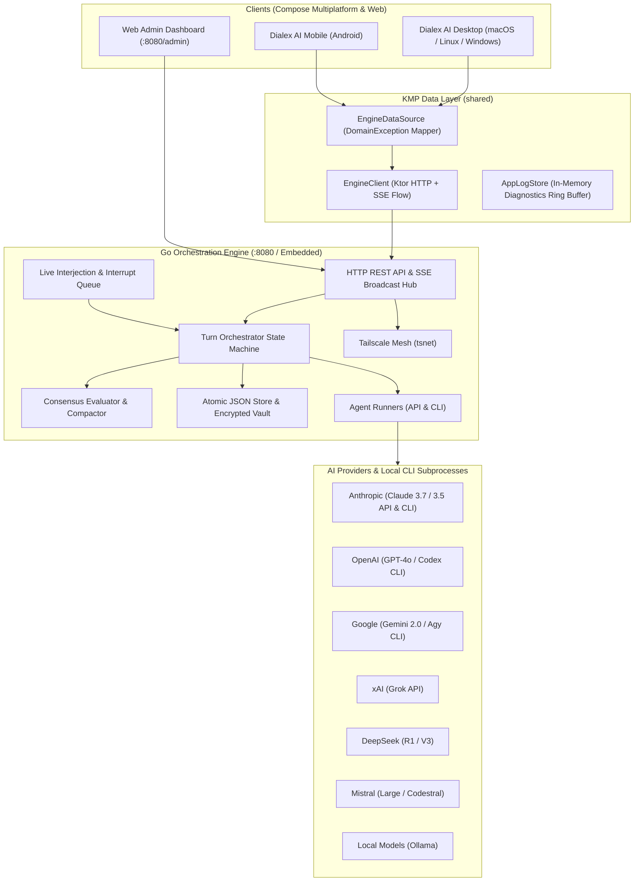
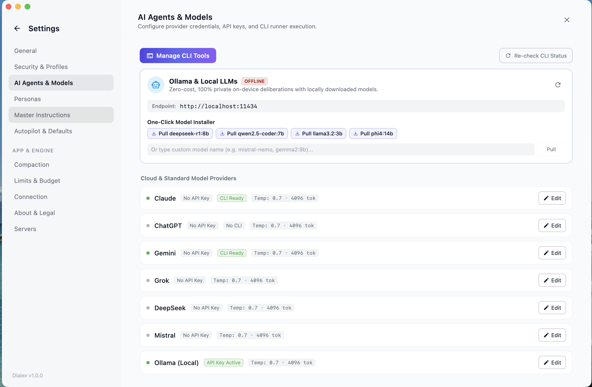

# Dialex AI — Sovereign Multi-Agent Deliberation & Synthetic Advisory Platform

[](https://kotlinlang.org)
[](https://www.jetbrains.com/lp/compose-multiplatform/)
[](https://go.dev)
[](https://tailscale.com)
[](docs/DEVELOPER_GUIDE.md#2-kolt-ecosystem-koltlibs-dependency--setup)
[](LICENSE)

**Dialex AI** by **Kolta Labs** is a sovereign cross-platform multi-agent deliberation workspace and synthetic advisory platform. It orchestrates structured, multi-round dialectic debates among competing frontier AI models (**Anthropic Claude, OpenAI ChatGPT/Codex, Google Gemini/Antigravity, xAI Grok, DeepSeek, Mistral, and local Ollama/CLI agents**) to eliminate single-model hallucinations, stress-test complex trade-offs, and produce executive-ready consensus deliverables.

Built upon a decoupled dual-engine topology, Dialex AI pairs a high-throughput **Go Orchestration Engine** with a sovereign, reactive **Kotlin Multiplatform (KMP) & Compose Multiplatform** presentation client for Desktop (macOS, Linux, Windows) and Mobile (Dialex AI Mobile / Android).

---

## 📑 Complete Documentation Suite

Dialex AI features exhaustive technical and user documentation organized in the [`docs/`](docs/README.md) directory:

| Guide | Summary | Link |
|---|---|---|
| 👔 **Executive Overview** | Business rationale, single-prompt LLM failure modes, Hegelian dialectic deliberation, and enterprise use cases. | [**docs/EXECUTIVE_OVERVIEW.md**](docs/EXECUTIVE_OVERVIEW.md) |
| 🏛️ **System Architecture** | Clean Architecture layers, MVI state flow, Go turn state-machine, SSE hub, and security vault. | [**docs/ARCHITECTURE.md**](docs/ARCHITECTURE.md) |
| 🖥️ **Server & Go Engine Setup** | Compilation, CLI commands, systemd/launchd daemons, Docker Compose, and Tailscale mesh (`tsnet`). | [**docs/SERVER_SETUP.md**](docs/SERVER_SETUP.md) |
| 📱 **Client Applications Setup** | Desktop (macOS/Linux/Windows) packaging (DMG/DEB/MSI), Dialex AI Mobile (Android), JNI, and logging. | [**docs/CLIENT_SETUP.md**](docs/CLIENT_SETUP.md) |
| 📖 **User & Deliberation Manual** | Council setup, 10 Universal Roles, 40+ Domain Personas, Anti-Fluff guardrails, and deliverables. | [**docs/USER_GUIDE.md**](docs/USER_GUIDE.md) |
| 🛠️ **Developer & Kolt Guide** | Contributor setup, testing, and in-depth guide to the **Kolt / KoltLibs** ecosystem (`compose-kmp`, `AsyncState`). | [**docs/DEVELOPER_GUIDE.md**](docs/DEVELOPER_GUIDE.md) |
| 🔮 **Advanced Features Specs** | Architectural specifications for Knowledge Graph, Problem Decomposition, Tension Detection, Dynamic Retrieval, Socratic Interview mode, Null Hypothesis Benchmarking, 8-Layer Persona DNA, and Mobile Epistemic Parity Suite. | [**docs/04_PENDING_FEATURES_SPEC.md**](docs/04_PENDING_FEATURES_SPEC.md) · [**Socratic Spec**](docs/features/05_SOCRATIC_INTERVIEW_MODE_SPEC.md) · [**Benchmarking Spec**](docs/features/06_NULL_HYPOTHESIS_BENCHMARKING_SPEC.md) · [**Persona DNA Spec**](docs/features/07_8_LAYER_PERSONA_DNA_SPEC.md) · [**Mobile Parity Spec**](docs/features/08_MOBILE_EPISTEMIC_PARITY_SPEC.md) |
| 🔌 **REST & SSE API Reference** | Complete HTTP REST endpoints, JWT authentication, and real-time Server-Sent Events specifications. | [**docs/API_REFERENCE.md**](docs/API_REFERENCE.md) |

---

## 🏛️ System Topology



---

---

## 📸 Visual Walkthrough & UI Showcase

<div align="center">
  
  <p><em>Figure 1: Live multi-agent debate stream with seat color coding, round progression, cost tracker, and human interjection queue.</em></p>
</div>

<br/>

<div align="center">
  
  <p><em>Figure 2: Moderator Consensus Outcome Bubble with 1-tap instant generative action buttons (Action Plan, Decision Matrix, Pro/Con, Exec Brief).</em></p>
</div>

<br/>

<table align="center" width="100%">
  <tr>
    <td width="50%" align="center">
      
      <br/><em>Figure 3: Multi-provider agents and $0 marginal cost local CLI runners (Claude, Codex, Antigravity, Ollama).</em>
    </td>
    <td width="50%" align="center">
      
      <br/><em>Figure 4: 1-Tap QR Companion Pairing with local LAN and zero-port Tailscale WireGuard mesh support.</em>
    </td>
  </tr>
  <tr>
    <td width="50%" align="center">
      
      <br/><em>Figure 5: 10 Universal Debate Archetypes and 40+ Domain Personas with Custom Badges.</em>
    </td>
    <td width="50%" align="center">
      
      <br/><em>Figure 6: Persona Studio with Ponytail style switch and AI Persona Builder.</em>
    </td>
  </tr>
</table>

---

## 🌟 Core Capabilities & Features

### 1. 🏛️ Multi-Model Council (Up to 6 Frontier Models)
- **Designated Moderator + Peer Seats**: Select a Primary Agent (e.g., Anthropic Claude 3.7 Sonnet) to frame the dilemma, moderate rounds, and synthesize conclusions, accompanied by up to 5 competing peer models.
- **Dual Execution Modes (API vs CLI)**: Connect directly via encrypted cloud API keys, or shell out to local authenticated developer CLIs (`claude`, `codex`, `antigravity`, or custom bash scripts) with zero extra credentials.

### 2. 🎭 Two-Tab Persona Registry & Live Customization
- **10 Universal Debate Archetypes**: Plain-language roles including *The Facilitator*, *Devil's Advocate*, *The Optimist*, *The Pragmatist*, *The Contrarian*, *The Expert*, *The Risk Analyst*, *The Ethicist*, *The Historian*, and *The Futurist*.
- **40+ Specialized Domain Personas**: Expandable domains covering Software Engineering, Scientific Research, Journalism, Product Strategy, Legal, and Healthcare.
- **PersonaBadge & Live Edit Sheet**: Selected personas attach as clean chips without polluting context fields. Tap the pencil icon to modify instructions on the fly, toggle **Ponytail Mode** (executive structure), and save as a `(Custom)` persona.

### 3. 🛡️ 3-Tier Anti-Fluff & Anti-Rabbit-Hole Guardrails
- **Human Dialogue Mode**: Enforces concise turns (2–4 sentences), eliminates sycophantic pleasantries (*"I agree with my colleague"*), and requires direct technical challenges.
- **Topic Drift Guardrail**: Forbids peripheral semantic debates, forcing agents to pull the deliberation back to the core question.
- **3-Tier Cascade**: Editable master directives in **Global Settings**, with clean enable/disable toggles in **Project Settings** and **Discussion Setup**.

### 4. ⚡ Live Human Interjections & Instant Interrupts
- **Queue for Next Round**: Submit human guidance while models are speaking; Dialex queues and injects your comment before the next round begins.
- **Instant Interrupt**: Immediately halt active model generation, safely finalize partial tokens, and force your interjection as the next turn without 409 conflicts.

### 5. 🎯 Moderator Consensus Outcome & Generative Deliverables
- **Crisp Consensus Synthesis**: Upon reaching consensus, the moderator generates a dedicated **Moderator Consensus Outcome Bubble** with a bottom-line answer, consensus points, and critical caveats.
- **Instant Generative Action Buttons**: Directly below the outcome bubble, synthesize specialized deliverables in one tap:
  - 📋 **Action Plan & Timeline**
  - ⚖️ **Weighted Decision Matrix**
  - 📊 **Pro/Con Trade-off Breakdown**
  - 📄 **Executive Memorandum (HTML)**
  - 📝 **Engineering Decision Summary**
  - ✨ **Custom Deliverable Format**

### 6. 🎯 Dedicated 1-on-1 Socratic Interview Mode
- **Forensic 1-on-1 Interrogation**: Conduct targeted, high-intensity Socratic dialogues directly with an individual persona (e.g., *The Risk Analyst*, *The Ethicist*, *Staff Systems Architect*) without spinning up a full 6-agent council.
- **5 Epistemic Socratic Stances**:
  - 🏛️ *Classic Elenchus*: Cross-examines consistency and exposes latent contradictions.
  - 🔨 *Maieutic Architecture*: Midwives latent system architectures from fuzzy requirements.
  - ⚛️ *Radical First Principles*: Strips away enterprise dogma down to fundamental physics/math.
  - 🛡️ *Adversarial Red-Team*: Relentlessly attacks blast radiuses and zero-trust vulnerabilities.
  - 🌌 *Aporia Boundary-Pusher*: Drives assumptions into intentional paradoxical deadlocks.
- **Strict *Brevis Interrogatio* Guardrail**: Enforces $\le 2$ sentences per turn, completely eliminating LLM conversational bloat and forcing sharp dialectic tension.
- **Live Epistemic Ledger**: Real-time sidebar ledger tracking green **Hardened Invariants** vs red strike-through **Surrendered Concessions**.
- **Dialogue Assist Chips**: 3 reactive Socratic direction chips (*"Defend Invariant"*, *"Concede & Narrow"*, *"Expose Edge Case"*) for rapid iteration.
- **1-Click Council Elevation**: Conclude interviews with a structured **Socratic Digest** and seamlessly elevate uncovered tensions into a multi-agent Council Debate seeded with the interview's invariants.

### 7. 🧠 Compounding Epistemic Cognitive Engine
- 🕸️ **Self-Organizing Knowledge Graph**: Embedded SQLite + FTS5 graph with activation decay ($W(t) = W_0 \cdot 2^{-\Delta t / t_{\text{half}}}$) and Hebbian co-reference reinforcement.
- 🔀 **Pre-Debate Problem Decomposition**: Divergent dual-mind breakdown of user dilemmas into orthogonal sub-axes before convening the council.
- ⚡ **Paraconsistent Tension Pair Detection**: Real-time extraction of thesis vs antithesis contradictions with unresolved conflict tracking.
- 🔍 **Round-Aware Dynamic Graph Retrieval (In-Debate RAG)**: Dynamic per-round query expansion retrieving empirical evidence from graph nodes and attached documents.

### 8. ⚔️ Null Hypothesis Benchmarking & Quantitative Evaluation Suite (`DialexBench`)
- **Automated $H_0$ Significance Testing**: Empirically validates whether multi-agent dialectic deliberation produces statistically superior outcomes compared to a single frontier model baseline.
- **4 Quantitative Scoring Dimensions**: Factuality ($S_{\text{fact}}$, 30%), Blind Spot Coverage ($S_{\text{blind}}$, 25%), Trade-Off Completeness ($S_{\text{trade}}$, 25%), and Actionability ($S_{\text{action}}$, 20%).
- **Double-Blind LLM Judge with Position Swapping**: Eliminates LLM primacy and presentation bias by evaluating Pass 1 ($A/B$) and Pass 2 ($B/A$) with anonymous deliverable labeling.
- **Paired Two-Tailed Student's $t$-test**: Computes exact $p$-values via the regularized incomplete beta function ($I_x(a,b)$), formally rejecting $H_0$ at $p < 0.05$.
- **Full-Stack Execution & Visuals**:
  - **Desktop KMP Arena**: Interactive UI with a 4-axis spider/radar chart, head-to-head deliverable viewer, and one-click execution.
  - **Standalone CLI (`dialexbench`)**: High-throughput terminal runner (`dialexbench list`, `run`, `stats`, `export`).
  - **Bundled DialexBench-10**: 10 canonical architectural dilemmas with ground-truth traps and trade-off axes.
  - **Multi-Format Export**: One-tap export to Markdown, CSV, and JSON.

---

## 🛠️ Build Requirements & The Kolt Ecosystem Dependency

> [!IMPORTANT]
> **Dialex depends on the Kolt Ecosystem (`KoltLibs`) via a Gradle Composite Build.**  
> If you are building Dialex from source, you **must clone `KoltLibs` alongside `DialexAI`**.

### Getting the Kolt Libraries
Dialex utilizes `io.github.koltsystems.koltx` libraries (`compose-kmp`, `utils`, `logutils`) developed by **Kolta Labs**. In `settings.gradle.kts`, Dialex includes `../KoltLibs` as a composite build:

```kotlin
includeBuild("../KoltLibs") {
    dependencySubstitution {
        substitute(module("io.github.koltsystems.koltx:utils")).using(project(":libs:utils"))
        substitute(module("io.github.koltsystems.koltx:logutils")).using(project(":libs:logutils"))
        substitute(module("io.github.koltsystems.koltx:compose-kmp")).using(project(":libs:compose-kmp"))
    }
}
```

### Step-by-Step Clone & Build Instructions

```bash
# 1. Create a parent workspace directory
mkdir -p ~/Workspace && cd ~/Workspace

# 2. Clone the KoltLibs repository
git clone https://github.com/Kolta-Labs/KoltLibs.git

# 3. Clone DialexAI into the same parent directory
git clone https://github.com/Kolta-Labs/DialexAI.git

# Verify directory layout:
# ~/Workspace/
#   ├── KoltLibs/
#   └── DialexAI/

# 4. Navigate into DialexAI and run the Desktop application
cd DialexAI
./gradlew :desktopApp:run
```

*For more details on Kolt architecture and module substitutions, refer to the [Developer Guide](docs/DEVELOPER_GUIDE.md#2-kolt-ecosystem-koltlibs-dependency--setup).*

---

## 🚀 Quick Start Workflows

### 1. Run the Desktop GUI (macOS / Linux / Windows)
Prerequisites: JDK 17 or 21, and the `KoltLibs` directory in place.

```bash
./gradlew :desktopApp:run
```
*The desktop app automatically starts a managed local Go engine if one is not already running on port 8080.*

---

### 2. Run with Docker Compose
Deploy the Go orchestration engine in a Docker container:

```bash
cd selfhosting
docker compose up -d
```
Access the embedded **Web Admin Dashboard** at `http://localhost:8080/admin`.

---

### 3. Deploy via Tailscale Mesh (Zero Port Forwarding)
```bash
cd selfhosting
TS_AUTHKEY="tskey-auth-xxxx" docker compose -f docker-compose.tailscale.yml up -d
```
Your server is now securely accessible across all your devices at `http://dialex:8080`.

---

### 4. Run Dialex AI Mobile (Android)
```bash
# Build and install to connected phone or emulator
./gradlew :androidApp:installDebug
```
*Use the built-in QR Code Scanner to link your phone to your desktop or self-hosted server in one tap.*

---

## 🔒 Security & Credential Vault

- **AES-256-GCM Vault**: API keys stored at rest are encrypted with keys derived using Argon2id.
- **Hardware Keystore**: Android keys are anchored in the device's hardware security module (TEE/StrongBox).
- **Subprocess Environment Sanitization**: Local CLI child processes have parent environment variables stripped to prevent credential leaks.
- **In-Memory Diagnostics (`AppLogStore`)**: High-speed circular ring buffer storing up to 1,000 events viewable under **Settings > Logs**.

---

## 🤝 Contributing & Standards

Contributions are welcome! Please ensure all pull requests comply with our architectural standards:
- Check out the [Developer Guide](docs/DEVELOPER_GUIDE.md).
- Verify the Desktop target compiles cleanly: `./gradlew :shared:compileKotlinDesktop`.
- Verify the Go engine test suite passes: `cd engine && go test -race ./pkg/...`.

---

## 📄 License

Dialex AI is licensed under the [PolyForm Noncommercial License 1.0.0](LICENSE).

- **Free for Individuals & Noncommercial Use**: You are free to use, modify, test, and distribute the software for personal study, research, education, hobby, or noncommercial pursuits.
- **Commercial Use**: Any use to run a commercial business or provide services for a fee requires a commercial agreement from **Kolta Labs**. For commercial inquiries, contact `licensing@koltalabs.com`.

---

*Copyright (c) 2026 Kolta Labs. Licensed under the [PolyForm Noncommercial License 1.0.0](file:///LICENSE).*
