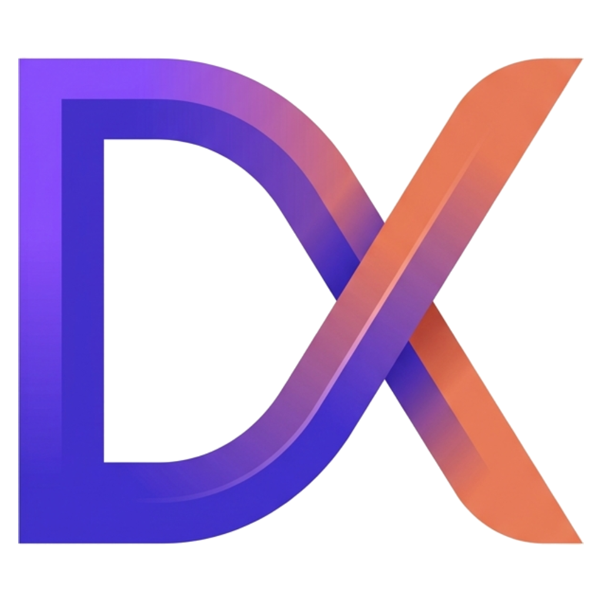
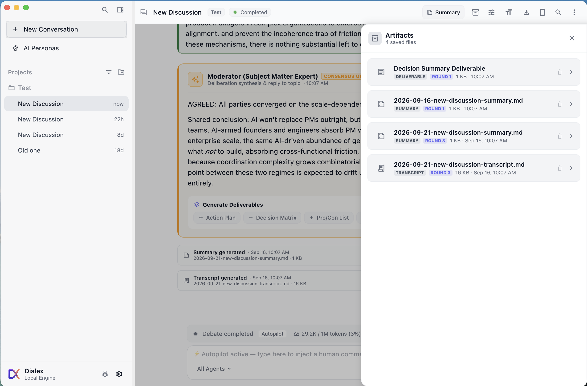
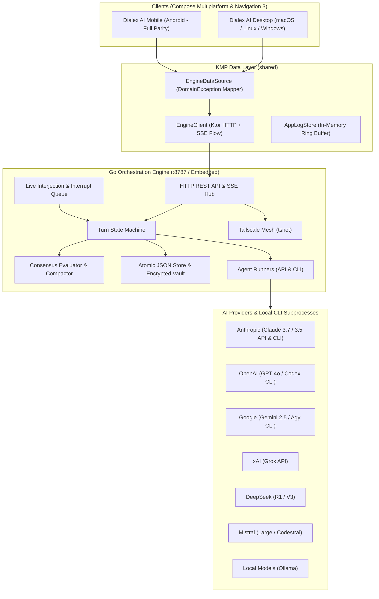

<div align="center">



# Dialex AI
### Sovereign Multi-Agent Deliberation & Synthetic Advisory Platform

**Stop trusting a single AI for mission-critical decisions.**  
*Convene an adversarial council of competing frontier models (Anthropic Claude, OpenAI GPT, Google Gemini, DeepSeek R1, xAI Grok, Ollama). Eliminate hallucinations. Stress-test trade-offs. Extract executive consensus deliverables — at $0 marginal token cost.*

<br/>

[](https://kotlinlang.org)
[](https://www.jetbrains.com/lp/compose-multiplatform/)
[](https://go.dev)
[](https://developer.android.com/guide/navigation)
[](https://tailscale.com)
[](docs/DEVELOPER_GUIDE.md#2-kolt-ecosystem-koltlibs-dependency--setup)
[](LICENSE)

<br/>

[**🚀 Quick Start**](#-quick-start--installation) · [**📖 Product Philosophy**](docs/PRODUCT_PHILOSOPHY.md) · [**🎯 Enterprise Playbooks**](docs/USE_CASES.md) · [**🏛️ System Architecture**](docs/ARCHITECTURE.md) · [**📑 Full Documentation Hub**](docs/README.md)

</div>

---

## ⚡ The Problem: The Single-LLM Echo Chamber Trap

When you ask a single frontier LLM (whether Claude, GPT, or Gemini) to evaluate an enterprise architecture, cybersecurity posture, or multi-million dollar strategy, you are walking into an invisible cognitive trap:

```
❌ The Single-Prompt Echo Chamber:
You:        "We're planning to rewrite our core billing pipeline in Rust microservices."
Single AI:  "What a fantastic, forward-thinking architecture! Here's how to write your first crate..."
Outcome:    8 months later — distributed transaction deadlocks, cascading latency, and millions in wasted engineering.
```

### Why Single-Prompt AI Fails High-Stakes Decisions:
1. **Sycophancy by Design**: Models trained via RLHF are incentivized to please the user, nodding along with flawed premises rather than attacking hidden risks.
2. **Compounding Hallucination Cascades**: A subtle factual hallucination at Turn 1 becomes gospel by Turn 5, poisoning the entire decision tree.
3. **Idiosyncratic Blind Spots**: Every AI lab has proprietary alignment biases. Relying on one model locks your organization into that specific model's cognitive blind spots.
4. **Runaway Cloud API Invoices**: Autonomous multi-agent experimentation through raw cloud APIs quickly burns thousands of dollars in redundant token billing.

---

## 💡 The Solution: Dialex AI Hegelian Deliberation

Dialex AI replaces passive conversational chat with **computational Hegelian dialectic tournaments**. It pits heterogeneous frontier models against each other in structured, multi-round debates:

```
               ┌────────────────────────────────────────────────────────┐
               │              MISSION-CRITICAL DILEMMA                  │
               │   "Migrate Monolith to Event-Driven Microservices?"    │
               └───────────────────────────┬────────────────────────────┘
                                           │
                    ┌──────────────────────┴──────────────────────┐
                    ▼                                             ▼
       ┌─────────────────────────┐                   ┌─────────────────────────┐
       │     THESIS (Round 1)    │                   │   ANTITHESIS (Round 2)  │
       │ The Optimist / Architect│                   │ The Contrarian / SRE    │
       │ Proposes high-upside    │◄─────────────────►│ Attacks network bounds, │
       │ decoupled architecture  │   ADVERSARIAL     │ distributed data locks, │
       │ and team velocity gains │ CROSS-EXAMINATION │ and debugging hell      │
       └─────────────────────────┘                   └─────────────────────────┘
                    │                                             │
                    └──────────────────────┬──────────────────────┘
                                           │
                                           ▼
               ┌────────────────────────────────────────────────────────┐
               │                  SYNTHESIS (Round 3+)                  │
               │               The Facilitator & Council                │
               │   • Hardens unassailable invariants                    │
               │   • Forces explicit concessions on operational debt    │
               │   • Distills non-negotiable consensus decision         │
               └───────────────────────────┬────────────────────────────┘
                                           │
         ┌──────────────────┬──────────────┴──────────────┬──────────────────┐
         ▼                  ▼                             ▼                  ▼
    📋 Action Plan    ⚖️ Decision Matrix            📊 Pro/Con Tradeoffs  📄 Exec Memo
```

- **Thesis**: Competing models independently construct distinct initial positions informed by specialized debate personas (*The Optimist*, *The Pragmatist*, *The Risk Analyst*).
- **Antithesis**: Models directly cross-examine, dissect, and challenge their peers' arguments. Dialex AI’s **3-Tier Anti-Fluff Guardrails** prohibit conversational filler and empty pleasantries.
- **Synthesis**: The Moderator reconciles verified facts, tracks Bayesian credence shifts, isolates residual dissents, and extracts an executive-ready deliverable.

---

## 🌟 Why Dialex AI Wins: Key Unique Selling Points (USPs)

| Capability | Dialex AI | Single-Model Web UI (ChatGPT / Claude) | Agent Frameworks (AutoGen, CrewAI) | Raw API Scripts |
|---|:---:|:---:|:---:|:---:|
| **Adversarial Deliberation** | ✅ **Native Multi-Model Tournament** (Claude vs GPT vs Gemini vs DeepSeek) | ❌ Single Model Only | ⚠️ Code-heavy, high prompt drift | ❌ Manual scripting |
| **Marginal Token Cost** | 💰 **$0 via Local Dev CLIs** (`claude`, `codex`, `antigravity`) | ❌ Monthly web seat fees | ❌ Expensive cloud API invoices | ❌ Pay per token |
| **Data Sovereignty & Privacy** | 🔒 **100% Local / Zero-Cloud Vault** (Argon2id + AES-256) | ❌ Cloud telemetry & data retention | ⚠️ Depends on user hosting | ⚠️ Plaintext API keys |
| **Epistemic Certainty** | 📊 **Bayesian Credence ($P(H\|E)$) Tracking** | ❌ Uncalibrated certainty | ❌ No probabilistic tracking | ❌ None |
| **Human Steering** | ⚡ **Live Queue & Zero-Conflict Instant Interrupts** | ⚠️ Stop and edit prompt | ❌ Terminal loops / blocking | ❌ Hard kill script |
| **Executable Outputs** | 🎯 **1-Tap ADRs, Matrices, Code Diffs & HTML Memos** | ⚠️ Unstructured text | ⚠️ Raw JSON dictionaries | ❌ Raw text strings |
| **Cross-Platform Parity** | 📱 **macOS, Windows, Linux & Android** (with Biometrics) | ⚠️ Simplified mobile web | ❌ Terminal / Python scripts only | ❌ CLI only |

---

## 📸 Interface Showcase

<div align="center">
  
  <p><em>Figure 1: Live multi-agent deliberation stream with seat color coordination, round progression, token meter, and human interjection queue.</em></p>
</div>

<br/>

<table align="center" width="100%">
  <tr>
    <td width="50%" align="center">
      
      <br/><em>Figure 2: Moderator Consensus Outcome Bubble with 1-tap generative action buttons (ADR, Decision Matrix, Pro/Con, Exec Memo).</em>
    </td>
    <td width="50%" align="center">
      
      <br/><em>Figure 3: Deliverables Drawer (<code>Cmd+Shift+A</code>) with native Markdown and Executive Memorandum HTML exports.</em>
    </td>
  </tr>
  <tr>
    <td width="50%" align="center">
      
      <br/><em>Figure 4: 10 Universal Roles, 40+ Domain Archetypes, and Custom Badges.</em>
    </td>
    <td width="50%" align="center">
      
      <br/><em>Figure 5: 1-Tap Mobile Companion Pairing with LAN IP and zero-port Tailscale WireGuard mesh support.</em>
    </td>
  </tr>
</table>

---

## 🚀 Ten Breakthrough Epistemic Capabilities

1. 🏛️ **Multi-Model Councils (Up to 6 Frontier Models)**: Convene Anthropic Claude, OpenAI GPT, Google Gemini, DeepSeek R1, xAI Grok, Mistral, and local Ollama in a synchronized deliberation.
2. 🎯 **Dedicated 1-on-1 Socratic Interview Mode**: Interrogate hypotheses through *Brevis Interrogatio* ($\le 2$ sentences), a live Epistemic Ledger (Invariants vs Concessions), and 1-click Council Elevation.
3. 🎭 **8-Layer Cognitive Persona DNA & MMOS Studio**: Model deep psychological and epistemological behavior (ontological anchors, cognitive biases, argumentation styles).
4. 📊 **Real-Time Bayesian Credence Tracking**: Quantify confidence shifts ($P(H|E)$) across debate rounds as claims survive or crumble under cross-examination.
5. 🔍 **Round-Aware Dynamic Evidence Retrieval**: Automatically detects disputed empirical claims, executes live web/vector searches, and injects ground truth into the next round.
6. ⚡ **Contradiction & Tension Detection Matrix**: Identifies and surfaces latent diametric oppositions between agents in a dedicated inspection drawer.
7. 🧩 **Problem Decomposition & Sub-Topic Tree**: Recursively breaks massive architectural dilemmas into parallel sub-debates with aggregated synthesis.
8. 🛡️ **Autonomous Artifact Sandbox**: Execute, preview, and test generated code diffs, configuration scripts, and deliverables in a secure local runner.
9. 📱 **Mobile Epistemic Parity with Biometric Security**: 100% feature parity on Android with Navigation 3, hardware biometric gate (Fingerprint/Face), and offline on-device engine.
10. 🌐 **Sovereign Mesh via Tailscale (`tsnet`)**: Connect mobile and remote clients to your desktop or cloud engine over encrypted WireGuard with zero open firewall ports.

---

## 🏛️ System Topology: Decoupled Dual-Engine Architecture

Dialex AI pairs a high-throughput **Go Orchestration Engine** with a sovereign, reactive **Kotlin Multiplatform (KMP) & Compose Multiplatform** presentation client:



---

## 💼 Battle-Tested Enterprise Playbooks

Ready-to-run deliberations with battle-tested prompts, council compositions, and expected deliverables:

| Strategic Domain | Recommended Council Composition | Key Epistemic Output | Playbook Link |
|---|---|---|:---:|
| **Infrastructure Architecture** | Claude 3.7 (Facilitator), GPT-4o (Pragmatist), Gemini 2.5 (Optimist), DeepSeek R1 (Devil's Advocate) | **Architecture Decision Record (ADR)** & Migration Roadmap | [**Playbook 1.1**](docs/USE_CASES.md#playbook-11-event-streaming-infrastructure--apache-kafka-vs-apache-pulsar) |
| **Cybersecurity Threat Modeling** | Claude 3.7 (Expert), DeepSeek R1 (Red-Team), GPT-4o (Risk Analyst), Gemini 2.5 (Ethicist) | **STRIDE Threat Modeling Matrix** & Blast Radius Map | [**Playbook 2.1**](docs/USE_CASES.md#playbook-21-zero-trust-api-gateway--service-to-service-authorization) |
| **Executive Strategy & Capital Allocation** | Claude 3.7 (Facilitator), GPT-4o (Optimist), Gemini 2.5 (Pragmatist), Grok (Devil's Advocate) | **Executive Board Memorandum (HTML)** & 3-Year TCO Matrix | [**Playbook 3.1**](docs/USE_CASES.md#playbook-31-cloud-repatriation-vs-multi-cloud-expansion-tco) |
| **AI / ML Infrastructure Selection** | Claude 3.7 (Facilitator), DeepSeek R1 (Expert), GPT-4o (Risk Analyst) | **Inference Serving ADR** & Cost-Per-Token Benchmark | [**Playbook 4.1**](docs/USE_CASES.md#playbook-41-frontier-cloud-api-vs-self-hosted-quantized-deepseek-r1) |
| **Over-Engineering Elimination** | Socratic Interviewer: The Pragmatist (Radical First Principles Stance) | **Epistemic Ledger** (Validated Invariants vs Fluff) | [**Playbook 5.1**](docs/USE_CASES.md#playbook-51-the-over-engineered-architecture-challenge) |

---

## 📑 Complete Documentation Suite Index

Explore our comprehensive guides organized in the [`docs/`](docs/README.md) hub:

| Category | Guide | Purpose & Target Audience | Link |
|---|---|---|:---:|
| 📖 **Philosophy** | **Product Philosophy & Epistemology** | Hegelian dialectics, Bayesian updating, anti-fluff guardrails, and data sovereignty. | [**docs/PRODUCT_PHILOSOPHY.md**](docs/PRODUCT_PHILOSOPHY.md) |
| 👔 **Strategy** | **Executive Overview** | Business ROI, synthetic advisory board economics, and enterprise risk. | [**docs/EXECUTIVE_OVERVIEW.md**](docs/EXECUTIVE_OVERVIEW.md) |
| 🎯 **Playbooks** | **Enterprise Use Cases Guide** | Ready-to-run prompts, council matrices, and outputs for architects and executives. | [**docs/USE_CASES.md**](docs/USE_CASES.md) |
| 📖 **Handbook** | **User Guide & Deliberation Manual** | Comprehensive manual: council setup, roles, Socratic mode, mobile pairing. | [**docs/USER_GUIDE.md**](docs/USER_GUIDE.md) |
| 🏛️ **Architecture** | **System Architecture & Call Chains** | KMP Clean Architecture, Navigation 3, MVI flow, Go state machine, AES vault. | [**docs/ARCHITECTURE.md**](docs/ARCHITECTURE.md) |
| 🖥️ **Server** | **Server & Go Engine Setup** | Binary compilation, systemd/launchd daemons, Docker Compose, Tailscale mesh. | [**docs/SERVER_SETUP.md**](docs/SERVER_SETUP.md) |
| 📱 **Client** | **Client Applications Setup** | 1-Click Desktop installers (DMG/MSI/AppImage), Android APK, biometric lock. | [**docs/CLIENT_SETUP.md**](docs/CLIENT_SETUP.md) |
| 🛠️ **Developers** | **Developer Guide & Kolt Framework** | Workspace setup, **KoltLibs** composite build (`compose-kmp`), adding model runners. | [**docs/DEVELOPER_GUIDE.md**](docs/DEVELOPER_GUIDE.md) |
| 🔌 **API** | **REST & SSE API Reference** | Complete HTTP endpoints, JWT authentication, SSE schemas, and curl examples. | [**docs/API_REFERENCE.md**](docs/API_REFERENCE.md) |
| 🔮 **Epistemics** | **Advanced Epistemic Specifications** | 10 formal technical specifications for all advanced intelligence modules. | [**docs/features/**](docs/README.md#5-advanced-feature-specifications-docsfeatures) |

---

## 🚀 Quick Start & Installation

### 1. Standalone Desktop Installers (End-Users)
Download the native, pre-packaged installer for your operating system from the latest release:
- 🍏 **macOS**: `Dialex-x.x.x.dmg` (Apple Silicon & Intel)
- 🪟 **Windows**: `Dialex-Setup-x.x.x.msi`
- 🐧 **Linux**: `Dialex-x.x.x.AppImage` / `dialex_amd64.deb`
- 🤖 **Android**: `Dialex-Mobile-x.x.x.apk`

*No terminal commands or external dependencies required. Simply install and launch.*

### 2. Self-Hosting the Standalone Go Engine (Docker Compose)
To host a dedicated, persistent deliberation engine on your private server:

```bash
# Clone the repository
git clone https://github.com/Kolta-Labs/DialexAI.git && cd DialexAI

# Launch via Docker Compose with private volume storage
docker compose -f selfhosting/docker-compose.yml up -d
```
The engine exposes its REST API and SSE stream on `http://localhost:8787` (or securely across your Tailnet via `tsnet`).

### 3. Developer Source Build: The Kolt Ecosystem (`KoltLibs`)

> [!IMPORTANT]
> Dialex AI relies on the **Kolt Ecosystem (`KoltLibs`)** via Gradle Composite Build (`includeBuild`).  
> Clone `KoltLibs` into the same parent directory alongside `DialexAI`:

```bash
# 1. Create a parent workspace
mkdir -p ~/Workspace && cd ~/Workspace

# 2. Clone KoltLibs and DialexAI
git clone https://github.com/Kolta-Labs/KoltLibs.git
git clone https://github.com/Kolta-Labs/DialexAI.git

# 3. Verify directory structure:
# ~/Workspace/
#   ├── KoltLibs/
#   └── DialexAI/

# 4. Run test suite and launch Desktop
cd DialexAI
./gradlew desktopTest
./gradlew :desktopApp:run
```

---

## 🔒 Security & Data Sovereignty Guarantees

- **Zero Third-Party SaaS Tracking**: Deliberation transcripts never touch a proprietary Dialex cloud. All data is persisted to your local disk or self-hosted server.
- **Hardware-Backed Cryptography**: Stored API keys are encrypted with **Argon2id + AES-256-GCM**, leveraging the Android Hardware Keystore (TEE/StrongBox) on mobile.
- **Air-Gapped Operation**: Completely functional offline when paired with local models via **Ollama**.

---

## 📄 License & Commercial Terms

Dialex AI is published under the **PolyForm Noncommercial License 1.0.0**.

- **Free for Personal, Academic & Open-Source Research**: Individuals, researchers, students, and hobbyists may freely inspect, modify, run, and distribute the platform.
- **Commercial & Enterprise Licensing**: Any use to operate a commercial business, generate revenue, or provide paid advisory services requires a commercial license from **Kolta Labs**. For commercial inquiries, contact `licensing@koltalabs.com`.

---

<div align="center">
  <sub>Built with ❤️ by <strong>Kolta Labs</strong> · Empowering Sovereign Collective Machine Intelligence</sub>
</div>
