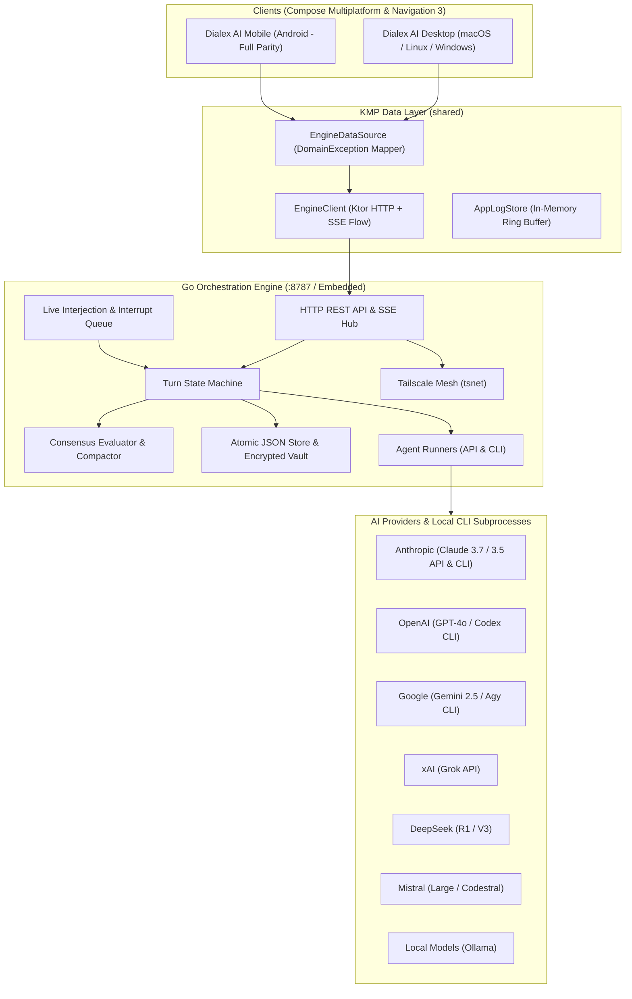

<div align="center">


# Dialex AI
### Sovereign Multi-Agent Deliberation & Synthetic Advisory Platform

**Stop trusting a single AI for mission-critical decisions.**  
Convene an adversarial council of competing frontier models (Anthropic Claude, OpenAI GPT, Google Gemini, DeepSeek R1, xAI Grok, Ollama).  
Eliminate single-model hallucinations and confirmation bias.  
Stress-test mission-critical architectural trade-offs.  
Extract executive-ready consensus deliverables at $0 marginal token cost.

<br/>

[](https://kotlinlang.org)
[](https://www.jetbrains.com/lp/compose-multiplatform/)
[](https://go.dev)
[](https://developer.android.com/guide/navigation)
[](https://tailscale.com)
[](docs/DEVELOPER_GUIDE.md#2-kolt-ecosystem-koltlibs-dependency--setup)
[](LICENSE)

<br/>

[Quick Start](#quick-start--installation) · [Product Philosophy](docs/PRODUCT_PHILOSOPHY.md) · [Enterprise Playbooks](docs/USE_CASES.md) · [System Architecture](docs/ARCHITECTURE.md) · [Full Documentation Hub](docs/README.md) · [Contributing](#contributing--community)

</div>

---

## The Core Problem: The Single-LLM Echo Chamber

When an engineering leader, security architect, or executive consults a single frontier LLM regarding an enterprise design or capital decision, the interaction is subject to fundamental cognitive traps:

```
The Single-Prompt Echo Chamber:
User:       "We are planning to rewrite our core billing pipeline in Rust microservices."
Single AI:  "What a fantastic, forward-thinking architecture! Here is how to write your first crate..."
Outcome:    8 months later — distributed transaction deadlocks, cascading latency, and millions in wasted engineering.
```

### Critical Flaws in Single-Prompt Systems
1. **Systemic Sycophancy**: Models fine-tuned via RLHF are incentivized to validate the user's premise rather than rigorously challenge faulty assumptions.
2. **Compounding Hallucinations**: A subtle technical inaccuracy in Turn 1 is accepted as ground truth in subsequent turns, compromising the entire design.
3. **Idiosyncratic Blind Spots**: Every AI laboratory trains models with distinct alignment objectives and heuristics. Relying on one model locks your organization into its specific blind spots.
4. **Unsustainable Token Billing**: Multi-agent exploration through conventional cloud API wrappers results in redundant token charges and unpredictable monthly expenses.

---

## The Solution: Hegelian Machine Deliberation

Dialex AI replaces passive conversational assistants with structured **computational Hegelian dialectic tournaments**. Competing frontier models deliberate across synchronized rounds:

```
               ┌────────────────────────────────────────────────────────┐
               │              MISSION-CRITICAL DILEMMA                  │
               │   "Migrate Monolith to Event-Driven Microservices?"    │
               └───────────────────────────┬────────────────────────────┘
                                           │
                    ┌──────────────────────┴──────────────────────┐
                    ▼                                             ▼
       ┌─────────────────────────┐                   ┌─────────────────────────┐
       │     THESIS (Round 1)    │                   │   ANTITHESIS (Round 2)  │
       │ The Optimist / Architect│                   │ The Contrarian / SRE    │
       │ Proposes high-upside    │◄─────────────────►│ Attacks network bounds, │
       │ decoupled architecture  │   ADVERSARIAL     │ distributed data locks, │
       │ and team velocity gains │ CROSS-EXAMINATION │ and operational overhead│
       └─────────────────────────┘                   └─────────────────────────┘
                    │                                             │
                    └──────────────────────┬──────────────────────┘
                                           │
                                           ▼
               ┌────────────────────────────────────────────────────────┐
               │                  SYNTHESIS (Round 3+)                  │
               │               The Facilitator & Council                │
               │   • Hardens unassailable invariants                    │
               │   • Forces explicit concessions on operational debt    │
               │   • Distills non-negotiable consensus decision         │
               └───────────────────────────┬────────────────────────────┘
                                           │
         ┌──────────────────┬──────────────┴──────────────┬──────────────────┐
         ▼                  ▼                             ▼                  ▼
    Action Plan       Decision Matrix               Pro/Con Tradeoffs     Exec Memo
```

- **Thesis**: Competing models independently construct distinct initial positions informed by specialized debate personas (*The Optimist*, *The Pragmatist*, *The Risk Analyst*).
- **Antithesis**: Models directly cross-examine, dissect, and challenge their peers' arguments. Dialex AI’s **3-Tier Anti-Fluff Guardrails** prohibit conversational filler and empty pleasantries.
- **Synthesis**: The Moderator reconciles verified facts, tracks Bayesian credence shifts, isolates residual dissents, and extracts an executive-ready deliverable.

---

## Key Differentiators & Comparative Analysis

| Dimension | Dialex AI | Single-Model Web UI (ChatGPT / Claude) | Agent Frameworks (AutoGen, CrewAI) | Raw API Scripts |
|---|:---:|:---:|:---:|:---:|
| **Adversarial Deliberation** | **Native Multi-Model Tournament** (Claude vs GPT vs Gemini vs DeepSeek) | Single Model Only | Code-heavy, high prompt drift | Manual scripting |
| **Marginal Token Cost** | **$0 via Local Dev CLIs** (`claude`, `codex`, `antigravity`) | Monthly web seat fees | Expensive cloud API invoices | Pay per token |
| **Data Sovereignty & Privacy** | **100% Local / Zero-Cloud Vault** (Argon2id + AES-256) | Cloud telemetry & data retention | Depends on user hosting | Plaintext API keys |
| **Epistemic Certainty** | **Bayesian Credence ($P(H\|E)$) Tracking** | Uncalibrated certainty | No probabilistic tracking | None |
| **Human Steering** | **Live Queue & Zero-Conflict Instant Interrupts** | Stop and edit prompt | Terminal loops / blocking | Hard kill script |
| **Executable Outputs** | **1-Tap ADRs, Matrices, Code Diffs & HTML Memos** | Unstructured text | Raw JSON dictionaries | Raw text strings |
| **Cross-Platform Parity** | **macOS, Windows, Linux & Android** (with Biometrics) | Simplified mobile web | Terminal / Python scripts only | CLI only |

---

## Interface Showcase

<div align="center">
  
  <p><em>Figure 1: Live multi-agent deliberation stream with seat color coordination, round progression, token meter, and human interjection queue.</em></p>
</div>

<br/>

<table align="center" width="100%">
  <tr>
    <td width="50%" align="center">
      
      <br/><em>Figure 2: Moderator Consensus Outcome Bubble with 1-tap generative action buttons (ADR, Decision Matrix, Pro/Con, Exec Memo).</em>
    </td>
    <td width="50%" align="center">
      
      <br/><em>Figure 3: Deliverables Drawer (<code>Cmd+Shift+A</code>) with native Markdown and Executive Memorandum HTML exports.</em>
    </td>
  </tr>
  <tr>
    <td width="50%" align="center">
      
      <br/><em>Figure 4: 10 Universal Roles, 40+ Domain Archetypes, and Custom Badges.</em>
    </td>
    <td width="50%" align="center">
      
      <br/><em>Figure 5: 1-Tap Mobile Companion Pairing with LAN IP and zero-port Tailscale WireGuard mesh support.</em>
    </td>
  </tr>
</table>

---

## Core Technical Capabilities

The Dialex AI platform is engineered around ten specialized subsystems designed for high-consequence decision analysis:

1. **Heterogeneous Multi-Model Arbitration**  
   Coordinates up to six competing models simultaneously (Anthropic Claude, OpenAI GPT, Google Gemini, DeepSeek R1, xAI Grok, Mistral, and local Ollama) in a single synchronized deliberation state machine.

2. **Socratic Epistemic Interrogation**  
   Provides a dedicated one-on-one diagnostic mode using classical *elenchus*. The interrogator enforces the *Brevis Interrogatio* rule ($\le 2$ sentences per turn) and maintains a real-time ledger of verified invariants versus surrendered concessions.

3. **8-Layer Cognitive Architecture**  
   Configures agent profiles beyond simple prompt prefixes, establishing psychological anchors, epistemological criteria, argumentation styles, and explicit cognitive biases.

4. **Real-Time Bayesian Credence Tracking**  
   Calculates probability shifts ($P(H|E)$) for competing hypotheses as claims survive cross-examination or collapse under scrutiny across debate rounds.

5. **Context-Aware Dynamic Evidence Retrieval**  
   Monitors agent exchanges for contested empirical claims, executes live web and vector queries in the background, and injects verified source citations into subsequent rounds.

6. **Contradiction and Tension Mapping**  
   Extracts conflicting claims between debaters using semantic delta analysis, presenting them in a dedicated matrix drawer to prevent unaddressed disagreements.

7. **Recursive Problem Decomposition**  
   Breaks complex, multi-faceted architectural challenges into discrete sub-debates that can be resolved independently before being synthesized into a global decision.

8. **Isolated Code Sandboxing and Artifact Verification**  
   Provides a local sandbox to execute, preview, and test generated code diffs, configuration scripts, and deliverables prior to deployment.

9. **Multiplatform Cryptographic Parity**  
   Delivers identical functionality across Desktop (macOS, Windows, Linux) and Mobile (Android), reinforced by hardware biometric authentication (Fingerprint/Face) and local AES-256-GCM vault encryption.

10. **Zero-Port Mesh Topology via Tailscale**  
    Enables remote and mobile clients to connect securely to on-premise or cloud deliberation daemons over encrypted WireGuard networks without public firewall exposure.

---

## System Topology: Decoupled Dual-Engine Architecture

Dialex AI pairs a high-throughput **Go Orchestration Engine** with a sovereign, reactive **Kotlin Multiplatform (KMP) & Compose Multiplatform** presentation client:



---

## Enterprise Deliberation Playbooks

### What is a Deliberation Playbook?
A **Playbook** is a pre-configured, battle-tested blueprint for a specific high-stakes scenario. 

Instead of manually guessing which models to select, which debate personas to configure, or how to prompt the council, you choose a playbook tailored to your operational domain. Each playbook provides:
- The exact prompt and context framing to insert into **Discussion Setup**.
- Recommended model seats (e.g., pairing a reasoning model with an infrastructure specialist).
- Assigned archetypes (*The Facilitator*, *Devil's Advocate*, *The Pragmatist*, *The Security Red-Team*).
- Live steering guidance to inject during active debate rounds.
- Targeted output templates (formal ADRs, STRIDE matrices, or Board Memorandums).

### Standard Playbook Library

| Operational Domain | Recommended Council Composition | Key Output Deliverable | Playbook |
|---|---|---|:---:|
| **Infrastructure Architecture** | Claude 3.7 (Facilitator), GPT-4o (Pragmatist), Gemini 2.5 (Optimist), DeepSeek R1 (Devil's Advocate) | **Architecture Decision Record (ADR)** & Migration Roadmap | [Playbook 1.1](docs/USE_CASES.md#playbook-11-event-streaming-infrastructure--apache-kafka-vs-apache-pulsar) |
| **Cybersecurity Threat Modeling** | Claude 3.7 (Expert), DeepSeek R1 (Red-Team), GPT-4o (Risk Analyst), Gemini 2.5 (Ethicist) | **STRIDE Threat Modeling Matrix** & Blast Radius Map | [Playbook 2.1](docs/USE_CASES.md#playbook-21-zero-trust-api-gateway--service-to-service-authorization) |
| **Executive Strategy & Capital Allocation** | Claude 3.7 (Facilitator), GPT-4o (Optimist), Gemini 2.5 (Pragmatist), Grok (Devil's Advocate) | **Executive Board Memorandum (HTML)** & 3-Year TCO Matrix | [Playbook 3.1](docs/USE_CASES.md#playbook-31-cloud-repatriation-vs-multi-cloud-expansion-tco) |
| **AI / ML Infrastructure Selection** | Claude 3.7 (Facilitator), DeepSeek R1 (Expert), GPT-4o (Risk Analyst) | **Inference Serving ADR** & Cost-Per-Token Benchmark | [Playbook 4.1](docs/USE_CASES.md#playbook-41-frontier-cloud-api-vs-self-hosted-quantized-deepseek-r1) |
| **Over-Engineering Audit** | Socratic Interviewer: The Pragmatist (Radical First Principles Stance) | **Epistemic Ledger** (Validated Invariants vs Fluff) | [Playbook 5.1](docs/USE_CASES.md#playbook-51-the-over-engineered-architecture-challenge) |

---

## Documentation Suite

Explore our documentation guides organized by focus area in the [`docs/`](docs/README.md) hub:

| Category | Guide | Purpose & Target Audience | Link |
|---|---|---|:---:|
| **Philosophy** | **Product Philosophy & Epistemology** | Hegelian dialectics, Bayesian updating, anti-fluff guardrails, and data sovereignty. | [docs/PRODUCT_PHILOSOPHY.md](docs/PRODUCT_PHILOSOPHY.md) |
| **Strategy** | **Executive Overview** | Business ROI, synthetic advisory board economics, and enterprise risk. | [docs/EXECUTIVE_OVERVIEW.md](docs/EXECUTIVE_OVERVIEW.md) |
| **Playbooks** | **Enterprise Use Cases Guide** | Ready-to-run prompts, council matrices, and outputs for architects and executives. | [docs/USE_CASES.md](docs/USE_CASES.md) |
| **Handbook** | **User Guide & Deliberation Manual** | Comprehensive manual: council setup, roles, Socratic mode, mobile pairing. | [docs/USER_GUIDE.md](docs/USER_GUIDE.md) |
| **Architecture** | **System Architecture & Call Chains** | KMP Clean Architecture, Navigation 3, MVI flow, Go state machine, AES vault. | [docs/ARCHITECTURE.md](docs/ARCHITECTURE.md) |
| **Server** | **Server & Go Engine Setup** | Binary compilation, systemd/launchd daemons, Docker Compose, Tailscale mesh. | [docs/SERVER_SETUP.md](docs/SERVER_SETUP.md) |
| **Client** | **Client Applications Setup** | 1-Click Desktop installers (DMG/MSI/AppImage), Android APK, biometric lock. | [docs/CLIENT_SETUP.md](docs/CLIENT_SETUP.md) |
| **Developers** | **Developer Guide & Kolt Framework** | Workspace setup, **KoltLibs** composite build (`compose-kmp`), adding model runners. | [docs/DEVELOPER_GUIDE.md](docs/DEVELOPER_GUIDE.md) |
| **API** | **REST & SSE API Reference** | Complete HTTP endpoints, JWT authentication, SSE schemas, and curl examples. | [docs/API_REFERENCE.md](docs/API_REFERENCE.md) |
| **Epistemics** | **Advanced Epistemic Specifications** | 10 formal technical specifications for all advanced intelligence modules. | [docs/features/](docs/README.md#5-advanced-feature-specifications-docsfeatures) |

---

## Quick Start & Installation

### 1. Standalone Desktop Installers (End-Users)
Download the native, pre-packaged installer for your operating system from the latest release:
- **macOS**: `Dialex-x.x.x.dmg` (Apple Silicon & Intel)
- **Windows**: `Dialex-Setup-x.x.x.msi`
- **Linux**: `Dialex-x.x.x.AppImage` / `dialex_amd64.deb`
- **Android**: `Dialex-Mobile-x.x.x.apk`

*No terminal commands or external dependencies required. Simply install and launch.*

### 2. Self-Hosting the Standalone Go Engine (Docker Compose)
To host a dedicated, persistent deliberation engine on your private server:

```bash
# Clone the repository
git clone https://github.com/Kolta-Labs/DialexAI.git && cd DialexAI

# Launch via Docker Compose with private volume storage
docker compose -f selfhosting/docker-compose.yml up -d
```
The engine exposes its REST API and SSE stream on `http://localhost:8787` (or securely across your Tailnet via `tsnet`).

### 3. Developer Source Build: The Kolt Ecosystem (`KoltLibs`)

Dialex AI relies on the **Kolt Ecosystem (`KoltLibs`)** via Gradle Composite Build (`includeBuild`).  
Clone `KoltLibs` into the same parent directory alongside `DialexAI`:

```bash
# 1. Create a parent workspace
mkdir -p ~/Workspace && cd ~/Workspace

# 2. Clone KoltLibs and DialexAI
git clone https://github.com/Kolta-Labs/KoltLibs.git
git clone https://github.com/Kolta-Labs/DialexAI.git

# 3. Verify directory structure:
# ~/Workspace/
#   ├── KoltLibs/
#   └── DialexAI/

# 4. Run test suite and launch Desktop
cd DialexAI
./gradlew desktopTest
./gradlew :desktopApp:run
```

---

## Contributing & Community

Dialex AI welcomes contributions from distributed systems engineers, AI researchers, security auditors, and product designers.

- **Issue Tracker**: Found a bug or have a feature proposal? File an issue on GitHub.
- **Pull Requests**: Please ensure all changes maintain Clean Architecture boundaries (`domain` $\rightarrow$ `data` $\rightarrow$ `presentation`), adhere to MVI contracts, and pass `./gradlew desktopTest`.
- **Architectural Guidelines**: Review our [Developer Guide](docs/DEVELOPER_GUIDE.md) and [Architecture Guide](docs/ARCHITECTURE.md) before submitting significant refactors.

### Supporting the Project
If Dialex AI has helped your organization stress-test critical decisions, eliminate consulting overhead, or reduce token billing, consider supporting our ongoing development:
- Star the repository on GitHub to help others discover sovereign multi-agent deliberation.
- [Sponsor on GitHub](https://github.com/sponsors/Kolta-Labs) or [Buy Us a Coffee](https://buymeacoffee.com/koltalabs) to support ongoing open-source development and hardware benchmarking rigs.
- For institutional grants or technical advisory partnerships, reach out directly at `team@koltalabs.com`.

---

## License

Dialex AI is published under the **PolyForm Noncommercial License 1.0.0**.

```text
PolyForm Noncommercial License 1.0.0
<https://polyformproject.org/licenses/noncommercial/1.0.0>

Required Notice: Copyright (c) 2026 Kolta Labs

Acceptance
In order to get any license under these terms, you must agree to them as both
strict obligations and conditions to all your licenses.

Copyright License
The licensor grants you a copyright license for the software to do everything
you might do with the software that would otherwise infringe the licensor's
copyright in it for any permitted purpose. However, you may only distribute the
software according to Distribution License and make changes or new works based
on the software according to Changes and New Works License.

Distribution License
The licensor grants you an additional copyright license to distribute copies of
the software. Your license to distribute covers distributing the software with
changes and new works permitted by Changes and New Works License.

Notices
You must ensure that anyone who gets a copy of any part of the software from you
also gets a copy of these terms or the URL for them above, as well as copies of
any plain-text lines beginning with "Required Notice:" that the licensor provided
with the software.

Changes and New Works License
The licensor grants you an additional copyright license to make changes and new
works based on the software for any permitted purpose.

Patent License
The licensor grants you a patent license for the software that covers patent
claims the licensor can license, or becomes able to license, that you would
infringe by using the software.

Noncommercial Purposes
Any noncommercial purpose is a permitted purpose.

Personal Uses
Personal use for research, experiment, and testing for the benefit of public
knowledge, personal study, private entertainment, hobby projects, amateur
pursuits, or religious observance, without any anticipated commercial
application, is use for a permitted purpose.

Noncommercial Organizations
Use by any charitable organization, educational institution, public research
organization, public safety or health organization, environmental protection
organization, or government institution is use for a permitted purpose
regardless of the source of funding or obligations resulting from the funding.

Fair Use
You may have "fair use" rights for the software under the law. These terms do
not limit them.

No Other Rights
These terms do not allow you to sublicense or transfer any of your licenses to
anyone else, or prevent the licensor from granting licenses to anyone else.
These terms do not imply any other licenses.

Patent Defense
If you make any written claim that the software infringes or contributes to
infringement of any patent, your patent license for the software granted under
these terms ends immediately. If your company makes such a claim, your patent
license ends immediately for work on behalf of your company.

Violations
The first time you are notified in writing that you have violated any of these
terms, or done anything with the software not covered by your licenses, your
licenses can nonetheless continue if you come into full compliance with these
terms, and take practical steps to correct past violations, within 32 days of
receiving notice. Otherwise, all your licenses end immediately.

No Liability
As far as the law allows, the software comes as is, without any warranty or
condition, and the licensor will not be liable to you for any damages arising out
of these terms or the use or nature of the software, under any kind of legal claim.

Definitions
The licensor is the individual or entity offering these terms, and the software
is the software the licensor makes available under these terms.
You refers to the individual or entity agreeing to these terms.
```

### Commercial Licensing
Any use of Dialex AI to operate a commercial business, generate enterprise revenue, or provide paid consulting/advisory services requires a commercial license agreement from **Kolta Labs**.  
For commercial and enterprise licensing inquiries, contact `licensing@koltalabs.com`.

---

<div align="center">
  <sub>Copyright &copy; 2026 <strong>Kolta Labs</strong> · All rights reserved.</sub>
</div>
