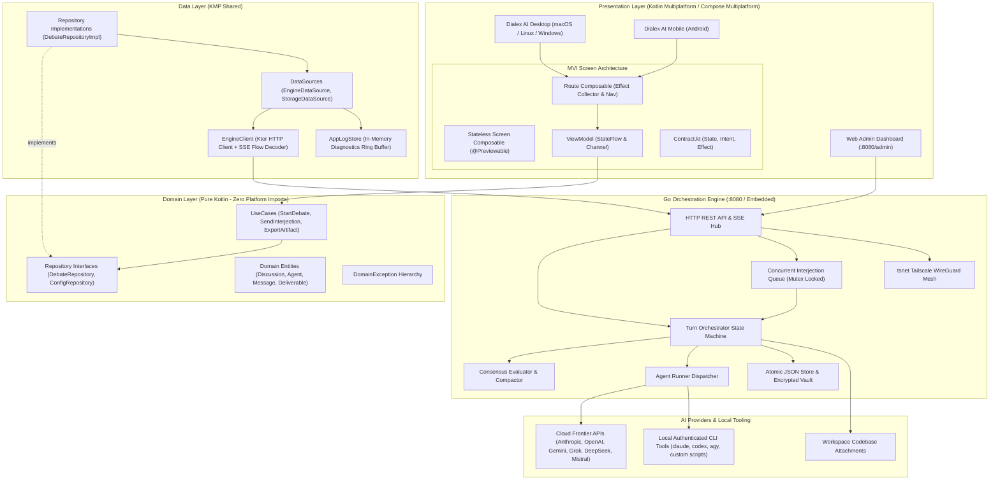
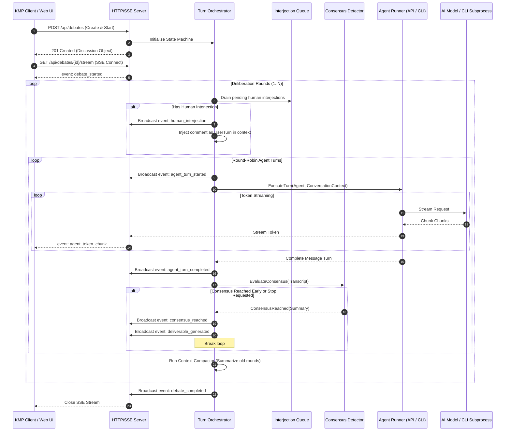

# Dialex AI System Architecture & Technical Design

## 1. Architectural Philosophy & Overview

**Dialex AI** is designed as a sovereign, multi-agent adversarial deliberation and consensus platform. Unlike traditional single-model chatbots or naive multi-agent wrappers that merely chain prompts sequentially, Dialex AI provides a deterministic state-machine orchestrator that pits competing frontier AI models against one another in structured, multi-round dialectic deliberations.

The system is structured around three foundational architectural tenets:
1. **Clean Architecture with Strict Layer Boundaries**: Unidirectional data flow where business logic (`domain`) has zero platform or framework dependencies, UI layers (`presentation`) are purely declarative and reactive (MVI), and data ingestion (`data`) isolates external protocols and platform exceptions.
2. **Dual-Engine Topology**: A decoupled architecture pairing a high-throughput **Go Orchestration Engine** (handling concurrent API streaming, CLI process management, state persistence, consensus evaluation, and headless server hosting) with a cross-platform **Kotlin Multiplatform (KMP) & Compose Multiplatform** client (providing native desktop, mobile, and web user experiences).
3. **Resilient Deliberation State Machine**: Turn-by-turn round-robin scheduling with real-time SSE streaming, live human interjections, dynamic context compaction, token budgeting, and pluggable consensus detection algorithms.

---

## 2. High-Level Topology & Data Flow



---

## 3. Presentation Layer & MVI Pattern

Dialex strictly enforces Model-View-Intent (MVI) throughout all client modules (`shared/src/commonMain/kotlin/com/dialex/presentation/`).

### 3.1 The Contract Structure
Every screen owns a single `Contract.kt` file defining three sealed constructs:
```kotlin
// Contract.kt
data class ScreenState(
    val discussion: Discussion? = null,
    val isLoading: Boolean = false,
    val activeAgentIndex: Int = 0,
    val participants: ImmutableList<Agent> = persistentListOf(),
    val tokenUsage: TokenUsageSummary = TokenUsageSummary.Zero,
    val error: String? = null
)

sealed interface ScreenIntent {
    data class StartDiscussion(val config: DebateConfig) : ScreenIntent
    data class SubmitInterjection(val text: String, val immediateInterrupt: Boolean) : ScreenIntent
    data class GenerateDeliverable(val format: DeliverableFormat) : ScreenIntent
    data object StopDiscussion : ScreenIntent
}

sealed interface ScreenEffect {
    data class NavigateTo(val route: String) : ScreenEffect
    data class ShowSnackbar(val message: String, val isError: Boolean = false) : ScreenEffect
    data class OpenArtifactViewer(val artifactId: String) : ScreenEffect
}
```

### 3.2 Immutability & Compose Recomposition
To prevent superfluous Compose recompositions:
- All collection fields in `State` (`List`, `Map`, `Set`) MUST use `kotlinx.collections.immutable` types (`ImmutableList`, `ImmutableMap`, `ImmutableSet`).
- Standard `kotlin.collections` are forbidden inside `State`.

### 3.3 Separation of Route and Screen
Dialex screens are split into two composable tiers:
1. **The Route Composable** (e.g. `ChatRoute`):
   - Instantiates or injects the `ViewModel`.
   - Collects `state` via `collectAsStateWithLifecycle()`.
   - The **only** collector of the `Effect` channel via `LaunchedEffect`.
   - Handles navigation transitions directly on the `Navigation 3` back stack.
2. **The Screen Composable** (e.g. `ChatScreen`):
   - Completely stateless.
   - Accepts only `state: ScreenState`, `onIntent: (ScreenIntent) -> Unit`, and resolved callback lambdas.
   - Never references a `ViewModel`, back stack, or raw `Flow`.
   - Annotated with `@Preview` and previewable with mock data in `commonMain`.

---

## 4. Domain Layer & Clean Architecture

The `domain` layer represents the enterprise business rules and is platform-agnostic:
- **Zero Platform Imports**: No `android.*`, `androidx.compose.*`, `java.*`, or platform-specific libraries.
- **Strict Hierarchy**:
  ```
  ViewModel → UseCase → Repository (Interface) → RepositoryImpl → DataSource → Originator
  ```
- **No Same-Layer Coupling**:
  - A `UseCase` never invokes another `UseCase`.
  - A `RepositoryImpl` never depends on another `Repository`.
  - A `DataSource` never calls a sibling `DataSource`.
  - Shared domain helper logic is extracted into plain Kotlin classes or top-level functions without suffixes.
- **Exception Mapping**:
  - Network errors (Ktor `HttpRequestException`), I/O errors, or JSON parsing failures are captured at the `DataSource` boundary and translated into strongly typed `DomainException` instances (`DomainException.NetworkError`, `DomainException.Unauthorized`, `DomainException.RateLimited`).
  - No raw external exceptions propagate into `domain` or `presentation`.

---

## 5. Go Orchestration Engine Architecture

The Go engine (`dialex-engine/`) is the heart of Dialex's deliberation coordination. It can be compiled as a standalone daemon, hosted inside Docker, or run as a local child process managed by the desktop GUI.



### 5.1 Concurrency & Race-Free Turn Execution
- **Mutex-Protected Discussion Engine**: Each active debate session has a dedicated Go goroutine bounded by a thread-safe mutex and cancellation context (`context.WithCancel`).
- **Live Interjection Queue**: Comments submitted by humans while agents are generating are pushed to a thread-safe FIFO queue (`sync.Mutex`). The orchestrator checks this queue between turns and incorporates user input without resetting round state.
- **Immediate Interrupts**: When an interrupt request arrives (`POST /api/debates/{id}/interrupt`), the active turn's context is canceled immediately (`cancelFunc()`), the partial response is cleanly finalized, and the user's interjection is inserted as the immediate next turn.

### 5.2 Consensus Detection Engine
Dialex features dynamic multi-agent consensus detection:
1. **Lexical Agreement Trigger**: Scans responses for explicit confirmation phrases (`AGREED:`, `CONSENSUS:`, `I concur with the architecture proposed by...`).
2. **Deterministic Vote Matrix**: Each agent can be prompted to cast an explicit programmatic vote or confidence score ($0.0 - 1.0$) on the active proposal.
3. **Compaction & Synthesis**: Upon reaching consensus threshold (or max rounds), a dedicated **Moderator Consensus Outcome Bubble** is generated with:
   - 🎯 **Bottom-Line Outcome**: 1–2 crisp sentences answering the core topic.
   - 🤝 **Key Consensus Points**: Concise bullet points of common agreement.
   - ⚠️ **Critical Caveats & Trade-offs**: Key trade-offs or constraints.

---

## 6. Security, Keystore & Subprocess Sandboxing

### 6.1 Credential Protection
- **AES-256-GCM Vault**: When running in self-hosted or daemon mode, API keys are stored in an encrypted vault (`dialex.vault`) with keys derived via Argon2id.
- **Android Keystore & EncryptedSharedPreferences**: On mobile devices, keys are anchored to the hardware security module (TEE/StrongBox).
- **Subprocess Sanitization**: When running local CLI agents (`claude`, `codex`, `antigravity`), child process environments are strictly scrubbed of master system variables, parent bash histories, and extraneous authentication tokens.

### 6.2 Terminal Execution Governance
When debates produce executable shell snippets or run with codebase tool capabilities, Dialex enforces three governance tiers:
1. **Require Approval (Default)**: Generates an interactive approval card in the UI. The command will NOT execute until the user reviews the exact command string and clicks "Approve".
2. **Safe Commands Only**: Automatically permits non-destructive inspection operations (`git status`, `git diff`, `ls`, `cat`, `grep`, `find`), while holding modifying operations (`rm`, `mv`, `git commit`, `curl`, `chmod`) for manual approval.
3. **Autonomous Execution**: Runs commands directly in an isolated pseudo-terminal, returning stdout/stderr back into the debate context.

---

## 7. Networking & Mesh Topology (Tailscale)

Dialex supports seamless peer-to-peer remote deliberation through integrated **Tailscale WireGuard mesh networking** via Go's `tsnet` library:
- When enabled (`TSNET_HOSTNAME=dialex`), the Go engine logs in directly to your private Tailscale Tailnet.
- **Zero Open Ports**: The engine requires zero public firewall openings, port forwards, or public domain DNS.
- **Mutual WireGuard Authentication**: Only authorized devices on your Tailnet (e.g. your Android phone running Dialex AI Mobile or your laptop) can communicate with the server over MagicDNS (`http://dialex:8080`).

---

## 📄 License

Dialex AI is licensed under the [PolyForm Noncommercial License 1.0.0](file:///LICENSE).
Copyright (c) 2026 Kolta Labs. Free for personal, academic, and noncommercial research. Commercial deployments require an enterprise license from Kolta Labs.
