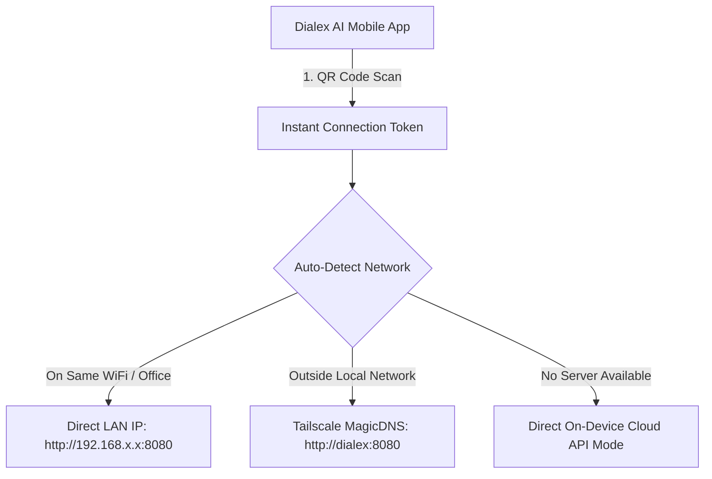

# Client Setup, Packaging & Native Installers Guide — Dialex AI

This guide details configuring, building, running, and installing the **Dialex AI client applications**, built with **Kotlin Multiplatform (KMP)** and **Compose Multiplatform**.

---

## 1. Client Topology & Target Platforms

Dialex AI shares over 90% of its UI, state management, and business logic in the `shared` module, delivering tailored native experiences across platforms:

| Platform | Target Name | Binary / Installer Format | UI Engine | Key Capabilities |
|---|---|---|---|---|
| **macOS** | Dialex AI Desktop | `.dmg` installer, `.app` bundle, Homebrew Cask | Compose Multiplatform (Skia / Metal) | Master-detail IDE, window double-click maximize, traffic light insets, sliding artifacts drawer |
| **Windows** | Dialex AI Desktop | `.msi` native installer, `.exe` standalone | Compose Multiplatform (Skia / DirectX) | Windows Start Menu integration, hotkeys, drag-and-drop codebase attachments |
| **Linux** | Dialex AI Desktop | `.AppImage` (portable), `.deb` (Debian/Ubuntu), `.rpm` | Compose Multiplatform (Skia / OpenGL) | Portable double-click AppImage, system tray minimization, Wayland/X11 |
| **Android** | Dialex AI Mobile | `.apk` package, Google Play Store / F-Droid | Compose Multiplatform (Android Target) | Radial Stadium Arena, hold-to-speak voice intake, native TTS audio briefings, 1-tap QR pairing |

---

## 2. No-Terminal 1-Click Installation (End-Users)

If you are an end-user and do **not** want to use terminal commands or build from source:

### 🍎 macOS Installation (.dmg)
1. Download the latest `DialexAI-macOS-arm64.dmg` (Apple Silicon M1/M2/M3/M4) or `DialexAI-macOS-x64.dmg` (Intel).
2. Double-click the downloaded `.dmg` file.
3. Drag **Dialex AI** into your `/Applications` folder.
4. Launch Dialex AI from Spotlight or Launchpad. The app will automatically launch its embedded Go engine on startup with zero setup.

### 🪟 Windows Installation (.msi / .exe)
1. Download `DialexAI-Setup-x64.msi`.
2. Double-click the installer and follow the setup wizard.
3. Launch **Dialex AI** from the Start Menu or Desktop shortcut.

### 🐧 Linux Installation (.AppImage / .deb)
- **Portable AppImage**: Download `DialexAI-x86_64.AppImage`, make it executable (`chmod +x DialexAI-*.AppImage` or right-click &rarr; Properties &rarr; Allow executing file as program), and double-click to launch.
- **Debian / Ubuntu**: Download `dialex-ai_amd64.deb` and double-click to install via Software Center (or `sudo dpkg -i dialex-ai_amd64.deb`).

### 📱 Android Installation (.apk)
1. Download `DialexAI-Mobile-release.apk`.
2. Open the APK on your Android device and tap **Install**.
3. Launch Dialex AI Mobile. Tap the QR scanner icon on the welcome screen to pair with your Desktop app or home server in one tap.

<div align="center">
  
  <p><em>Figure 2.1: First-launch Engine Connection Setup screen with In-Device Solo mode vs Remote Server connection.</em></p>
</div>

---

## 3. Developer Build & Packaging from Source

### 3.1 Prerequisites & The KoltLibs Dependency

> [!IMPORTANT]
> **Dialex AI requires the Kolt Ecosystem (`KoltLibs`) via a Gradle Composite Build.**  
> If you are building from source, you must clone `KoltLibs` as a sibling directory in the same parent folder.

```bash
# 1. Create a parent workspace directory
mkdir -p ~/Workspace && cd ~/Workspace

# 2. Clone Kolt
git clone https://github.com/Kolta-Labs/Kolt.git

# 3. Clone DialexAI alongside Kolt
git clone https://github.com/Kolta-Labs/DialexAI.git

# 4. Verify directory layout:
# ~/Workspace/
#   ├── Kolt/ (or KoltLibs/)
#   └── DialexAI/
```

- **Java Development Kit (JDK)**: Version `17` or `21` (JDK 21 LTS strongly recommended).
- **Android SDK & NDK** (only for compiling Dialex AI Mobile):
  - Set `ANDROID_HOME` or specify `sdk.dir` in `local.properties`:
    ```properties
    sdk.dir=/Users/<username>/Library/Android/sdk
    ```
- **Go 1.22+** (only if compiling or modifying the Go engine from source).

### 3.2 Running Desktop in Development Mode
```bash
cd ~/Workspace/DialexAI

# Start the native Desktop GUI (automatically spawns local Go engine)
./gradlew :desktopApp:run
```

To point the desktop app to a remote or self-hosted server:
```bash
DIALEX_ENGINE_URL="http://192.168.1.100:8080" ./gradlew :desktopApp:run
```

### 3.3 Packaging Native Installers
Compose Multiplatform includes built-in Gradle packaging tasks to produce native installation bundles with an embedded runtime:

```bash
# macOS: Generates DMG and .app bundle in desktopApp/build/compose/binaries/main/dmg/
./gradlew :desktopApp:packageDmg

# Linux: Generates .deb or .rpm packages
./gradlew :desktopApp:packageDeb
./gradlew :desktopApp:packageRpm

# Windows: Generates .msi installer or .exe package
./gradlew :desktopApp:packageMsi
./gradlew :desktopApp:packageExe
```

---

## 4. Dialex AI Mobile (Android) Setup

The mobile client lives in `:androidApp` with its main entry point at `androidApp/src/androidMain/kotlin/com/dialex/android/MainActivity.kt`.

### 4.1 Compiling and Installing Debug APK
```bash
# Build the debug APK
./gradlew :androidApp:assembleDebug

# Install to connected device or emulator via adb
./gradlew :androidApp:installDebug
```

The APK will be located at:
`androidApp/build/outputs/apk/debug/androidApp-debug.apk`

---

### 4.2 Mobile Pairing & Connectivity Modes

Dialex AI Mobile connects to your desktop or self-hosted server via three modes:



1. **Instant QR Code Pairing**: Open Desktop app or Web Admin (`Settings > Mobile Pairing`), and scan the QR code using Dialex AI Mobile. Credentials, server URL, and TLS certificates are configured in one tap.
2. **Smart Away Mode**: When leaving home WiFi, Dialex AI Mobile seamlessly transitions from LAN IP to Tailscale WireGuard MagicDNS without dropping ongoing debate streams.
3. **Voice Dilemma Intake & Audio Briefings**:
   - Hold the microphone button in Dialex AI Mobile to dictate a debate dilemma.
   - Tap the audio speaker icon on the Moderator Outcome Bubble to listen to executive summaries generated via native Android Text-to-Speech (TTS).

<div align="center">
  
  <p><em>Figure 4.1: Mobile Companion Pairing modal with 1-tap QR scanning and Tailscale (tsnet) zero-port mesh toggle.</em></p>
</div>

---

## 5. Client Logging, Diagnostics & Settings

Dialex AI features an in-memory, thread-safe diagnostics ring buffer (`AppLogStore`) designed for zero-overhead real-time monitoring and crash analysis:
- Records HTTP request/response payloads, SSE token chunk deltas, and state machine transitions.
- Stores the most recent **1,000 events** in a circular memory buffer.
- Inspectable live in the UI under **Settings &gt; Logs** with filterable search and one-click JSON clipboard export.

<div align="center">
  
  <p><em>Figure 5.1: General Settings, Dark/Light Appearance theming, and PolyForm Noncommercial License 1.0.0 legal notice.</em></p>
</div>

---

## 📄 License

Dialex AI is licensed under the [PolyForm Noncommercial License 1.0.0](file:///LICENSE).  
Copyright (c) 2026 Kolta Labs. Free for personal, academic, and noncommercial research. Commercial deployments require an enterprise license from Kolta Labs.
