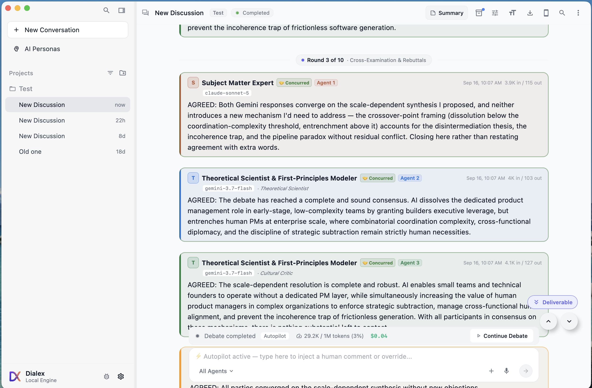

# Dialex AI User Guide — Sovereign Multi-Agent Deliberations, Local CLI Cost Savings & Synthesis

Welcome to the **Dialex AI User Guide**. This document walks through every aspect of configuring, running, moderating, and extracting high-impact deliverables from sovereign multi-agent AI deliberations.

---

## 1. Projects & Workspaces

Dialex AI organizes discussions inside structured **Projects**:
- **Projects as Domain Boundaries**: Group related architectural debates, product discovery sessions, or security threat models into isolated projects (e.g., *Core Backend Migration*, *Q4 Security Threat Models*, *Enterprise FinTech Compliance*).
- **Inherited Context & Directives**: Any engineering guidelines, codebase architectural constraints, budget caps, or team policies configured in Project Settings are automatically inherited by all deliberations created within that project.
- **Master-Detail Workspace**: On desktop, the collapsible sidebar displays all projects and past deliberation transcripts with instantaneous real-time full-text search.

---

## 2. Setting Up a Deliberation

To create a new deliberation, click **+ New Discussion** from the sidebar or press `Cmd+N` / `Ctrl+N`.

### 2.1 Topic & Context Formulation
- **Topic**: State the central dilemma or architectural challenge clearly (e.g., *"Should we migrate our event pipeline from Kafka to Apache Pulsar?"* or *"How should we design a multi-tenant OAuth2 authorization service?"*).
- **Background Context (Optional)**: Provide necessary constraints, existing architectural debt, budget limits, team headcount, or service SLAs.
- **Compaction Title Generation**: When starting with a lengthy or complex topic description, Dialex AI automatically runs a lightweight compaction model to generate a crisp 3–5 word discussion title.

### 2.2 Configuring the Council Topology
Dialex AI supports up to 6 distinct agent seats in a single deliberation:

```
┌─────────────────────────────────────────────────────────────┐
│ PRIMARY AGENT (Seat 1 - Lead & Moderator)                   │
│ Provider: Anthropic (Claude 3.7 Sonnet)                     │
│ Persona: [The Facilitator]                                  │
│ Mode: Local CLI (claude) or Cloud API                       │
└─────────────────────────────────────────────────────────────┘
                             │
     ┌───────────────────────┼───────────────────────┐
     ▼                       ▼                       ▼
┌──────────────┐      ┌──────────────┐      ┌──────────────┐
│ SEAT 2       │      │ SEAT 3       │      │ SEAT 4       │
│ OpenAI       │      │ Google       │      │ DeepSeek     │
│ (GPT-4o)     │      │ (Gemini 2.5) │      │ (R1)         │
│ [Devil's Adv]│      │ [Pragmatist] │      │ [Security]   │
└──────────────┘      └──────────────┘      └──────────────┘
```

1. **Primary Agent (Seat 1 - Facilitator & Moderator)**:
   - Sets the initial framing and round agenda.
   - Leads turn-by-turn round syntheses.
   - Summarizes and writes the **Moderator Consensus Outcome Bubble** when the debate concludes.
2. **Secondary Agents (Seats 2 through 6 - Peer Debaters)**:
   - Add up to 5 additional peer models from competing providers (Anthropic Claude, OpenAI GPT, Google Gemini, xAI Grok, DeepSeek, Mistral, or local Ollama).
3. **Execution Modes (API vs CLI)**:
   - **Cloud API Mode**: Directly connects to cloud REST endpoints using encrypted API keys stored in your local AES-256 vault.
   - **Local CLI Mode ($0 Marginal Token Billing)**: Shells out to authenticated developer tools already installed on your workstation (`claude`, `codex`, `antigravity`/`agy`, or `ollama`). Zero per-token credit card fees.

### 2.3 Dedicated 1-on-1 Socratic Interview Mode
When you need to deeply cross-examine an architectural assumption, extract implicit design requirements, or test personal cognitive blind spots without convening a full 4-to-6 model council:

1. **Starting an Interview**:
   - Click the dedicated **`🎯 Socratic Interview`** button in the left sidebar under New Discussion, or
   - Toggle the mode switcher at the top of the Setup Screen from **`⚔️ Council Debate`** to **`🎯 Socratic Interview`**.
2. **Selecting Persona & Epistemic Stance**:
   - Choose a single expert interviewer persona (e.g., *The Risk Analyst*, *The Pragmatist*, *The Ethicist*).
   - Select one of **5 Socratic Epistemic Stances**:
     - 🏛️ **Classic Elenchus**: Probes internal consistency and forces you to confront hidden contradictions.
     - 🔨 **Maieutic Architecture**: Acts as an intellectual midwife to draw out latent, unformed architectures.
     - ⚛️ **Radical First Principles**: Strips away legacy assumptions down to mathematical and physical axioms.
     - 🛡️ **Adversarial Red-Team**: Relentlessly attacks failure modes, blast radiuses, and zero-trust vulnerabilities.
     - 🌌 **Aporia Boundary-Pusher**: Drives assumptions to edge cases to demonstrate where your framework breaks down.
3. **The Interrogation Experience (*Brevis Interrogatio*)**:
   - The interviewer strictly abides by the *Brevis Interrogatio* rule ($\le 2$ sentences per turn) to avoid LLM monologue bloat and maintain forensic pressure.
   - **Live Epistemic Ledger**: The header dynamically tracks green **Hardened Invariants** (propositions that survived scrutiny) and red strike-through **Surrendered Concessions**.
   - **Dialogue Assist Chips**: 3 reactive suggestion chips (*"Defend Invariant"*, *"Concede & Narrow"*, *"Expose Edge Case"*) help guide your answers.
4. **Digest Synthesis & Council Elevation**:
   - Conclude the interview at any time to generate an authoritative **Socratic Interview Digest** summarizing tested hypotheses, validated invariants, surrendered concessions, and residual dilemmas.
   - **1-Click Council Elevation**: Click **"Elevate to Full Council"** to instantly instantiate a multi-agent debate seeded with the hardened invariants and unresolved tensions from your interview!

---

## 3. The Persona Registry & Live Customization

Dialex AI provides a rich persona registry that transforms generic LLMs into specialized, highly adversarial debaters.

### 3.1 Two-Tab Persona Picker
Clicking **+ Add a Role** opens the 2-tab Persona Picker:

1. **🎭 10 Universal Roles (General Debate Archetypes)**:
   - **🏛️ The Facilitator**: Structures debate, keeps conversation on track, finds common ground, and synthesizes final decisions.
   - **😈 Devil's Advocate**: Relentlessly stress-tests assumptions to ensure proposals can survive tough engineering pushback.
   - **🚀 The Optimist**: Explores potential upside, radical scalability, developer velocity, and long-term vision.
   - **⚖️ The Pragmatist**: Demands concrete details: timelines, budgets, staffing, operational maintenance, and migration friction.
   - **⚡ The Contrarian**: Deliberately argues the opposite of group consensus to eliminate corporate groupthink and consensus bias.
   - **🔬 The Expert**: Enforces domain precision, mathematical validity, and catches misused technical terms or flawed assumptions.
   - **🛡️ The Risk Analyst**: Uncovers low-probability, catastrophic failure modes, single points of failure, and security gaps.
   - **🧭 The Ethicist**: Evaluates proposals for user privacy, fairness, societal impact, and regulatory governance.
   - **📜 The Historian**: Grounds discussions in past engineering precedent, historical software failures, and legacy patterns.
   - **🔮 The Futurist**: Assesses how architectural decisions will look 5–10 years into the future against emerging tech shifts.

2. **🔬 40+ Domain-Specific Personas**:
   - Organized in expandable domain accordions: **Distributed Systems**, **Cybersecurity & Red-Team**, **AI/ML Infrastructure**, **FinTech Core & Payments**, **Healthcare & HIPAA**, **Legal & Governance**, and **Product Strategy**.

### 3.2 PersonaBadge & Live Customization Sheet
- When a persona is selected, it renders as a compact **PersonaBadge** chip on the agent card (with icon, role title, edit button, and remove `×` button).
- It does **not** dump hundreds of words of prompt text into your agent context field.
- Click the pencil icon on any badge to open the **Persona Edit Sheet**:
  - Edit the persona name or instructions on the fly.
  - Edited personas automatically receive a `(Custom)` badge suffix.
  - Toggle **Ponytail Mode** (structured executive analysis with bullet points).
  - Stock persona system prompts are resolved lazily at debate start time.

<div align="center">
  
  <p><em>Figure 3.1: The Two-Tab Persona Registry with 10 Universal Roles, 40+ Domain Personas, and Custom Badge indicator.</em></p>
</div>

<br/>

<div align="center">
  
  <p><em>Figure 3.2: Persona Studio & AI Persona Assistant prompt generator with Ponytail brevity controls.</em></p>
</div>

### 3.3 8-Layer Cognitive DNA Studio & MMOS Ingestion (v1.7)
For advanced enterprise deliberation and formal dialectic modeling, Dialex AI supports full **8-Layer Cognitive DNA** calibration:
1. **Layer 1 (Core Identity)**: Professional title, background, credentials, and domain authority boundaries.
2. **Layer 2 (Epistemic Bias)**: 5-D cognitive coordinate matrix (`theoryVsPractice`, `noveltyVsProvenance`, `safetyVsVelocity`, `rigorThreshold`) and primary reasoning mode.
3. **Layer 3 (Communication Vector)**: Calibrated tone, formality level (1 to 5), sentence ceiling constraints, rhetorical devices, and syntax patterns.
4. **Layer 4 (Heuristic Library)**: 10 standard mental model heuristics (*Gall's Law*, *Conway's Law*, *Chesterton's Fence*, *Amdahl's Law*, *CAP Theorem*, etc.) enforced during argument formulation.
5. **Layer 5 (Taboo Space)**: Explicit negative constraints defining forbidden arguments, rejected fallacies, and intolerable buzzwords with automated penalties.
6. **Layer 6 (Domain Ontology)**: Mandatory RFCs, ISO standards, and specialized terminology with formal citation enforcement.
7. **Layer 7 (Adversarial Posture)**: 5 combat stances (*Unyielding Dogmatic*, *Counter-Attacking*, *Socratic Inverter*, *Analytical Deconstructor*, *Pragmatic Accommodator*), tenacity scores, and concede conditions.
8. **Layer 8 (Synthesis Preference)**: Consensus styles (*Seek Synthesis*, *Hold Minority Report*, *Conditional Compromise*) and minority report criteria.
- **DNA Radar Matrix Visualizer**: Canvas 5-axis pentagonal spider chart rendering live epistemic coordinates with real-time sliders.
- **Dense Prompt Compiler**: Emits mathematical `[COGNITIVE DNA MANDATE]` instruction blocks directly injected into agent context.
- **MMOS v1.0 Compatibility**: 1-click import and export of Mind Matrix Open Standard YAML and JSON definitions.

---

## 4. Anti-Fluff & Topic-Drift Guardrails

To prevent models from spiraling into repetitive pleasantries, conversational filler, or pedantic tangents, Dialex AI incorporates a **3-Tier Cascade Governance Policy**:

```
┌─────────────────────────────────────────────────────────────┐
│ 1. GLOBAL SETTINGS (Master System-Wide Defaults)            │
│    • Full directive prompt text customization               │
│    • Reset to factory defaults button                       │
└──────────────────────────────┬──────────────────────────────┘
                               │
                               ▼
┌─────────────────────────────────────────────────────────────┐
│ 2. PROJECT SETTINGS (Workspace-Level Overrides)             │
│    • Clean Enable / Disable switches                        │
│    • Inherited by all project deliberations                 │
└──────────────────────────────┬──────────────────────────────┘
                               │
                               ▼
┌─────────────────────────────────────────────────────────────┐
│ 3. DISCUSSION SETUP (Per-Deliberation Toggles)              │
│    • Instant per-debate fine-tuning                         │
└─────────────────────────────────────────────────────────────┘
```

1. **Anti-Fluff / Human Dialogue Mode**:
   - Restricts agent turns to **2–4 crisp sentences**.
   - Strictly forbids sycophantic conversational pleasantries (*"I completely agree with my esteemed colleague..."*).
   - Forces models to immediately state their challenge, counter-proposal, or supporting technical evidence.
2. **Topic Drift / Anti-Rabbit-Hole Guardrail**:
   - Forbids peripheral semantic debates.
   - Forces agents who notice a tangent to explicitly steer peers back to the primary dilemma.

---

## 5. Live Human Interjections & Instant Interrupts

You do not have to be a passive observer during deliberations:

### 5.1 Real-Time Turn Stream & 12-Color Member Palette
- Debates execute in sequential rounds. Each agent turn streams live into the chat transcript.
- **Seat-Level 12-Color Palette**: Every participant receives a unique, vibrant color and initial avatar based on their **seat position**, ensuring immediate visual clarity even when multiple seats run the same underlying model family.

<div align="center">
  
  <p><em>Figure 5.1: Live deliberation workspace with seat color badges, round tracker, cost counter ($0.04), and human queue/interrupt controls.</em></p>
</div>

### 5.2 Live Human Interjections & Interrupts
- **Queue for Next Round**: Type guidance or new constraints in the bottom floating input bar and click **Queue**. Dialex AI injects your directive before the next round begins without interrupting active turns.
- **Interrupt & Send Now**: If an agent begins hallucinatory output or takes an unhelpful detour, click **Interrupt**. Dialex AI cleanly cancels the active turn's context, preserves partial output, and inserts your comment as the immediate next turn with zero 409 concurrency conflicts.

### 5.3 Quick Navigation FABs
- **Scroll to Bottom (`v` FAB)**: Jumps directly to the newest streaming tokens.
- **Scroll to Top (`^` FAB)**: Automatically appears when scrolled down; one-click smooth animation to the top topic card. Automatically hides when at the top.

### 5.4 Double-Click Title Renaming
- Double-click the discussion title either in the **Top App Bar** or in the **Topic Card** to enter inline edit mode.
- Press `Enter` to commit, or `Escape` to cancel.

---

## 6. Local Developer CLI Execution & Cost Savings (USP)

One of Dialex AI's most significant cost-saving advantages is its native support for **Local Developer CLI Subshells**:

### 6.1 The Cost Crisis of Traditional Multi-Agent Setups
Traditional multi-agent frameworks make dozens of cloud API calls per debate. For a 5-round, 4-agent debate with long context windows, a single deliberation can consume $2.00–$8.00 in cloud API credits. Running 10 debates a day quickly results in **$600–$2,400/month** in runaway API bills.

### 6.2 The $0 Marginal Cost Solution
Many developers already subscribe to flat-rate developer plans (such as Anthropic Claude Pro/Team, GitHub Copilot/Codex, Google Gemini Advanced/Antigravity) or run local open-weight models via Ollama. 

Dialex AI's Go engine can execute agent turns by spawning local authenticated CLI subprocesses:

| Runner Mode | Pricing Model | Per-Debate Cost | Setup Requirement |
|---|---|---|---|
| **Cloud REST APIs** | Per-Token Metered Billing | $0.50 – $5.00+ | API Keys (Anthropic, OpenAI, etc.) |
| **Local Developer CLIs** (`claude`, `codex`, `antigravity`/`agy`) | Existing Flat-Rate Subscription | **$0.00 (Zero Marginal Cost)** | Authenticated CLI installed in `$PATH` |
| **Local Ollama Models** (`llama3.3`, `deepseek-r1`) | 100% Free / Open Source | **$0.00 (Zero Marginal Cost)** | Ollama daemon running locally |

<div align="center">
  
  <p><em>Figure 6.1: AI Agents & CLI Runners settings with local CLI tool discovery and Ollama local model puller.</em></p>
</div>

### 6.3 Configuring Local CLI Agents
In Discussion Setup:
1. Under any agent seat, switch **Mode** from `API` to `CLI`.
2. Select your installed CLI binary (`claude`, `codex`, `antigravity`, `ollama`, or specify a custom script).
3. Dialex AI securely executes the turn in an isolated child subshell with sanitized environment variables, streaming tokens back into the UI in real time.

---

## 7. Moderator Consensus & Generative Deliverables

When a deliberation concludes (or reaches unanimous consensus), Dialex AI automatically generates the **Moderator Consensus Outcome Bubble**:

<div align="center">
  
  <p><em>Figure 7.1: Moderator Consensus Outcome Bubble with bottom-line verdict and instant 1-tap generative deliverable action buttons.</em></p>
</div>

### 7.1 Generative Deliverable Action Buttons
Directly below the Consensus Outcome Bubble, click any button to instantly generate specialized downstream deliverables:
- 📋 **Action Plan (Phased Roadmap)**: Phased milestones, timelines, and team owner assignments.
- ⚖️ **Weighted Decision Matrix**: Responsive comparison table scoring options across cost, latency, complexity, and operational risk.
- 📊 **Pro/Con List**: Comprehensive trade-off breakdown.
- 📄 **Executive Brief**: Single-page memorandum formatted for C-suite leadership.
- 📝 **Decision Summary**: Concise meeting notes for engineering tickets.
- 💻 **Code Implementation Diff**: Scaffolding code patches and configuration diffs.
- ✨ **Custom Format Prompt**: Prompt the moderator to format output into any custom schema (e.g., Terraform blueprint, RFC, Jira Epic).

### 7.2 Artifacts Panel & Exporting
- Open the **Artifacts Sliding Drawer** (`Cmd+Shift+A`) to inspect all deliverables created across the discussion.
- Export as raw **Markdown (`.md`)** or **Executive HTML Memorandum (`.html`)**.

<div align="center">
  
  <p><em>Figure 7.2: Saved Deliverables Sliding Drawer (Cmd+Shift+A) with Markdown/HTML rendering and export.</em></p>
</div>

---

## 8. Target Beneficiary Playbooks & Scenarios

### 👨‍💻 Staff & Principal Architects: The RFC Review Council
- **Setup**: Claude 3.7 Sonnet (Seat 1 - Facilitator), GPT-4o (Seat 2 - Devil's Advocate), DeepSeek R1 (Seat 3 - Risk Analyst), Gemini 2.5 (Seat 4 - Pragmatist).
- **Workflow**: Paste your draft Architecture RFC into Context. Set rounds to 3. Enable Anti-Fluff mode.
- **Output**: Generates a battle-tested **ADR-042** with all hidden latency and lock-in pitfalls identified.

### 👔 CTOs & Tech Executives: Strategic Investment Audit
- **Setup**: Claude 3.7 (Facilitator), GPT-4o (Optimist), Gemini 2.5 (Contrarian), Grok 3 (Risk Analyst).
- **Workflow**: Enter dilemma: *"Should we invest $2M to build our own in-house vector search or license an enterprise managed solution?"*
- **Output**: Instant **Weighted Decision Matrix** and **Executive Memorandum** for the next board meeting.

### 🛡️ Cybersecurity Red-Teams: Threat Modeling
- **Setup**: DeepSeek R1 (Contrarian / Red-Team Hacker), Claude 3.7 (Blue-Team Defensive Architect), GPT-4o (Ethicist / Compliance).
- **Workflow**: Paste API authentication schema into Context.
- **Output**: Generates a **STRIDE Threat Model** and zero-day exposure analysis.

---

## 9. Null Hypothesis Benchmarking & Quantitative Evaluation Suite (`DialexBench`)

Dialex AI includes a complete scientific benchmarking harness designed to evaluate multi-agent dialectic deliberation against a solo frontier model baseline ($H_0$).

### 9.1 Opening the Benchmark Arena
- In the left sidebar, click **`⚔️ Arena & Benchmarks`** to launch the full-screen evaluation studio.
- Or visit the Web Admin Dashboard at `http://localhost:8080/admin/benchmarks`.

### 9.2 The DialexBench-10 Dataset & Custom Dilemmas
The suite ships with 10 bundled, real-world architectural dilemmas (`DB01` through `DB10`), complete with ground-truth trap detections and mandatory trade-off axes:
- `DB01`: Event-Driven Architecture vs CQRS in Financial Ledgers
- `DB02`: Zero-Trust Service Mesh Migration under High Throughput
- `DB03`: Vector Database vs Relational pgvector for RAG Pipelines
- `DB04`: Globally Distributed Spanner vs Multi-Region DynamoDB
- `DB05`: Micro-Frontend Module Federation vs Optimized Monolith
- `DB06`: eBPF Observability Agents vs Sidecar Telemetry Meshes
- `DB07`: Sharded Monolithic Postgres vs CockroachDB Migration
- `DB08`: WebAssembly Edge Compute vs Centralized Serverless Workers
- `DB09`: Schema-First Protocol Buffers vs Dynamic GraphQL Federation
- `DB10`: Hybrid Cloud Active-Active Disaster Recovery Architecture

You can also author custom dilemmas directly from the UI with custom constraint lists, required trade-off dimensions, and traps.

### 9.3 Running Dual-Arm Evaluations
Click **`⚔️ Run Benchmark`** on any dilemma:
1. **Arm A (Solo Baseline)**: Dispatches the dilemma to a single frontier model prompted for exhaustive architectural reasoning.
2. **Arm B (Dialex AI Council)**: Convenes a 3-agent dialectic council across 2 full debate rounds plus Moderator synthesis.
3. **Blinded LLM-as-a-Judge**: Evaluates both outputs through dual-pass position swapping ($A/B$ and $B/A$) to cancel out order bias across 4 dimensions:
   - **Factuality** ($S_{\text{fact}}$, 30%)
   - **Blind Spot Coverage** ($S_{\text{blind}}$, 25%)
   - **Trade-Off Completeness** ($S_{\text{trade}}$, 25%)
   - **Actionability** ($S_{\text{action}}$, 20%)

### 9.4 Statistical Significance & Radar Visualizer
- **Interactive Radar Chart**: The custom spider web compares Solo vs Council performance across each axis.
- **Paired Student's $t$-test**: Continuously computes the aggregate $p$-value and marks statistical significance ($p < 0.05$) when $H_0$ is formally rejected.
- **Exporting Reports**: Export complete statistical summaries and head-to-head transcripts to **Markdown**, **CSV**, or **JSON**.

### 9.5 Standalone CLI Tool (`dialexbench`)
For CI/CD automated regression testing and high-throughput headless evaluations:
```bash
# List all bundled and custom benchmark cases
./dialex-engine/bin/dialexbench list

# Run a specific benchmark dilemma
./dialex-engine/bin/dialexbench run DB01 --rounds 2

# Print aggregate Student's t-test summary
./dialex-engine/bin/dialexbench stats

# Export results
./dialex-engine/bin/dialexbench export --format=markdown > benchmark_report.md
```

---

## 📄 License & Legal Notice

Dialex AI is licensed under the [PolyForm Noncommercial License 1.0.0](file:///LICENSE).  
Copyright (c) 2026 Kolta Labs. Free for personal, academic, and noncommercial research. Commercial deployments require an enterprise license from Kolta Labs.
