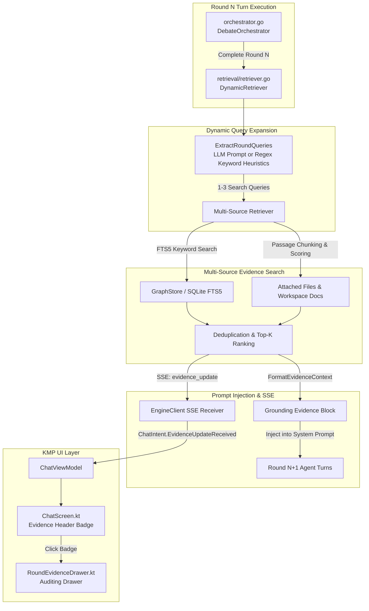

# Feature 04: Round-Aware Dynamic Graph Retrieval & In-Debate Evidence Grounding Engine

> **Component Scope**:
> - **Go Engine**: `engine/pkg/retrieval/retriever.go`, `engine/pkg/model/evidence.go`, `engine/pkg/orchestrator/orchestrator.go`, dynamic prompt injection.
> - **KMP Shared Layer**: `shared/.../domain/model/EvidenceModels.kt`, `Discussion.kt` evidence persistence, SSE `evidence_update` event handling.
> - **UI / Presentation**: `RoundEvidenceDrawer.kt`, `ChatContract.kt`, `ChatViewModel.kt`, `ChatScreen.kt` evidence badge.
> - **Tests**: `engine/pkg/retrieval/retriever_test.go`, `engine/pkg/orchestrator/orchestrator_test.go`, `shared/.../presentation/chat/EvidenceRetrievalTest.kt`.

---

## 1. Overview & Motivation

Multi-agent deliberation frequently suffers from **Empirical Drifting**:
1. **Ungrounded Hallucinations**: Models cite speculative performance numbers, phantom API signatures, or incorrect framework constraints.
2. **Context Amnesia**: Critical architectural requirements stated in attached documentation or discovered in previous project discussions are forgotten as the conversation lengthens.
3. **Static RAG Limitations**: Standard RAG retrieves context only once at debate setup ($T_0$). As debate arguments shift into unexpected technical sub-domains during rounds 2, 3, or 4, the initial context becomes stale.

**Feature 04** introduces **Round-Aware Dynamic Retrieval & In-Debate Evidence Grounding**:
- **Continuous In-Debate Grounding**: Between debate rounds, the engine extracts the delta of disputed assertions, benchmarks, and technical terms from round $N$, generating 1 to 3 targeted precision queries.
- **Multi-Source Hybrid Retrieval**: Queries both the persistent **SQLite FTS5 Knowledge Graph** and **Attached Project Files / Workspace Documentation**.
- **Historical Cross-Round Deduplication**: Prevents repeating citations from earlier rounds while selecting top-scoring evidence candidates.
- **Dynamic Prompt Injection**: Prepends a high-priority `[DYNAMIC GROUNDING EVIDENCE FOR ROUND N+1]` block into the system context of subsequent agent turns.
- **Inspectable Round Evidence Drawer**: A slide-out Compose Multiplatform inspector allowing users to audit exact retrieved snippets, source attributions, relevance scores, and copy citation tags.

---

## 2. Architecture & Retrieval Pipeline



---

## 3. Go Engine Implementation

### 3.1 Domain Models (`engine/pkg/model/evidence.go`)
- **`EvidenceSourceType`**:
  - `EvidenceSourceKnowledgeGraph`: Retrieved from past deliberation nodes and assertions.
  - `EvidenceSourceAttachedFile`: Retrieved from files explicitly attached to the discussion.
  - `EvidenceSourceWorkspaceDoc`: Retrieved from project workspace scope files.
- **`EvidenceItem`**:
  - `ID`: Unique string (e.g. `ev_g_node123` or `ev_f_file456_p2`).
  - `Round`: Round for which this evidence was retrieved.
  - `Query`: Search query that retrieved this item.
  - `SourceType`: Source classification enum.
  - `SourceID`, `SourceTitle`: File or Node title.
  - `Snippet`: Extracted 280-character textual excerpt.
  - `Score`: Relevance score float in `[0.0, 1.0]`.
  - `AttributionBadge`: Preformatted citation string (e.g. `[Evidence: Graph Node "SQLite WAL"]`).
  - `TimestampMs`: Milliseconds epoch.
- **`RoundEvidence`**:
  - Packages `Round`, `TriggerQueries`, `Items: []EvidenceItem`, and `SummaryContext`.

### 3.2 Dynamic Retrieval Engine (`engine/pkg/retrieval/retriever.go`)
1. **Query Extraction (`ExtractRoundQueries`)**:
   - Compiles non-system, non-error agent turns from the completed round.
   - LLM Mode: Directs the compaction runner to identify disputed claims, benchmarks, and trade-offs, returning 1-3 targeted queries in JSON.
   - Heuristic Fallback: Scans for technical keywords (e.g. `benchmark`, `latency`, `throughput`, `postgres`, `sqlite`, `raft`, `wal`, `paxos`, `goroutine`) and capitalized acronyms.
2. **Multi-Source Search & Scoring**:
   - **Knowledge Graph FTS5**: Calls `GraphStore.SearchFTS(projectID, query, 5)` matching Porter-stemmed tokens against node summaries.
   - **Attached Document Chunks**: Chunks documents into 400-character overlapping passages and calculates token-overlap term-frequency scores.
3. **Cross-Round Deduplication & Top-K Ranking**:
   - Filters out any `SourceID` previously retrieved in earlier rounds.
   - Deduplicates identical sources retrieved across multiple concurrent queries, keeping the highest relevance score.
   - Sorts candidates descending by score and retains the top 3 highest-signal items.
4. **Prompt Grounding Block Formatting**:
   ```text
   [DYNAMIC GROUNDING EVIDENCE FOR ROUND 2]
   The following authoritative evidence was retrieved based on disputed claims from the previous round:
   1. [Evidence: File "benchmark_results.md"] (Relevance: 0.88):
      "PostgreSQL with sync_commit=on caps at 2,400 writes/sec on nvme-1..."
   2. [Evidence: Graph Node "SQLite WAL Concurrency"] (Relevance: 0.75):
      "WAL mode allows concurrent readers alongside a single active writer..."

   MANDATE: You MUST anchor your arguments to this retrieved evidence where applicable. Cite authoritative points using attribution tags like [Evidence: ...]. Challenge any ungrounded assertions made by peers that conflict with this evidence.
   ```

---

## 4. KMP Shared & MVI Presentation

### 4.1 Clean Architecture & State Flow
1. **Domain Layer (`com.dialex.domain.model.EvidenceModels.kt`)**:
   - Data structures: `EvidenceItem`, `RoundEvidence`, `EvidenceSourceType`.
   - Extensions: `List<RoundEvidence>.forRound(round)`, `totalItemCount()`, `EvidenceItem.formattedScore()`.
2. **Presentation Layer (`com.dialex.presentation.chat`)**:
   - `ChatContract.kt`:
     - State fields: `evidenceHistory: ImmutableList<RoundEvidence>`, `selectedEvidenceRound: Int?`, `showEvidenceDrawer: Boolean`.
     - Intents: `OpenEvidenceDrawer`, `CloseEvidenceDrawer`, `SelectEvidenceRound(round)`.
   - `ChatViewModel.kt`:
     - Accumulates `evidenceHistory` upon receiving `evidence_update` SSE payloads or loading discussion snapshots.

### 4.2 Round Evidence Drawer UI (`RoundEvidenceDrawer.kt`)
- **Top Bar Evidence Badge**:
  - Displays search icon and cumulative evidence count (e.g. `🔍 5 Sources`) in `ChatScreen.kt` header.
- **Round Selector Tabs**:
  - Horizontal pill selector for rounds with retrieved evidence (`Round 2`, `Round 3`, ...).
  - Displays the active search queries that triggered retrieval for that round.
- **Evidence Cards**:
  - Source type badge with icon:
    - 🌐 **Graph Node**: `Icons.Outlined.Hub`
    - 📄 **Attached File**: `Icons.Outlined.Description`
    - 📁 **Workspace Doc**: `Icons.Outlined.TravelExplore`
  - Relevance score pill (e.g. `88% Match`).
  - Monospace snippet excerpt box.
  - One-click copy button for `[Evidence: SourceTitle]` citation tags to facilitate manual user interventions.

---

## 5. Verification & Test Coverage

- **Go Engine Test Suite**:
  - `engine/pkg/retrieval/retriever_test.go`:
    - `TestHeuristicExtractQueries`: Validates technical keyword and acronym extraction.
    - `TestSplitIntoPassages`: Verifies paragraph and length boundaries for document chunking.
    - `TestComputePassageScore`: Tests token-matching scoring mechanics.
    - `TestRetrieveForRound_Deduplication`: Confirms prior round sources are never re-retrieved.
    - `TestFormatEvidenceContext`: Tests presence of grounding mandate and formatted evidence items.
  - `engine/pkg/orchestrator/orchestrator_test.go`:
    - End-to-end debate run verifying evidence retrieval between rounds and prompt block injection.
- **KMP Shared & UI Tests**:
  - `EvidenceRetrievalTest.kt`:
    - Tests `ChatViewModel` evidence ingestion, round selection, total item count computation, and drawer visibility state.
