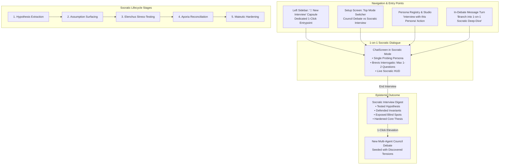

# Detailed Specification: Dedicated 1-on-1 Socratic Interview Mode

> **Feature**: Feature 05 — Dedicated 1-on-1 Socratic Interview Mode  
> **Status**: Approved Specification  
> **Target Release**: Dialex AI v1.5  
> **Core Focus**: Dedicated left-sidebar entry point, 5 deep philosophical & engineering Socratic stances, maieutic dialogue lifecycle state machine, and seamless 1-click council elevation.

---

## 1. Executive Summary & Design Philosophy

### The "Why"
Convening a 4-to-6-frontier-model adversarial council is powerful for multi-perspective debates, but it is **cognitively noisy and resource-heavy** when an architect, engineer, or founder simply wants to:
1. **Clarify a fuzzy, nascent proposal** before presenting it to peers.
2. **Subject an architectural assumption to forensic interrogation** via the classical Socratic method (*Elenchus* and *Maieutics*).
3. **Be challenged 1-on-1 without group distraction**, receiving focused, penetrating counter-questions rather than multi-page monologues.

### The Anti-Confusion Guarantee
Dialex AI remains cohesive and structured. A user will never wonder:
- *"Is this a debate or a normal chat?"*
- *"Where did my interview notes go?"*
- *"How do I turn this interview into a real council decision?"*

**The Guiding Principles**:
1. **Unified Workspace Storage, Distinct Mode**: Socratic interviews live inside project workspaces right alongside Council Debates, clearly distinguished by an amber/purple badge (`🎯 Socratic Interview` vs `⚔️ Council Debate`).
2. **Dedicated Standalone Left-Sidebar Entry Point**: A first-class **`🎯 New Interview`** pill on the left sidebar immediately above/below `+ New Conversation` allows instant access without digging through menus.
3. **5 Deep Socratic Stances**: Grounded in epistemology, systems theory, and security threat-modeling.
4. **The Socratic Deliverable Bridge**: An interview doesn't end in a dead-end chat transcript. It concludes with an automated **Socratic Interview Digest** and a **one-click "Elevate to Full Council Debate"** action that pre-populates a multi-agent debate seeded with the uncovered tensions!

---

## 2. UI/UX & Entry Point Design



### 2.1 Entry Point 1: Standalone Left-Sidebar Capsule (`WorkspaceSidebar.kt`)
In the top navigation area of the sidebar, right alongside `+ New Conversation` and `Setup with AI`, a dedicated **"New Interview"** pill is placed:

```
┌────────────────────────────────────────────────────────┐
│  [ + New Conversation ]      (Council Debate)         │
│  [ 🎯 New Interview ]         (1-on-1 Socratic Mode)   │
│  [ ✨ Setup with AI ]                                  │
│  [ 🧠 AI Personas ]                                    │
└────────────────────────────────────────────────────────┘
```

- **Visual Styling**:
  - Elegant amber/gold or deep violet glow (`cc.accent` or `amber` accent token).
  - Hover tooltip: *"Begin a focused 1-on-1 Socratic interrogation with an expert persona"*.
- **Click Action**:
  - Immediately navigates to `Setup` pre-configured in `DiscussionMode.SOCRATIC_INTERVIEW`.
  - Sets the default interviewer (e.g. *The Devil's Advocate* or *The Risk Analyst*), ready for the user to type their dilemma and begin.

### 2.2 Entry Point 2: Top-Level Mode Switcher in Setup (`SetupScreen.kt`)
At the top of the Setup Screen:
```
┌────────────────────────────────────────────────────────────────────────┐
│  Mode:  [ ⚔️ Council Debate (Multi-Agent) ]   [ 🎯 Socratic Interview (1-on-1) ] │
└────────────────────────────────────────────────────────────────────────┘
```
- Switching between modes smoothly transforms the screen without losing the entered topic or attached files.
- In Socratic Mode, the 5 extra peer seats collapse into a single **Interviewer Card** + **Socratic Stance Selector**.

### 2.3 Entry Point 3: Persona Registry & Studio ("🎯 Interview" Button)
In `PersonaPickerScreen`, `PersonaGallerySheet`, and `SettingsScreen -> Personas`:
- Every persona card displays a direct action: `[ 🎯 Socratic Interview ]`.
- Instantly launches an interview with that specific persona pre-selected as the interrogator.

### 2.4 Entry Point 4: In-Debate Branching ("Branch to 1-on-1")
- In an active council debate, clicking an agent's turn context menu allows `[ 🎯 Branch into 1-on-1 Socratic Deep-Dive ]`.
- Creates a linked child interview focused on resolving that specific point of contention.

---

## 3. The 5 Deep Socratic Stances

Each stance applies a distinct epistemic framework to uncover hidden flaws and harden the user's thinking:

| Stance ID | Name & Roots | Epistemic Objective | Core Questioning Mechanics |
| :--- | :--- | :--- | :--- |
| `RUTHLESS_ELENCHUS` | **Classic Elenchus**<br/>($\text{ἔλεγχος}$ — Cross-examination) | Forensic contradiction hunting & falsification. Exposes cognitive dissonance and hidden assumptions. | Formulates counter-examples ($\neg P \implies Q$) that reduce the premise to absurdity (*Reductio ad absurdum*). Probes race conditions, network partitions, and cascading failure modes. |
| `MAIEUTIC_ARCHITECT` | **Maieutic Architecture**<br/>($\mu\alpha\iota\epsilon\upsilon\tau\iota\kappa\eta$ — Midwife of truth) | Elicits latent requirements, unstated scale limits, and implicit invariants that the user knows intuitively but hasn't formalized. | Inverts vague intuition into formal mathematical boundaries (e.g. *"At what exact write throughput does eventual consistency cross from tolerable lag into data corruption?"*). |
| `FIRST_PRINCIPLES` | **Radical First Principles**<br/>(Axiomatic deconstruction) | Strips away vendor hype, cargo-cult patterns, and leaky abstractions down to physics, information theory, and dollar TCO. | Challenges every library and architectural layer: *"Why Kafka if throughput is 200 req/sec?", "What physical CPU/RAM/network limit forces this boundary?"* |
| `ADVERSARIAL_RED_TEAM` | **Adversarial Red-Teamer**<br/>(The malicious saboteur) | Stress-tests trust boundaries, single points of failure, insider threats, and catastrophe recovery. | Adopts the posture of hostile entropy: *"I inject 5 seconds of latency into your auth gateway; what fails open vs closed?", "What prevents silent data poisoning?"* |
| `APORIA_BOUNDARY_PUSHER` | **Aporia & Extreme Scale**<br/>($\dot{\alpha}\pi\text{o}\rho\acute{\iota}\alpha$ — Paradox & impasse) | Forces the user out of comforting incremental patches by introducing $100\times$ load, zero-day obsolescence, or systemic deadlocks. | Catapults the dilemma to asymptotic extremes: *"What breaks first at 50,000 writes/sec?", "If this cloud provider goes dark for 48 hours, is recovery deterministic?"* |

---

## 4. The 5-Stage Socratic Dialogue Lifecycle

The Socratic persona dynamically tracks the dialogue through 5 cognitive phases:

```
[ Stage 1: Hypothesis ] ➔ [ Stage 2: Surfacing ] ➔ [ Stage 3: Elenchus ] ➔ [ Stage 4: Aporia ] ➔ [ Stage 5: Hardening ]
```

1. **Stage 1: Hypothesis Extraction**
   - Goal: Help the user formulate an unambiguous, testable thesis.
   - Persona behavior: Clarifies definitions, boundary scopes, and measurable success criteria.
2. **Stage 2: Assumption Surfacing**
   - Goal: Identify hidden dependencies (e.g. "We assume network partitions are rare", "We assume write volume is low").
   - Persona behavior: Probes foundational axioms underlying the design.
3. **Stage 3: Elenchus Stress-Testing**
   - Goal: Attack the surfaced assumptions with concrete adversarial counter-examples.
   - Persona behavior: Presents acute failure scenarios, concurrency traps, and latency penalties.
4. **Stage 4: Aporia Reconciliation**
   - Goal: Confront irreducible trade-offs where no silver-bullet exists (e.g. CAP theorem, developer velocity vs formal verification).
   - Persona behavior: Forces explicit prioritization: which constraint will you consciously sacrifice?
5. **Stage 5: Maieutic Hardening & Digest**
   - Goal: Crystallize the battle-tested, refined architecture.
   - Persona behavior: Summarizes validated invariants, discarded assumptions, and remaining open dilemmas into the **Socratic Digest**.

---

## 5. Conversational Protocol & UI/UX

### 5.1 Brevis Interrogatio (No Monologues)
Standard LLMs tend to vomit 8-paragraph unsolicited essays. The Socratic Persona engine enforces strict rules:
- **Maximum Length**: 2–3 concise sentences of reflection.
- **Question Mandate**: Exactly **1 or 2 penetrating, non-leading questions** per turn.
- **Never Solves**: Never provides the answer or writes the code for the user; relentlessly prompts the user to construct the solution.

### 5.2 The Socratic HUD (Heads-Up Display)
Rendered at the top of `ChatScreen` in Socratic mode:

```
┌────────────────────────────────────────────────────────────────────────────────────────┐
│ 🎯 SOCRATIC INTERVIEW · The Risk Analyst (Claude 3.7 Sonnet)                           │
│ Phase: 3. Elenchus Stress-Testing  |  Turns: 4/10  |  Stance: Ruthless Elenchus       │
├────────────────────────────────────────────────────────────────────────────────────────┤
│ • Core Hypothesis: "Postgres advisory locks eliminate Redis operational complexity"    │
│ ⚠️ Open Tension: Lock release reliability during ungraceful worker SIGKILL            │
│ 💡 Validated Invariant: Single-leader DB guarantees zero split-brain                   │
│                                           [ 📋 End Interview & Generate Digest ]       │
└────────────────────────────────────────────────────────────────────────────────────────┘
```

### 5.3 The Socratic Digest & Council Bridge
When the interview concludes, the engine generates an authoritative **Socratic Interview Digest**:
- **Initial Premise**: The user's original unrefined statement.
- **Validated Invariants**: Principles the user successfully defended.
- **Exposed Blind Spots & Discarded Assumptions**: Hidden risks and naive axioms unmasked during questioning.
- **Hardened Architectural Thesis**: The refined, battle-tested design.
- **Residual Contradictions**: High-level trade-offs requiring multi-stakeholder debate.
- **The Council Action Button**:
  ```
  ┌──────────────────────────────────────────────────────────────────────┐
  │  🚀 Convene Multi-Agent Council on Residual Tensions                 │
  │  Creates a 4-agent debate with this Hardened Thesis as context!      │
  └──────────────────────────────────────────────────────────────────────┘
  ```

---

## 6. Technical Architecture & Clean Layering

### 6.1 Go Engine Architecture (`engine/pkg/socratic/`)
- **`engine/pkg/model/project.go`**:
  - `DiscussionMode`: `"COUNCIL"` (default) vs `"SOCRATIC_INTERVIEW"`.
  - `Discussion.SocraticConfig`: Holds `InterviewerPersonaID`, `Stance`, and `Stage`.
  - `Discussion.SocraticDigest`: Persisted outcome artifact.
- **`engine/pkg/socratic/engine.go`**:
  - Implements prompt synthesis with stance-specific instructions and `Brevis Interrogatio` constraints.
  - Generates deterministic heuristic fallback when offline.
- **`engine/pkg/socratic/digest.go`**:
  - Summarizes the interview transcript into the structured 5-part `SocraticDigest`.
- **`engine/pkg/api/socratic_handlers.go`**:
  - `POST /api/v1/discussions/{id}/socratic/turn`: Processes user input, returns streaming Socratic question.
  - `POST /api/v1/discussions/{id}/socratic/digest`: Generates and stores the final digest.
  - `POST /api/v1/discussions/{id}/socratic/elevate`: Spawns a new Council debate seeded with the digest's residual tensions.

### 6.2 KMP Shared Clean Architecture
- **Domain Layer**:
  - `com.dialex.domain.model.SocraticModels.kt`: Data classes (`SocraticStance`, `SocraticStage`, `SocraticDigest`, `DiscussionMode`).
  - `com.dialex.domain.usecase.ConductSocraticTurnUseCase`
  - `com.dialex.domain.usecase.GenerateSocraticDigestUseCase`
  - `com.dialex.domain.usecase.ElevateSocraticToCouncilUseCase`
- **Data Layer**:
  - `EngineDataSource.kt`: Maps Socratic REST endpoints and wraps network errors into `DomainException`.
  - `DiscussionRepositoryImpl.kt`: Implements domain interfaces.
- **Presentation Layer**:
  - `WorkspaceSidebar.kt`: Standalone `🎯 New Interview` navigation capsule.
  - `SetupViewModel.kt`: Seamless `DiscussionMode` toggle and single-interviewer configuration.
  - `ChatViewModel.kt`: Alternating turn coordination, Socratic HUD state, and digest handling.
  - `ChatScreen.kt`: Renders `SocraticHud.kt` and `SocraticDigestBubble.kt`.

---

## 7. Verification & Test Plan

1. **Go Engine Tests (`engine/pkg/socratic/engine_test.go`)**:
   - Verification of prompt assembly across all 5 Socratic Stances.
   - `Brevis Interrogatio` enforcement (max questions, concise token lengths).
   - Digest extraction from multi-turn dialogue transcripts.
   - Council elevation: validates creation of a new Council discussion with seeded tensions.
2. **KMP Shared & UI Tests (`shared/.../SocraticInterviewTest.kt`)**:
   - `SetupViewModel`: Switching to Socratic mode sets default interviewer and collapses peer seats.
   - `ChatViewModel`: Alternating user-persona turns without round rotation or consensus polling.
   - Socratic HUD rendering and state transitions across stages 1–5.
   - Digest generation and navigation to new elevated debate.
