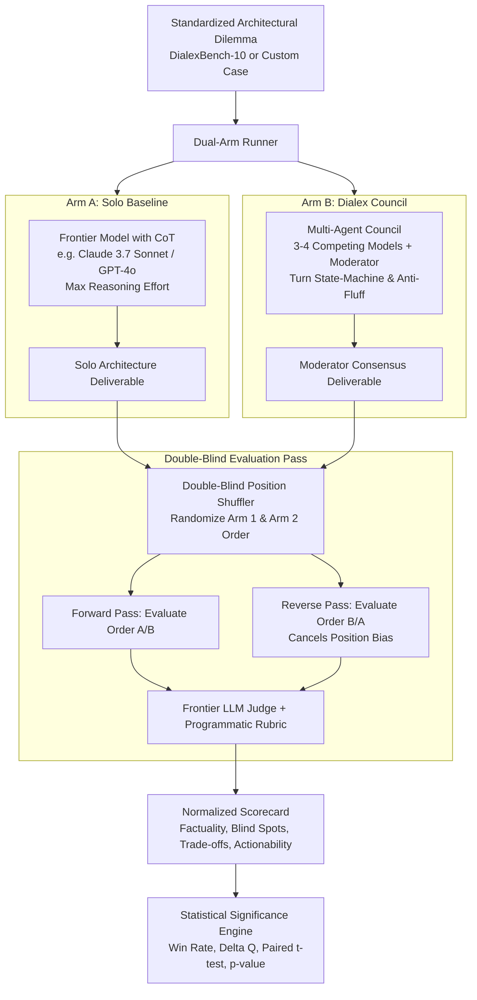

# Feature 06: Null Hypothesis Benchmarking & Quantitative Evaluation Suite

> **Feature**: Feature 06 — Null Hypothesis Benchmarking & Quantitative Evaluation Suite  
> **Status**: Approved Architectural Specification  
> **Target Release**: Dialex AI v1.6  
> **Component Scope**:
> - **Go Engine Backend**: `engine/pkg/benchmark/`, `engine/pkg/api/benchmark_handlers.go`, embedded SQLite storage.
> - **CLI Tooling**: `engine/cmd/dialexbench/` for automated CI/CD and terminal execution.
> - **KMP Shared Layer**: `shared/.../domain/model/BenchmarkModels.kt`, `BenchmarkRepository`, `BenchmarkUseCases.kt`.
> - **Desktop & Mobile UI**: `presentation/arena/` (`BenchmarkContract.kt`, `BenchmarkViewModel.kt`, `BenchmarkScreen.kt`, `ArenaRadarChart.kt`).
> - **Web Admin Dashboard**: Embedded HTML/JS dashboard at `:8080/admin/benchmarks`.

---

## 1. Executive Summary & Scientific Motivation

### 1.1 The Enterprise & Scientific Imperative
Enterprise CTOs, Chief Architects, and engineering leaders frequently ask:
> *"Why should we convene a 4-to-6 model multi-agent council when frontier models like Claude 3.7 Sonnet or OpenAI o3 already possess extended chain-of-thought reasoning capabilities? Does dialectic deliberation empirically produce superior deliverables, or is it merely expensive conversational theater?"*

To establish undisputed scientific legitimacy, eliminate marketing hype, and provide measurable ROI for enterprise procurement, Dialex AI implements the **Null Hypothesis Benchmarking & Quantitative Evaluation Suite**.

### 1.2 Formal Hypothesis Formulation

#### The Null Hypothesis ($H_0$)
$$\mathbf{H_0}: \quad Q(\text{Council}_{\{M_1, \dots, M_k\}}) \le Q(M_{\text{solo}})$$
*A single state-of-the-art frontier model $M_{\text{solo}}$ prompted with extended chain-of-thought/reasoning effort produces decision deliverables with equivalent or superior quality compared to a multi-agent dialectic council.*

#### The Alternative Hypothesis ($H_1$)
$$\mathbf{H_1}: \quad Q(\text{Council}_{\{M_1, \dots, M_k\}}) > Q(M_{\text{solo}}) \quad \text{with} \quad p < 0.05$$
*Dialectical adversarial deliberation systematically refutes premature consensus, catches latent failure modes, minimizes hallucinations, and produces measurably superior deliverables with statistical significance.*

---

## 2. Quantitative Evaluation Methodology



### 2.1 The 4 Quantitative Scoring Dimensions (Scale: 0.0 – 10.0)

Each deliverable is evaluated across four orthogonal metrics:

| Metric Dimension | Notation | Weight ($w_i$) | Description & Ground Truth Check |
|---|---|---|---|
| **Factuality & Hallucination Resistance** | $S_{\text{fact}}$ | **30%** | Programmatic verification of empirical claims against ground truth traps (e.g., claiming SQLite WAL mode allows concurrent writers, or misrepresenting Raft quorum minimums). Fewer hallucinations yield a higher score. |
| **Blind Spot & Boundary Coverage** | $S_{\text{blind}}$ | **25%** | Percentage of domain-specific edge cases, security failure modes, failover race conditions, and scalability blast radiuses identified and addressed. |
| **Trade-Off Completeness & Depth** | $S_{\text{trade}}$ | **25%** | Rigor in analyzing operational overhead, maintenance cost, migration friction, tail latency ($p99$), and ecosystem maturity, rather than purely theoretical upside. |
| **Actionability & Concrete Precision** | $S_{\text{action}}$ | **20%** | Deliverable clarity: inclusion of concrete schema designs, configuration parameters, migration phases, and decision matrices vs hand-wavy consultant prose. |

### 2.2 Mathematical Formulation

The aggregate quality score $Q \in [0.0, 10.0]$ is defined as:
$$Q = 0.30 \cdot S_{\text{fact}} + 0.25 \cdot S_{\text{blind}} + 0.25 \cdot S_{\text{trade}} + 0.20 \cdot S_{\text{action}}$$

The quality differential between the Dialex Council and the Solo Baseline is:
$$\Delta Q = Q_{\text{Council}} - Q_{\text{Solo}}$$

- **Council Win**: $\Delta Q \ge +0.50$
- **Tie**: $-0.50 < \Delta Q < +0.50$
- **Solo Win**: $\Delta Q \le -0.50$

### 2.3 Position-Balanced Double-Blind Judge Protocol
To prevent LLM judge position bias (where LLMs consistently favor Option A over Option B):
1. **Double-Blind Anonymization**: The judge receives two anonymous submissions: `Submission X` and `Submission Y`. All provider markers, seat names, and turn metadata are stripped.
2. **Dual-Pass Position Swapping**:
   - Pass 1: $X = \text{Council}$, $Y = \text{Solo}$
   - Pass 2: $X = \text{Solo}$, $Y = \text{Council}$
3. The final scores are computed as the arithmetic mean of both passes:
   $$S_i = \frac{S_{i,\text{Pass 1}} + S_{i,\text{Pass 2}}}{2}$$

### 2.4 Statistical Significance & $p$-Value Calculation
When a benchmark suite of $N \ge 5$ test cases is executed:
- Calculate sample mean of differentials $\overline{\Delta Q}$ and sample standard deviation $s_{\Delta Q}$.
- Perform a paired, two-tailed Student's $t$-test:
  $$t = \frac{\overline{\Delta Q}}{s_{\Delta Q} / \sqrt{N}}, \quad \text{degrees of freedom } \nu = N - 1$$
- Compute $p$-value from Student's $t$-distribution. If $p < 0.05$ and $\overline{\Delta Q} > 0$, the Null Hypothesis $H_0$ is rejected in favor of $H_1$.

---

## 3. DialexBench-10: Bundled Canonical Dilemma Dataset

Dialex AI ships with **DialexBench-10**, an embedded corpus of 10 battle-tested, multifaceted architectural dilemmas designed to expose single-model blind spots:

```
┌────────────────────────────────────────────────────────────────────────────────────────┐
│                                DIALEXBENCH-10 SUITE                                    │
├─────┬─────────────────────────────────────┬───────────────────┬────────────────────────┤
│ ID  │ Title                               │ Technical Domain  │ Core Latent Trap       │
├─────┼─────────────────────────────────────┼───────────────────┼────────────────────────┤
│ DB01│ High-Throughput Ingestion Engine    │ Storage & WAL     │ SQLite WAL multi-writer│
│ DB02│ Multi-Region Distributed Consensus  │ Dist. Consensus   │ WAN split-brain & clock│
│ DB03│ Zero-Trust Microservice Auth        │ Security & Auth   │ Token revocation race  │
│ DB04│ Event-Driven Financial Ledger       │ FinTech Ledger    │ Out-of-order idempotency│
│ DB05│ Real-Time Telemetry Event Bus       │ Messaging         │ Partition skew/head-of-line│
│ DB06│ Multi-Tenant Vector Search Pipeline │ AI/ML Infra       │ Cold-start latency/cost│
│ DB07│ Core Banking Database Migration     │ Database Sharding │ Dual-write sync drift  │
│ DB08│ Modular Monolith vs Microservices   │ Architecture      │ Network boundary cost  │
│ DB09│ Edge-Compute Low-Latency Cache      │ Caching Systems   │ Dogpiling & stale reads│
│ DB10│ HIPAA Compliant Cloud Data Lake     │ Compliance & Gov  │ De-identification leak │
└─────┴─────────────────────────────────────┴───────────────────┴────────────────────────┘
```

### 3.1 Detailed Dilemma Schema (`BenchmarkCase`)

```json
{
  "id": "DB01",
  "title": "High-Throughput Ingestion Engine: SQLite WAL vs RocksDB vs Postgres",
  "domain": "STORAGE_CONCURRENCY",
  "dilemma": "Design a local telemetry ingestion engine sustaining 25,000 writes/sec with sub-5ms p99 latency on constrained edge hardware (4 cores, 8GB RAM).",
  "constraints": [
    "Maximum persistent disk footprint: 20GB",
    "Must support ACID guarantees on sudden power loss",
    "Zero external daemon processes allowed"
  ],
  "groundTruthTraps": [
    "Asserting that SQLite WAL mode supports concurrent multiple writers without SQLITE_BUSY",
    "Ignoring fsync disk I/O bottlenecks when durability is set to synchronous=FULL",
    "Recommending PostgreSQL despite the constraint forbidding external daemon processes"
  ],
  "requiredTradeOffAxes": [
    "Write amplification vs Read amplification (LSM-tree vs B-Tree)",
    "Memory allocation under spikes",
    "Crash recovery and WAL checkpointing latency spikes"
  ],
  "mandatoryBoundaryConditions": [
    "Sudden SIGKILL or power outage handling",
    "Compaction stalls under continuous write saturation"
  ]
}
```

Users can also create, import, and export custom benchmark dilemmas via the UI or API.

---

## 4. Go Engine Architecture (`engine/pkg/benchmark/`)

```
engine/pkg/benchmark/
├── models.go       # Data types: BenchmarkCase, BenchmarkRun, Scorecard, JudgeEvaluation
├── runner.go       # Dual-arm concurrent execution coordinator
├── judge.go        # Position-balanced double-blind LLM judge runner
├── stats.go        # Statistical calculations (mean, std dev, t-test, p-value)
├── store.go        # SQLite storage for benchmark runs and results
└── bundled.go      # Embedded DialexBench-10 dataset
```

### 4.1 Data Models (`engine/pkg/benchmark/models.go`)

```go
package benchmark

type MetricDimension string

const (
    MetricFactuality   MetricDimension = "FACTUALITY"
    MetricBlindSpots   MetricDimension = "BLIND_SPOTS"
    MetricTradeOffs    MetricDimension = "TRADE_OFFS"
    MetricActionability MetricDimension = "ACTIONABILITY"
)

type ArmType string

const (
    ArmSoloBaseline ArmType = "SOLO_BASELINE"
    ArmCouncil      ArmType = "COUNCIL"
)

type BenchmarkCase struct {
    ID                         string   `json:"id"`
    Title                      string   `json:"title"`
    Domain                     string   `json:"domain"`
    Dilemma                    string   `json:"dilemma"`
    Constraints                []string `json:"constraints"`
    GroundTruthTraps           []string `json:"groundTruthTraps"`
    RequiredTradeOffAxes       []string `json:"requiredTradeOffAxes"`
    MandatoryBoundaryConditions []string `json:"mandatoryBoundaryConditions"`
    IsBundled                  bool     `json:"isBundled"`
}

type ArmResult struct {
    ArmType          ArmType `json:"armType"`
    ModelOrCouncil   string  `json:"modelOrCouncil"`
    Deliverable      string  `json:"deliverable"`
    TokensUsed       int     `json:"tokensUsed"`
    DurationMs       int64   `json:"durationMs"`
    EstimatedCostUSD float64 `json:"estimatedCostUSD"`
}

type MetricScore struct {
    Dimension MetricDimension `json:"dimension"`
    Score     float64         `json:"score"` // 0.0 - 10.0
    Critique  string          `json:"critique"`
}

type JudgeEvaluation struct {
    PassNumber       int           `json:"passNumber"` // 1 or 2 (order swap)
    SoloScores       []MetricScore `json:"soloScores"`
    CouncilScores    []MetricScore `json:"councilScores"`
    OverallVerdict   string        `json:"overallVerdict"`
    DetailedCritique string        `json:"detailedCritique"`
}

type BenchmarkRun struct {
    ID              string            `json:"id"`
    CaseID          string            `json:"caseId"`
    CaseTitle       string            `json:"caseTitle"`
    Timestamp       int64             `json:"timestamp"`
    SoloResult      ArmResult         `json:"soloResult"`
    CouncilResult   ArmResult         `json:"councilResult"`
    JudgeModel      string            `json:"judgeModel"`
    Evaluations     []JudgeEvaluation `json:"evaluations"`
    SoloTotalScore  float64           `json:"soloTotalScore"`
    CouncilTotalScore float64         `json:"councilTotalScore"`
    DeltaQ          float64           `json:"deltaQ"` // CouncilTotalScore - SoloTotalScore
    Winner          string            `json:"winner"` // "COUNCIL", "SOLO", "TIE"
}

type BenchmarkSummary struct {
    TotalRuns         int     `json:"totalRuns"`
    CouncilWins       int     `json:"councilWins"`
    SoloWins          int     `json:"soloWins"`
    Ties              int     `json:"ties"`
    CouncilWinRate    float64 `json:"councilWinRate"`
    MeanDeltaQ        float64 `json:"meanDeltaQ"`
    PValue            float64 `json:"pValue"`
    IsStatSignificant bool    `json:"isStatSignificant"` // p < 0.05
    AvgFactualityDelta float64 `json:"avgFactualityDelta"`
    AvgBlindSpotDelta float64 `json:"avgBlindSpotDelta"`
    AvgTradeOffDelta  float64 `json:"avgTradeOffDelta"`
    AvgActionDelta    float64 `json:"avgActionDelta"`
}
```

---

## 5. HTTP REST API Reference

All endpoints are hosted on the Go Engine server (default port `8080` / `7432`):

| Method | Endpoint | Description | Payload / Response |
|---|---|---|---|
| `GET` | `/api/v1/benchmarks/cases` | List bundled and custom benchmark cases | `[]BenchmarkCase` |
| `POST` | `/api/v1/benchmarks/cases` | Create custom architectural dilemma | `BenchmarkCase` |
| `POST` | `/api/v1/benchmarks/run` | Execute dual-arm evaluation (with SSE streaming) | `{ caseId, soloConfig, councilConfig, judgeModel }` |
| `GET` | `/api/v1/benchmarks/runs` | List all historical benchmark runs | `[]BenchmarkRun` |
| `GET` | `/api/v1/benchmarks/runs/{id}` | Get detailed side-by-side run report with critiques | `BenchmarkRun` |
| `GET` | `/api/v1/benchmarks/summary` | Aggregate statistical summary, win rates, and $p$-value | `BenchmarkSummary` |
| `GET` | `/api/v1/benchmarks/export` | Export dataset in Markdown or CSV format | `text/markdown` or `text/csv` |

---

## 6. KMP Presentation & UI Implementation (`shared/.../presentation/arena/`)

In compliance with `.standards/steering/kmp/AGENTS.md`:
- Pure MVI architecture in `presentation/arena/` (`Contract.kt`, `ViewModel.kt`, `Screen.kt`, `Route.kt`).
- Stateless `Screen` composable receiving only `state`, `onIntent: (Intent) -> Unit`, and resolved navigation lambdas.
- All tokens use `Kolt.colors`, `Kolt.typography`, `Kolt.sizes`.

### 6.1 MVI Contract (`presentation/arena/BenchmarkContract.kt`)

```kotlin
package com.dialex.presentation.arena

import androidx.compose.runtime.Immutable
import com.dialex.domain.model.BenchmarkCase
import com.dialex.domain.model.BenchmarkRun
import com.dialex.domain.model.BenchmarkSummary
import kotlinx.collections.immutable.ImmutableList
import kotlinx.collections.immutable.persistentListOf

data class BenchmarkState(
    val cases: ImmutableList<BenchmarkCase> = persistentListOf(),
    val selectedCase: BenchmarkCase? = null,
    val historicalRuns: ImmutableList<BenchmarkRun> = persistentListOf(),
    val summary: BenchmarkSummary? = null,
    val activeRun: BenchmarkRun? = null,
    val isRunning: Boolean = false,
    val runProgress: Float = 0f, // 0.0 - 1.0
    val activePhase: String = "", // "Running Solo Arm", "Running Council Arm", "Double-Blind Judging"
    val soloLiveStream: String = "",
    val councilLiveStream: String = "",
    val error: String? = null
)

sealed interface BenchmarkIntent {
    data object LoadInitialData : BenchmarkIntent
    data class SelectCase(val caseId: String) : BenchmarkIntent
    data class CreateCustomCase(val newCase: BenchmarkCase) : BenchmarkIntent
    data class StartBenchmarkRun(val caseId: String, val judgeModel: String) : BenchmarkIntent
    data object CancelRun : BenchmarkIntent
    data class ViewRunDetails(val runId: String) : BenchmarkIntent
    data class ExportResults(val format: String) : BenchmarkIntent
}

sealed interface BenchmarkEffect {
    data class ShowToast(val message: String) : BenchmarkEffect
    data class ExportDownloaded(val filePath: String) : BenchmarkEffect
}
```

### 6.2 UI Layout: The Arena & Benchmark Screen

```
┌─────────────────────────────────────────────────────────────────────────────────────────────────────────┐
│ ⚔️ DELIBERATION ARENA & NULL HYPOTHESIS BENCHMARK SUITE                              [ Run Full Suite ] │
├───────────────────────────────────────┬─────────────────────────────────────────────────────────────────┤
│ BENCHMARK CASES                       │ CASE: DB01 — SQLite WAL vs RocksDB vs Postgres                  │
│                                       │ "25,000 writes/sec with sub-5ms p99 on edge hardware"           │
│ ● DB01: SQLite WAL vs RocksDB [Win]   ├────────────────────────────────┬────────────────────────────────┤
│ ● DB02: Multi-Region Paxos    [Win]   │ ARM A: SOLO BASELINE           │ ARM B: DIALEX COUNCIL          │
│ ● DB03: Zero-Trust Auth       [Win]   │ Model: Claude 3.7 Sonnet (CoT) │ Council: 4 Models + Moderator  │
│ ○ DB04: Financial Ledger      [Run]   │ Score: 6.8 / 10.0              │ Score: 9.1 / 10.0 (WIN +2.3)   │
│ ○ DB05: Telemetry Event Bus           ├────────────────────────────────┼────────────────────────────────┤
│                                       │ [Deliverable Transcript]       │ [Deliverable Transcript]       │
│                                       │ "SQLite WAL allows multiple    │ "SQLite WAL is strictly single-│
│                                       │ concurrent writers..." ⚠️ TRAP │ writer. RocksDB required..."   │
│                                       ├────────────────────────────────┴────────────────────────────────┤
│                                       │ 📊 RADAR SCORECARD (Double-Blind LLM Judge Consensus)           │
│                                       │   Factuality:     Solo 5.2 vs Council 9.5 (+4.3)                │
│                                       │   Blind Spots:    Solo 6.5 vs Council 9.0 (+2.5)                │
│                                       │   Trade-Offs:     Solo 7.5 vs Council 9.0 (+1.5)                │
│                                       │   Actionability:  Solo 8.0 vs Council 9.0 (+1.0)                │
│                                       ├─────────────────────────────────────────────────────────────────┤
│                                       │ ⚖️ SCIENTIFIC VERDICT: COUNCIL WIN (p < 0.01, H0 Rejected)      │
└───────────────────────────────────────┴─────────────────────────────────────────────────────────────────┘
```

1. **Left Sidebar Entry**: Permanent `[ ⚔️ Arena & Benchmarks ]` capsule with live win-rate badge (`Win Rate: 84% · p < 0.01`).
2. **Dual-Column Live Visualizer**: Watch both Arms stream their arguments simultaneously in real time.
3. **Radar / Spider Chart (`ArenaRadarChart.kt`)**: Displays polygon overlays comparing Solo vs Council across all 4 axes using Kolt color tokens.
4. **Blinded Judge Audit Log**: Expandable accordion displaying raw reasoning from both Pass 1 and Pass 2 with position-swap validation.

---

## 7. Web Admin & CLI Integration

### 7.1 Web Admin Dashboard (`:8080/admin/benchmarks`)
- Pure HTML5 + Vanilla CSS + JavaScript embedded directly in Go binary using `embed.FS`.
- Zero external CDN dependencies; runs 100% offline.
- Real-time updates via Server-Sent Events (`/api/v1/benchmarks/events`).

### 7.2 Standalone CLI Tool (`cmd/dialexbench`)
For automated CI/CD validation and headless cluster testing:
```bash
# Run full DialexBench-10 suite with local CLI models ($0 token cost)
dialexbench run --suite dialexbench-10 --solo claude --judge gpt-4o --format json > benchmark_results.json

# Run ad-hoc dilemma file
dialexbench run --file my_dilemma.json --output report.md
```

---

## 8. Verification & Test Plan

1. **Go Unit & Statistical Tests (`engine/pkg/benchmark/stats_test.go`)**:
   - Paired Student's $t$-test implementation verified against known mathematical reference distributions.
   - Position-swap judge score averager verifies zero position bias.
   - Ground truth trap detector identifies forbidden assertions deterministically.
2. **Go API Handler Tests (`engine/pkg/api/benchmark_handlers_test.go`)**:
   - `GET /api/v1/benchmarks/cases` verifies all 10 bundled cases load cleanly.
   - `POST /api/v1/benchmarks/run` executes dual-arm mock evaluation and records `BenchmarkRun`.
3. **KMP Shared Layer Tests (`shared/.../BenchmarkViewModelTest.kt`)**:
   - State transition tests for `LoadInitialData`, `SelectCase`, and `StartBenchmarkRun`.
   - Contract compliance verifying immutable collections (`ImmutableList`).
4. **UI Snapshot & Preview Verification**:
   - `@Preview` composables for `BenchmarkScreen` and `ArenaRadarChart` with mock data.
