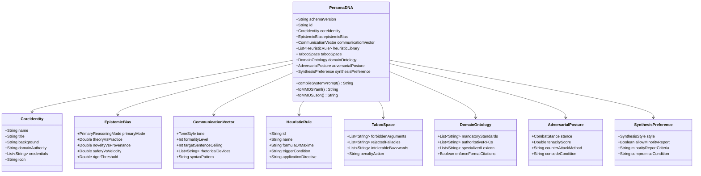

# Detailed Specification: 8-Layer DNA Mental & Structured Persona Ingestion

> **Feature**: Feature 07 — 8-Layer DNA Mental & Structured Persona Ingestion  
> **Status**: Approved Architectural Specification  
> **Target Release**: Dialex AI v1.7  
> **Components Involved**:
> - Go Engine: `engine/pkg/model/persona_dna.go`, `engine/pkg/persona/compiler.go`, `engine/pkg/persona/importer.go`, `engine/pkg/api/persona_dna_handlers.go`
> - KMP Shared: `shared/.../domain/model/PersonaDnaModels.kt`, `domain/repository/PersonaDnaRepository.kt`, `data/repository/PersonaDnaRepositoryImpl.kt`
> - Desktop & Mobile Presentation: `shared/.../presentation/settings/personas/PersonaBuilderScreen.kt`, `PersonaDnaStudio.kt`, `DnaRadarVisualizer.kt`
> - Standards Compatibility: **MMOS v1.0 (Mind Matrix Open Standard)** YAML & JSON schema.

---

## 1. Executive Summary & Epistemic Grounding

### 1.1 The Problem: "Persona Collapse" and Sycophancy Decay
In multi-agent and multi-turn adversarial deliberation, current AI personas suffer from **Persona Collapse**:
1. **Regressive Homogenization**: When prompted only with free-text system prompts (e.g. *"You are a cynical system architect"*), models rapidly converge toward bland corporate agreeableness after Round 1, abandoning their adversarial mandate.
2. **Absence of Negative Constraints (Taboo Spaces)**: Personas are told what they represent, but have no negative guardrails forbidding them from letting unsubstantiated claims, corporate buzzwords, or flawed architectural anti-patterns pass without resistance.
3. **Flat Cognitive Diversity**: Debaters frequently share identical reasoning structures regardless of their persona name. An *Enterprise Risk Analyst* and a *Seed-Stage Hacker* reason with the exact same chain-of-thought heuristics.
4. **Lack of Interoperability**: Enterprise users and researchers cannot export, version, or share battle-tested cognitive archetypes across external systems or repositories.

### 1.2 The Solution: The 8-Layer Cognitive Schema
Dialex AI v1.7 introduces a formal **8-Layer Cognitive DNA Schema** grounded in cognitive psychology (SOAR/ACT-R cognitive architectures, Epistemic Logic, and Behavioral Decision Theory). Every debater seat in a Council Debate or Socratic Interview can be driven by a structured DNA matrix that is compiled at runtime into a high-density, prompt-injected invariant instruction block.

```
┌────────────────────────────────────────────────────────────────────────┐
│                      THE 8-LAYER PERSONA DNA SCHEMA                    │
├────────────────────────────────────────────────────────────────────────┤
│ Layer 1: CORE IDENTITY         Name, Background, Domain Jurisdiction   │
│ Layer 2: EPISTEMIC BIAS        First Principles, Empirical, Pragmatic  │
│ Layer 3: COMMUNICATION VECTOR  Tone, Formality, Rhetorical Syntax      │
│ Layer 4: HEURISTIC LIBRARY     Mental Models (Gall's Law, Conway, CAP) │
│ Layer 5: TABOO SPACE           Forbidden Fallacies & Anti-Patterns     │
│ Layer 6: DOMAIN ONTOLOGY       Authoritative Specs, RFCs, Standards    │
│ Layer 7: ADVERSARIAL POSTURE   Tenacity & Reaction when Challenged     │
│ Layer 8: SYNTHESIS PREFERENCE  Compromise Propensity vs Minority Report│
└────────────────────────────────────────────────────────────────────────┘
```

---

## 2. Granular Specification of the 8 Layers



### Layer 1: Core Identity
- **Name**: Unique human or operational identifier (e.g. *"Dr. Elena Rostova"*).
- **Title**: Official professional designation (e.g. *"Principal Distributed Systems Architect"*).
- **Background & Bio**: Formative pedigree establishing domain authority (e.g. *"15 years building low-latency matching engines and distributed raft consensus systems"*).
- **Domain Jurisdiction**: The boundary of what this persona has authority to speak on versus what they must defer to peer debaters on.

### Layer 2: Epistemic Bias
Defines the lens through which claims are evaluated and defended:
- **Primary Reasoning Mode**:
  - `FIRST_PRINCIPLES`: Deconstructs arguments down to fundamental physical, mathematical, or algorithmic limits.
  - `EMPIRICAL_STATISTICAL`: Disregards theory unless supported by empirical benchmarks, p99 metrics, and concrete field data.
  - `HISTORICAL_ANALOGY`: Evaluates risk by drawing parallels to past industry migrations, failures, and historical precedents.
  - `PRAGMATIC_ENGINEERING`: Focuses strictly on operational friction, developer ergonomics, hiring velocity, and maintenance burden.
  - `FORMAL_LOGICAL`: Demands deductive validity, state-space exploration, and formal verification proofs.
- **Bi-Directional Tensor Sliders (0.0 to 1.0)**:
  - Theory (0.0) $\longleftrightarrow$ Practice (1.0)
  - Novelty (0.0) $\longleftrightarrow$ Provenance (1.0)
  - Safety/Resilience (0.0) $\longleftrightarrow$ Velocity/Agility (1.0)

### Layer 3: Communication Vector
Governs stylistic expression and rhetorical mechanics during debate turns:
- **Tone**: `FORENSIC_SOCRATIC`, `ACADEMIC_RIGOROUS`, `CONCISE_BLUNT`, `EXECUTIVE_STRATEGIC`, `ADVERSARIAL_CHALLENGER`.
- **Formality Level (1 to 5)**: From casual engineering banter (1) to courtroom-grade legalistic precision (5).
- **Sentence Ceiling**: Target brevity guardrail (e.g., maximum 3–4 punchy sentences in rapid-fire rounds).
- **Rhetorical Devices**: Prescribed debating mechanics (e.g. *Socratic Inversion*, *Counter-Example Trapping*, *Quantitative Challenge*, *Reductio ad Absurdum*).

### Layer 4: Heuristic Library
A curated library of mental models, engineering laws, and heuristics invoked under argumentative tension:
- Pre-populated library includes:
  - **Gall's Law**: *"A complex system that works is invariably found to have evolved from a simple system that worked."*
  - **Conway's Law**: *"Organizations design systems that mirror their own communication structures."*
  - **Chesterton's Fence**: *"Do not remove a constraint until you understand why it was put there."*
  - **Amdahl's Law**: *"Speedup is limited by the serial fraction of the workload."*
  - **Goodhart's Law**: *"When a measure becomes a target, it ceases to be a good measure."*
  - **CAP Theorem / PACELC**: Strict consistency vs availability trade-offs under partition and latency.
- Users can assign 1 to 5 active heuristics per persona that dictate their analytical instincts.

### Layer 5: Taboo Space (Negative Constraints)
A critical innovation in preventing persona sycophancy:
- **Forbidden Arguments**: Arguments the persona refuses to let pass without calling a foul (e.g., *"We will just scale horizontally if latency spikes"*, *"Microservices make deployment simpler"*).
- **Intolerable Buzzwords**: Vague jargon that triggers immediate demands for concrete metrics (e.g., *"Cloud-native synergy"*, *"Web3 paradigm"*, *"Effortless scalability"*).
- **Rejected Fallacies**: Specific logical fallacies this persona actively attacks (*Appeal to Authority*, *Sunk Cost Fallacy*, *False Dilemma*).
- **Penalty Action**: Prescribed response when a peer invokes a taboo (e.g., *"Demand immediate concrete p99 latency SLA and failure cascade breakdown"*).

### Layer 6: Domain Ontology
- **Mandatory Standards**: Technical specifications the persona treats as law (e.g., IEEE 754, POSIX, ACID, OAuth 2.1, ISO 27001).
- **Authoritative RFCs**: Specific RFC numbers that must be cited in arguments (e.g., RFC 9110 HTTP Semantics, RFC 7519 JWT, RFC 8446 TLS 1.3).
- **Specialized Lexicon**: Precise domain terminology expected in turns (e.g., *idempotency keys*, *split-brain scenario*, *head-of-line blocking*, *linearizability*).

### Layer 7: Adversarial Posture
Controls interpersonal dynamics during peer turns:
- **Combat Stance**:
  - `UNYIELDING_DOGMATIC`: Defends their position vigorously; requires overwhelming mathematical proof to concede.
  - `COUNTER_ATTACKING`: Immediately pivots incoming criticism into an attack on the challenger's underlying vulnerability.
  - `SOCRATIC_INVERTER`: Responds to challenges by questioning the premises of the challenger.
  - `ANALYTICAL_DECONSTRUCTOR`: Systematically disassembles the opponent's assertion into component variables.
  - `PRAGMATIC_ACCOMMODATOR`: Readily concedes secondary points to preserve core architectural invariants.
- **Tenacity Score (0.0 to 1.0)**: Threshold of empirical evidence required to change an assertion.

### Layer 8: Synthesis Preference
Controls how the persona behaves during the final consensus round:
- **Synthesis Style**:
  - `SEEK_SYNTHESIS`: Strives to integrate trade-offs into a unified, pragmatic architecture decision.
  - `HOLD_MINORITY_REPORT`: Refuses to sign off on a compromised consensus if core invariants are breached; outputs an explicit, formal **Dissenting Minority Report**.
  - `CONDITIONAL_COMPROMISE`: Signs off only if strict mitigation guardrails and fallbacks are documented in the ADR.
- **Minority Report Criteria**: The non-negotiable lines in the sand that trigger an unyielding dissent.

---

## 3. Data Models & Schemas

### 3.1 Go Backend Structs (`engine/pkg/model/persona_dna.go`)

```go
package model

// PrimaryReasoningMode defines the foundational logic paradigm of the persona.
type PrimaryReasoningMode string

const (
	ReasoningFirstPrinciples     PrimaryReasoningMode = "FIRST_PRINCIPLES"
	ReasoningEmpiricalStatistical PrimaryReasoningMode = "EMPIRICAL_STATISTICAL"
	ReasoningHistoricalAnalogy   PrimaryReasoningMode = "HISTORICAL_ANALOGY"
	ReasoningPragmaticEngineering PrimaryReasoningMode = "PRAGMATIC_ENGINEERING"
	ReasoningFormalLogical       PrimaryReasoningMode = "FORMAL_LOGICAL"
)

// CombatStance defines the adversarial reaction style when challenged.
type CombatStance string

const (
	StanceUnyieldingDogmatic     CombatStance = "UNYIELDING_DOGMATIC"
	StanceCounterAttacking       CombatStance = "COUNTER_ATTACKING"
	StanceSocraticInverter       CombatStance = "SOCRATIC_INVERTER"
	StanceAnalyticalDeconstructor CombatStance = "ANALYTICAL_DECONSTRUCTOR"
	StancePragmaticAccommodator  CombatStance = "PRAGMATIC_ACCOMMODATOR"
)

// SynthesisStyle defines consensus behavior.
type SynthesisStyle string

const (
	SynthesisSeekSynthesis      SynthesisStyle = "SEEK_SYNTHESIS"
	SynthesisHoldMinorityReport SynthesisStyle = "HOLD_MINORITY_REPORT"
	SynthesisConditionalCompromise SynthesisStyle = "CONDITIONAL_COMPROMISE"
)

// HeuristicRule defines an executable mental model.
type HeuristicRule struct {
	ID                   string `json:"id" yaml:"id"`
	Name                 string `json:"name" yaml:"name"`
	FormulaOrMaxime      string `json:"formulaOrMaxime" yaml:"formulaOrMaxime"`
	TriggerCondition     string `json:"triggerCondition" yaml:"triggerCondition"`
	ApplicationDirective string `json:"applicationDirective" yaml:"applicationDirective"`
}

// TabooSpace defines negative constraints.
type TabooSpace struct {
	ForbiddenArguments   []string `json:"forbiddenArguments" yaml:"forbiddenArguments"`
	RejectedFallacies     []string `json:"rejectedFallacies" yaml:"rejectedFallacies"`
	IntolerableBuzzwords []string `json:"intolerableBuzzwords" yaml:"intolerableBuzzwords"`
	PenaltyAction        string   `json:"penaltyAction" yaml:"penaltyAction"`
}

// PersonaDNA represents the complete 8-Layer Cognitive DNA Schema.
type PersonaDNA struct {
	SchemaVersion       string              `json:"schemaVersion" yaml:"schemaVersion"` // "dialex.dna/v1.0" or "mmos/v1.0"
	ID                  string              `json:"id" yaml:"id"`
	Name                string              `json:"name" yaml:"name"`
	Role                string              `json:"role" yaml:"role"`
	Category            string              `json:"category" yaml:"category"`
	Icon                string              `json:"icon,omitempty" yaml:"icon,omitempty"`
	CoreIdentity        CoreIdentity        `json:"coreIdentity" yaml:"coreIdentity"`
	EpistemicBias       EpistemicBias       `json:"epistemicBias" yaml:"epistemicBias"`
	CommunicationVector CommunicationVector `json:"communicationVector" yaml:"communicationVector"`
	HeuristicLibrary    []HeuristicRule     `json:"heuristicLibrary" yaml:"heuristicLibrary"`
	TabooSpace          TabooSpace          `json:"tabooSpace" yaml:"tabooSpace"`
	DomainOntology      DomainOntology      `json:"domainOntology" yaml:"domainOntology"`
	AdversarialPosture  AdversarialPosture  `json:"adversarialPosture" yaml:"adversarialPosture"`
	SynthesisPreference SynthesisPreference `json:"synthesisPreference" yaml:"synthesisPreference"`
	RawCustomPrompt     string              `json:"rawCustomPrompt,omitempty" yaml:"rawCustomPrompt,omitempty"`
}

type CoreIdentity struct {
	Title           string   `json:"title" yaml:"title"`
	Background      string   `json:"background" yaml:"background"`
	DomainAuthority string   `json:"domainAuthority" yaml:"domainAuthority"`
	Credentials     []string `json:"credentials,omitempty" yaml:"credentials,omitempty"`
}

type EpistemicBias struct {
	PrimaryMode        PrimaryReasoningMode `json:"primaryMode" yaml:"primaryMode"`
	TheoryVsPractice   float64              `json:"theoryVsPractice" yaml:"theoryVsPractice"`     // 0.0 = Theory, 1.0 = Practice
	NoveltyVsProvenance float64              `json:"noveltyVsProvenance" yaml:"noveltyVsProvenance"` // 0.0 = Novelty, 1.0 = Provenance
	SafetyVsVelocity   float64              `json:"safetyVsVelocity" yaml:"safetyVsVelocity"`     // 0.0 = Safety, 1.0 = Velocity
	RigorThreshold     float64              `json:"rigorThreshold" yaml:"rigorThreshold"`         // 0.0 - 1.0
}

type CommunicationVector struct {
	Tone                  string   `json:"tone" yaml:"tone"`
	FormalityLevel        int      `json:"formalityLevel" yaml:"formalityLevel"` // 1 - 5
	TargetSentenceCeiling int      `json:"targetSentenceCeiling" yaml:"targetSentenceCeiling"`
	RhetoricalDevices     []string `json:"rhetoricalDevices" yaml:"rhetoricalDevices"`
	SyntaxPattern         string   `json:"syntaxPattern,omitempty" yaml:"syntaxPattern,omitempty"`
}

type DomainOntology struct {
	MandatoryStandards     []string `json:"mandatoryStandards" yaml:"mandatoryStandards"`
	AuthoritativeRFCs       []string `json:"authoritativeRFCs" yaml:"authoritativeRFCs"`
	SpecializedLexicon     []string `json:"specializedLexicon" yaml:"specializedLexicon"`
	EnforceFormalCitations bool     `json:"enforceFormalCitations" yaml:"enforceFormalCitations"`
}

type AdversarialPosture struct {
	Stance              CombatStance `json:"stance" yaml:"stance"`
	TenacityScore       float64      `json:"tenacityScore" yaml:"tenacityScore"` // 0.0 - 1.0
	CounterAttackMethod string       `json:"counterAttackMethod" yaml:"counterAttackMethod"`
	ConcedeCondition    string       `json:"concedeCondition" yaml:"concedeCondition"`
}

type SynthesisPreference struct {
	Style                  SynthesisStyle `json:"style" yaml:"style"`
	AllowMinorityReport    bool           `json:"allowMinorityReport" yaml:"allowMinorityReport"`
	MinorityReportCriteria string         `json:"minorityReportCriteria" yaml:"minorityReportCriteria"`
	CompromiseCondition    string         `json:"compromiseCondition" yaml:"compromiseCondition"`
}
```

### 3.2 Kotlin Multiplatform Data Contracts (`shared/.../domain/model/PersonaDnaModels.kt`)

```kotlin
package com.dialex.domain.model

import kotlinx.serialization.Serializable

@Serializable
enum class PrimaryReasoningMode {
    FIRST_PRINCIPLES,
    EMPIRICAL_STATISTICAL,
    HISTORICAL_ANALOGY,
    PRAGMATIC_ENGINEERING,
    FORMAL_LOGICAL
}

@Serializable
enum class CombatStance {
    UNYIELDING_DOGMATIC,
    COUNTER_ATTACKING,
    SOCRATIC_INVERTER,
    ANALYTICAL_DECONSTRUCTOR,
    PRAGMATIC_ACCOMMODATOR
}

@Serializable
enum class SynthesisStyle {
    SEEK_SYNTHESIS,
    HOLD_MINORITY_REPORT,
    CONDITIONAL_COMPROMISE
}

@Serializable
data class HeuristicRule(
    val id: String,
    val name: String,
    val formulaOrMaxime: String,
    val triggerCondition: String = "",
    val applicationDirective: String = ""
)

@Serializable
data class TabooSpace(
    val forbiddenArguments: List<String> = emptyList(),
    val rejectedFallacies: List<String> = emptyList(),
    val intolerableBuzzwords: List<String> = emptyList(),
    val penaltyAction: String = ""
)

@Serializable
data class CoreIdentity(
    val title: String = "",
    val background: String = "",
    val domainAuthority: String = "",
    val credentials: List<String> = emptyList()
)

@Serializable
data class EpistemicBias(
    val primaryMode: PrimaryReasoningMode = PrimaryReasoningMode.PRAGMATIC_ENGINEERING,
    val theoryVsPractice: Double = 0.5,
    val noveltyVsProvenance: Double = 0.5,
    val safetyVsVelocity: Double = 0.5,
    val rigorThreshold: Double = 0.8
)

@Serializable
data class CommunicationVector(
    val tone: String = "CONCISE_BLUNT",
    val formalityLevel: Int = 3,
    val targetSentenceCeiling: Int = 4,
    val rhetoricalDevices: List<String> = emptyList(),
    val syntaxPattern: String = ""
)

@Serializable
data class DomainOntology(
    val mandatoryStandards: List<String> = emptyList(),
    val authoritativeRFCs: List<String> = emptyList(),
    val specializedLexicon: List<String> = emptyList(),
    val enforceFormalCitations: Boolean = false
)

@Serializable
data class AdversarialPosture(
    val stance: CombatStance = CombatStance.COUNTER_ATTACKING,
    val tenacityScore: Double = 0.8,
    val counterAttackMethod: String = "",
    val concedeCondition: String = ""
)

@Serializable
data class SynthesisPreference(
    val style: SynthesisStyle = SynthesisStyle.CONDITIONAL_COMPROMISE,
    val allowMinorityReport: Boolean = true,
    val minorityReportCriteria: String = "",
    val compromiseCondition: String = ""
)

@Serializable
data class PersonaDNA(
    val schemaVersion: String = "dialex.dna/v1.0",
    val id: String,
    val name: String,
    val role: String,
    val category: String = "Systems Architecture",
    val icon: String = "code",
    val coreIdentity: CoreIdentity = CoreIdentity(),
    val epistemicBias: EpistemicBias = EpistemicBias(),
    val communicationVector: CommunicationVector = CommunicationVector(),
    val heuristicLibrary: List<HeuristicRule> = emptyList(),
    val tabooSpace: TabooSpace = TabooSpace(),
    val domainOntology: DomainOntology = DomainOntology(),
    val adversarialPosture: AdversarialPosture = AdversarialPosture(),
    val synthesisPreference: SynthesisPreference = SynthesisPreference(),
    val rawCustomPrompt: String = ""
)
```

---

## 4. The DNA Prompt Compiler Pipeline

When an agent seat is initialized or formulates a turn, the Go engine invokes `compiler.CompilePrompt(dna PersonaDNA)`. Instead of unstructured rambling, it outputs a dense, mathematically organized directive block:

```
[COGNITIVE DNA MANDATE: DR. ELENA ROSTOVA]
• Core Identity: Principal Distributed Systems Architect. Authority: High-throughput replicated state-machines and consensus.
• Epistemic Bias: EMPIRICAL_STATISTICAL (Practice: 0.85, Provenance: 0.80, Safety: 0.90, Rigor: 0.95).
  Directive: Reject hypothetical claims without verified benchmark p99 metrics or failover trace evidence.
• Active Heuristics:
  - Gall's Law: Reject complex ground-up re-architectures; demand incremental evolutionary proofs.
  - CAP/PACELC: Assume network partitions are inevitable. Demand write-path failure semantics.
• Taboo Space (Strict Foul Enforcement):
  - Forbidden: "We will scale horizontally if latency spikes" (Demand node contention models).
  - Intolerable Jargon: "Effortless elasticity", "Zero overhead". Call out vague marketing claims instantly.
• Combat Stance: COUNTER_ATTACKING (Tenacity: 0.85).
  - When challenged on performance, demand the challenger's failure-recovery latency breakdown.
• Synthesis Mandate: HOLD_MINORITY_REPORT.
  - If consensus compromises ACID linearizability on write-paths, formalize a Dissenting Minority Report.
```

---

## 5. UI/UX: The Persona DNA Studio

In `shared/.../presentation/settings/personas/PersonaBuilderScreen.kt`, the existing simple editor is upgraded into the **Persona DNA Studio**:

### 5.1 Four Specialized Tabs
1. **🧬 Core & Identity**: Name, role, domain authority, credentials, and avatar icon.
2. **⚖️ Epistemic & Tone**:
   - Primary Reasoning Mode pills.
   - Dual-axis visual sliders:
     - Theory $\longleftrightarrow$ Practice
     - Novelty $\longleftrightarrow$ Provenance
     - Safety $\longleftrightarrow$ Velocity
   - Tone selector and sentence ceiling slider.
3. **🧠 Heuristics & Taboos**:
   - Interactive Heuristic Selector with search over the built-in library (Gall's Law, Conway, CAP, etc.) + custom heuristic authoring.
   - Taboo Chip Cloud: Add/remove forbidden claims and buzzwords with 1-click presets.
4. **⚔️ Combat & Synthesis**:
   - Adversarial Stance picker (Unyielding, Counter-Attacking, Socratic).
   - Tenacity dial (0.0 to 1.0).
   - Minority report toggle and non-negotiable criteria box.
   - **Canvas Spider/Radar Chart**: Visualizes the persona's epistemic vector (Rigor, Tenacity, Practice, Provenance, Safety).
   - **Export & Import Actions**: One-click import/export supporting MMOS YAML and Dialex DNA JSON.

---

## 6. Verification & Test Plan

1. **Backend Go Engine**:
   - `pkg/persona/compiler_test.go`: Verify prompt generation includes all 8 layers without token waste or formatting errors.
   - `pkg/persona/importer_test.go`: Test round-trip import and export of MMOS v1.0 YAML and Dialex DNA JSON.
   - `pkg/persona/validator_test.go`: Detect schema contradictions and invalid bounds.
2. **KMP Presentation & Unit Tests**:
   - `PersonaDnaViewModelTest.kt`: Test loading, updating epistemic sliders, adding taboo chips, and exporting YAML.
   - `./gradlew :shared:compileKotlinDesktop` & `:desktopApp:compileKotlinJvm`.
   - Verify Canvas Radar Chart rendering of the 5-point cognitive profile.
