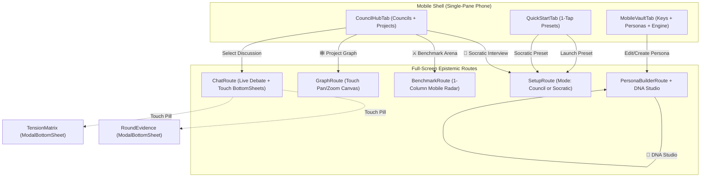

# Feature 08: Mobile Epistemic Parity & Gap Closure Suite (v1.8) — Architectural Specification

## Executive Summary

Dialex AI was designed as a sovereign, uncompromised multi-agent deliberation workbench. While the Desktop client provides an expansive 3-pane IDE layout (Workspace Tree, Deliberation Stage, Artifacts/Diagnostics HUD), the mobile viewport (`maxWidth < 600.dp`, smartphone portrait) currently exhibits functional gaps where advanced epistemic features are either inaccessible, lack touch-friendly entrypoints, or suffer from layout clipping due to desktop-first assumptions.

This specification establishes **Complete Epistemic Parity** between Desktop and Mobile, ensuring that any user on an Android or iOS smartphone can initiate Socratic interviews, benchmark multi-agent deliberations against single-model null hypotheses, explore project knowledge graphs, inspect retrieved RAG evidence and dialectical tension matrices via touch-first bottom sheets, and configure 8-layer cognitive persona DNAs.

---

## 1. Inventory of Mobile Gaps & Target Solutions

| # | Feature Area | Desktop Status | Mobile Gap | Mobile Epistemic Solution |
|---|---|---|---|---|
| **1** | **Socratic Interview Launcher** | Standalone `[ 🎯 Socratic Interview ]` capsule in left sidebar rail. | `CouncilHubTab` and `QuickStartTab` only launch multi-agent Council Setup. Socratic mode hidden deep in setup dropdown. | Add a prominent **`🎯 1-on-1 Socratic Interview`** hero action card in `CouncilHubTab` and quick-launcher in `QuickStartTab`. |
| **2** | **Null Hypothesis Arena Entry** | Sidebar button `[ ⚔️ Arena & Benchmarks ]` + Canvas Radar icon. | Route `BenchmarkArena` exists in `AnimatedContent`, but has **zero entrypoints** in mobile navigation shell. | Add a dedicated **Arena Benchmark Banner** in `CouncilHubTab` and top-bar quick action icon linking directly to `BenchmarkArena`. |
| **3** | **Mobile Arena Viewport & Radar** | 2-column wide layout (`Row`) with fixed 360dp left column. | Completely clips and overflows on mobile screens ($<420\text{dp}$). Radar chart and comparison arms pushed off-screen. | Implement **Responsive Single-Column Layout** with top segmented control: `[ 📊 Benchmark Arena | 📜 Dilemma History ]` and compact 260dp Canvas Radar. |
| **4** | **Knowledge Graph Exploration** | Context menu on project folder navigates to `Graph(projectId)`. | No button or tab exists on mobile to explore project knowledge graphs. | Add **`[ 🕸️ Knowledge Graph ]`** button to Project headers in `CouncilHubTab` and an action in Mobile Chat header. |
| **5** | **Mobile Persona Studio & DNA** | Full Persona Studio tab in desktop Settings. | `MobileVaultTab` only manages API keys and profiles. No way to create, edit, or calibrate 8-layer DNA on mobile. | Add **"Personas & Cognitive DNA"** section in `MobileVaultTab` with 1-tap navigation to `PersonaBuilder` and DNA Studio. |
| **6** | **Hierarchical Project Grouping** | Tree sidebar with collapsible folders, project creation, and discussion moves. | `CouncilHubTab` displays a flat list of discussions. Projects are invisible and unmanageable. | Introduce **Collapsible Project Accordions**, `[ + New Project ]` dialog, and project moving bottom sheet. |
| **7** | **Dynamic RAG Evidence Bottom Sheet** | Slide-out drawer (`Cmd+Shift+E`) or 92% wide desktop modal. | Wide desktop modal clips on small screens; keyboard shortcuts unavailable on mobile. | Implement **Touch-Friendly `ModalBottomSheet`** for `RoundEvidenceDrawer` with direct pill in mobile chat header. |
| **8** | **Paraconsistent Tension Matrix** | Slide-out drawer (`Cmd+Shift+T`) or 92% wide desktop modal. | Inaccessible without keyboard shortcuts; lacks mobile header indicator. | Implement **Touch-Friendly `ModalBottomSheet`** for `TensionMatrixDrawer` with direct live pill in mobile chat header. |
| **9** | **Problem Decomposition Modal** | 92% wide dual-perspective popup dialog. | Small screens cause excessive wrapping and clipped axis checkboxes. | Implement **Responsive Compact Touch Modal** with vertical perspective switcher and thumb-friendly tap targets ($\ge 48\text{dp}$). |

---

## 2. Detailed Technical Architecture

### 2.1 Socratic Interview & Benchmark Arena Launchers (`CouncilHubTab.kt`)

In `CouncilHubTab.kt`, the top header area is upgraded into a **Multi-Mode Command Hub**:

```kotlin
// CouncilHubTab.kt UI Layout Hierarchy
Column(modifier = Modifier.fillMaxSize().padding(horizontal = 16.dp)) {
    // 1. Hero Status Card (Pocket Council)
    HeroStatusCard(activeCouncilsCount, isConnected)
    
    // 2. Epistemic Quick-Action Row
    Row(modifier = Modifier.fillMaxWidth(), horizontalArrangement = Arrangement.spacedBy(8.dp)) {
        // Socratic Interview Button (Amber Accent)
        EpistemicActionCard(
            title = "Socratic Interview",
            subtitle = "1-on-1 Deep Inquiry",
            icon = Icons.Outlined.Gavel,
            accentColor = cc.agentFourth,
            onClick = onNewSocraticInterview,
            modifier = Modifier.weight(1f)
        )
        // Arena Benchmarks Button (Electric Cyan)
        EpistemicActionCard(
            title = "Benchmark Arena",
            subtitle = "Null Hypothesis Tests",
            icon = Icons.Outlined.Shield,
            accentColor = cc.agentSixth,
            onClick = onOpenBenchmarkArena,
            modifier = Modifier.weight(1f)
        )
    }
    
    // 3. Hierarchical Project & Discussion Accordions
    ProjectWorkspaceSection(projects, discussions, ...)
}
```

### 2.2 Hierarchical Project Workspace Grouping (`CouncilHubTab.kt`)

Instead of displaying discussions in a flat list, `CouncilHubTab` groups discussions by their parent `Project`:

```
┌─────────────────────────────────────────────────────────────┐
│ 📁 Core Infrastructure (3 Deliberations)             [🕸️] [▾] │
├─────────────────────────────────────────────────────────────┤
│  🟢 Raft vs Paxos Distributed Consensus             Active  │
│  ⚪ SQLite WAL Lock Contention Mitigation           Draft   │
│  🔵 Zero-Trust Token Revocation at Edge             Done    │
└─────────────────────────────────────────────────────────────┘
┌─────────────────────────────────────────────────────────────┐
│ 📁 FinTech Payments (1 Deliberation)                 [🕸️] [▸] │
└─────────────────────────────────────────────────────────────┘
┌─────────────────────────────────────────────────────────────┐
│ 📁 Ungrouped (2 Deliberations)                       [🕸️] [▸] │
└─────────────────────────────────────────────────────────────┘
```

- Each project header includes:
  - Collapsible Chevron (`Expanded` / `Collapsed` state remembered per project).
  - Deliberation count badge.
  - **`[ 🕸️ ]` Knowledge Graph Button**: Navigates immediately to `backStack.add(Graph(projectId))`.
  - Context menu (`...`): Rename Project, Delete Project, Add Discussion to Project.
- Top bar action: `[ + New Project ]` opens a sleek mobile dialog.

### 2.3 Mobile-Responsive Benchmark Arena (`BenchmarkScreen.kt`)

Currently, `BenchmarkScreen.kt` unconditionally renders:
```kotlin
Row(modifier = Modifier.fillMaxSize().padding(padding)) {
    Column(modifier = Modifier.width(360.dp)...) { /* Left: Cases */ }
    Column(modifier = Modifier.weight(1f)...) { /* Right: Arena */ }
}
```

To achieve responsive mobile behavior:
```kotlin
@Composable
fun BenchmarkScreen(
    state: BenchmarkState,
    onIntent: (BenchmarkIntent) -> Unit,
    onBack: () -> Unit,
    isCompact: Boolean = false,
    modifier: Modifier = Modifier
) {
    if (isCompact) {
        // Mobile Single-Column Layout with Top Tab Switcher
        var mobileTab by remember { mutableStateOf(BenchmarkMobileTab.ARENA) }
        
        Column(modifier = Modifier.fillMaxSize()) {
            PrimaryTabRow(selectedTabIndex = mobileTab.ordinal) {
                Tab(selected = mobileTab == BenchmarkMobileTab.ARENA, text = { Text("⚔️ Arena & Radar") })
                Tab(selected = mobileTab == BenchmarkMobileTab.CASES, text = { Text("📋 Dilemma Suite (${state.cases.size})") })
            }
            
            when (mobileTab) {
                BenchmarkMobileTab.ARENA -> {
                    MobileArenaView(
                        selectedCase = state.selectedCase,
                        latestRun = state.latestRun,
                        isEvaluating = state.isEvaluating,
                        onRunEvaluation = { onIntent(BenchmarkIntent.RunBenchmark(it.id)) }
                    )
                }
                BenchmarkMobileTab.CASES -> {
                    MobileCasePickerView(
                        cases = state.cases,
                        selectedCase = state.selectedCase,
                        onSelectCase = { 
                            onIntent(BenchmarkIntent.SelectCase(it))
                            mobileTab = BenchmarkMobileTab.ARENA
                        }
                    )
                }
            }
        }
    } else {
        // Desktop Two-Column Layout (Existing)
    }
}
```

In `MobileArenaView`:
- **Top Canvas Radar**: Rendered at compact height (`260.dp`), perfectly calibrated for phone screens.
- **Head-to-Head Comparison**: Displayed as stacked or swipeable horizontal cards:
  - Card 1: `Solo Baseline (Claude 3.7 Sonnet / High Reasoning)` — Factuality, Blind Spots, Cost.
  - Card 2: `Dialex Multi-Agent Council (3 Competitors + Moderator)` — Scores, Win Indicators.
- **Blinded Judge Verdict**: Expanded card detailing the LLM Judge justification and $\Delta Q$.

### 2.4 Mobile Persona Studio & DNA Calibration (`MobileVaultTab.kt`)

Add a dedicated **Persona Management & DNA Studio** card to `MobileVaultTab.kt`:

```kotlin
// In MobileVaultTab.kt
item {
    Card(
        colors = CardDefaults.cardColors(containerColor = cc.panel),
        border = BorderStroke(1.dp, cc.border),
        shape = RoundedCornerShape(12.dp),
        modifier = Modifier.fillMaxWidth()
    ) {
        Column(modifier = Modifier.padding(16.dp), verticalArrangement = Arrangement.spacedBy(10.dp)) {
            Row(
                modifier = Modifier.fillMaxWidth(),
                horizontalArrangement = Arrangement.SpaceBetween,
                verticalAlignment = Alignment.CenterVertically
            ) {
                Column {
                    Text("Personas & Cognitive DNA", style = MaterialTheme.typography.titleMedium, fontWeight = FontWeight.Bold, color = cc.textPrimary)
                    Text("Calibrate 8-layer mental models & custom agents", style = MaterialTheme.typography.bodySmall, color = cc.textMuted)
                }
                IconButton(onClick = { onOpenPersonaBuilder(null) }) {
                    Icon(Icons.Default.Add, contentDescription = "New Persona", tint = cc.accent)
                }
            }
            
            // List of custom & active personas with 1-tap edit
            personas.forEach { persona ->
                PersonaListItem(
                    persona = persona,
                    onClick = { onOpenPersonaBuilder(persona.id) }
                )
            }
        }
    }
}
```

### 2.5 Touch Bottom Sheets for Dynamic RAG & Tension Matrix (`ChatScreen.kt`)

In mobile chat, keyboard shortcuts (`Cmd+Shift+E`, `Cmd+Shift+T`) cannot be invoked.
- **Header Pills**: In `ChatScreen.kt` (compact layout), the top bar displays two compact interactive pills:
  - `[ 🔍 Evidence (3) ]` (Tapping sets `evidenceDrawerOpen = true`)
  - `[ ⚡ Tensions (2 Open) ]` (Tapping sets `tensionDrawerOpen = true`)
- **Bottom Sheet Rendering**:
  When `isCompact = true`, instead of centered dialogs, `RoundEvidenceDrawer` and `TensionMatrixDrawer` render as `ModalBottomSheet`:
  - Features swipe-down dismiss gesture.
  - Full screen width with rounded top corners (`RoundedCornerShape(topStart = 16.dp, topEnd = 16.dp)`).
  - Draggable pill handle at the top.
  - High-contrast scrollable evidence/tension list.

### 2.6 Problem Decomposition Touch Adaptation (`DecompositionModal.kt`)

In `DecompositionModal.kt`:
- When rendered on compact screens (`isCompact = true`):
  - Sets width to `fillMaxWidth(0.98f)`.
  - Stacks Perspective A and Perspective B tabs vertically or via a prominent segmented button.
  - Enforces minimum touch target of `48.dp` on every axis selection checkbox row.
  - Fixes the `Apply Selected Axes to Agenda` button at the bottom of the sheet above the navigation bar insets.

---

## 3. Navigation & State Flow Architecture



---

## 4. Touch Ergonomics & Accessibility Requirements

1. **Touch Target Size**: Every button, chip, tab, and menu trigger must satisfy $\ge 48\text{dp} \times 48\text{dp}$ clickable bounds per WCAG 2.2 AA.
2. **Safe Area Insets**: All bottom bars, action buttons, and bottom sheets must respect `WindowInsets.navigationBars` and `WindowInsets.ime` using Compose insets padding.
3. **Contrast & Theming**: All colors must use `LocalCcColors.current` semantic tokens (`cc.accent`, `cc.agentFourth`, `cc.agentSixth`, `cc.border`). Zero hardcoded platform hex colors.
4. **Haptic Feedback**: Subtle vibration or tactile response on drawer drag, axis toggle, and benchmark execution triggers.

---

## 5. Verification & Test Plan

1. **Unit Tests (`shared/src/commonTest/kotlin/...`)**:
   - `CouncilHubViewModelTest`: Verify project grouping, Socratic launcher intents, and arena navigation.
   - `BenchmarkMobileViewModelTest`: Verify mobile tab transitions between Arena and Case Picker.
   - `MobileVaultViewModelTest`: Verify persona listing and builder launch triggers.
2. **UI & Viewport Verification**:
   - Verify layout responsiveness across 3 critical mobile viewports:
     - Compact Phone Portrait (360dp width, e.g. Pixel 4a / iPhone SE)
     - Standard Phone Portrait (412dp width, e.g. Pixel 8 / Galaxy S24)
     - Foldable / Small Tablet (600dp width)
   - Verify that no horizontal scrolling occurs on `BenchmarkScreen` or `DecompositionModal`.
   - Verify that bottom sheets dismiss cleanly on swipe down and outside tap.
3. **Compilation Integrity**:
   - `./gradlew :shared:compileKotlinDesktop` (PASS)
   - `./gradlew :shared:desktopTest` (PASS)
   - `./gradlew :desktopApp:compileKotlinJvm` (PASS)
   - `./gradlew :androidApp:assembleDebug` (PASS)
