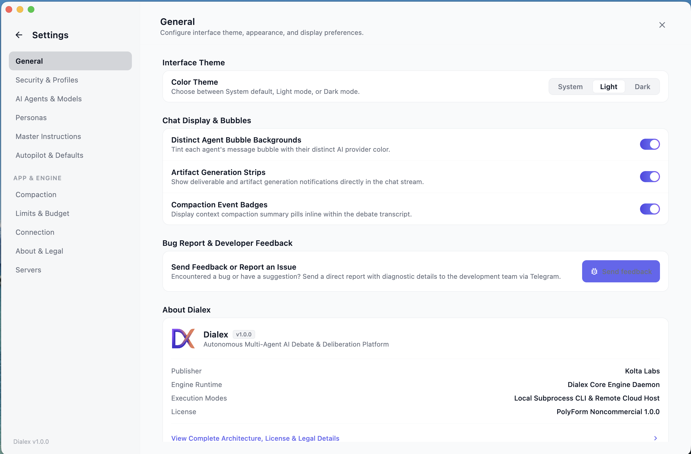

# Feature List, USPs & Beneficiaries Catalog — Dialex AI

This document details all user-facing capabilities, unique selling propositions (USPs), architectural controls, target audiences, and operational workflows of **Dialex AI**.

---

## 1. Executive Summary of Key USPs

```
┌──────────────────────────────────────────────────────────────────────────────────┐
│                             DIALEX AI KEY ADVANTAGES                            │
├───────────────────────┬──────────────────────────┬───────────────────────────────┤
│ Adversarial Council   │ $0 Marginal CLI Cost     │ 1-Click Native Desktop Apps   │
│ Up to 6 Frontier LLMs │ Run on local subshells   │ macOS (.dmg), Win (.msi),     │
│ eliminate blind spots │ with existing subscriptions│ Linux (.AppImage), Android    │
├───────────────────────┼──────────────────────────┼───────────────────────────────┤
│ Zero-Cloud Privacy    │ Deterministic State      │ Actionable Deliverables       │
│ AES-256 Vault +       │ Go turn state-machine    │ Automated ADRs, Matrices,     │
│ Tailscale Private Mesh│ with Instant Interrupts  │ Executive Memos, Code Diffs   │
└───────────────────────┴──────────────────────────┴───────────────────────────────┘
```

---

## 2. Multi-Agent Deliberation & Frontier Models

- **Up to 6 Simultaneous Frontier Models**: Convene Anthropic Claude (3.7 / 3.5 Sonnet), OpenAI (GPT-4o / Codex / o3), Google (Gemini 2.5 Pro / Flash / Antigravity), xAI Grok 3, DeepSeek (R1 / V3), Mistral Large, and local Ollama models in a single deliberation.
- **Designated Moderator Topology**: Seat 1 serves as the Primary Facilitator to frame topics, direct rounds, and synthesize consensus, accompanied by up to 5 competing peer models.
- **12-Color Member Palette**: Deterministic, accessible color coding mapped dynamically to council seats using Kolt theme tokens, ensuring crystal-clear speaker differentiation.
- **Dual Execution Modes (API vs CLI)**: Connect directly via encrypted cloud API keys or shell out to authenticated developer CLIs (`claude`, `codex`, `antigravity`/`agy`, `ollama`) with zero extra per-token billing.

---

## 3. Two-Tab Persona Registry & Style Modifiers

- **10 Universal Debate Archetypes**:
  1. 🏛️ **The Facilitator**: Structures debate, maintains topical focus, and synthesizes consensus.
  2. 😈 **Devil's Advocate**: Relentlessly stress-tests assumptions, exposing hidden failure modes.
  3. 🚀 **The Optimist**: Explores 10x upside, radical scalability, and architectural innovation.
  4. ⚖️ **The Pragmatist**: Grounds debates in engineering velocity, maintenance cost, and latency.
  5. ⚡ **The Contrarian**: Attacks groupthink and defends high-leverage unorthodox paradigms.
  6. 🔬 **The Expert**: Enforces protocol precision, mathematical validity, and rigorous correctness.
  7. 🛡️ **The Risk Analyst**: Uncovers edge cases, blast radiuses, and single points of failure.
  8. 🧭 **The Ethicist**: Audits alignment, user privacy, and organizational governance.
  9. 📜 **The Historian**: References software engineering precedents and historical post-mortems.
  10. 🔮 **The Futurist**: Assesses 5-to-10-year technology trajectories and obsolescence risks.
- **40+ Specialized Domain Personas**: Expandable domains covering Distributed Systems, Cybersecurity, AI/ML Infrastructure, Healthcare/HIPAA, FinTech Core, Legal Compliance, and Product Strategy.
- **Deliberation Style Modifiers**:
  - **Standard**: Deep dialectic rigor with code citations and nuance.
  - **Ponytail Mode**: Structured executive bullet points with trade-off matrices.

<table align="center" width="100%">
  <tr>
    <td width="50%" align="center">
      
      <br/><em>Figure 3.1: Two-Tab Persona Registry with 10 Universal Roles, 40+ Domain Personas, and Custom Badges.</em>
    </td>
    <td width="50%" align="center">
      
      <br/><em>Figure 3.2: Persona Studio & AI Prompt Builder with Ponytail brevity controls.</em>
    </td>
  </tr>
</table>

---

## 4. 3-Tier Anti-Fluff & Topic Drift Guardrails

- **Human Dialogue Mode**: Enforces concise turns (2–4 sentences), eliminates sycophantic pleasantries (*"I agree with my esteemed colleague"*), and requires direct technical challenges.
- **Topic Drift Guardrail**: Forbids peripheral semantic debates, forcing agents to pull the deliberation back to the core question.
- **3-Tier Cascade Hierarchy**:
  1. *Global Settings*: Master organization-wide defaults.
  2. *Project Settings*: Workspace-level overrides.
  3. *Discussion Setup*: Per-session toggles.

---

## 5. Live Human Interjections & Instant Interrupts

- **Steering Queue**: Type guidance while models are speaking; Dialex AI queues and injects your steering directive before the next round begins without stalling active turns.
- **Instant Interrupt**: Immediately halt active model generation, safely finalize partial tokens, and force human guidance as the next turn without 409 concurrency conflicts.

---

## 6. In-Stream Deliverables & Generative Artifacts

- **Consensus Outcome Bubble**: Upon reaching agreement, the moderator generates a dedicated consensus outcome bubble with bottom-line verdict, consensus agreements, and critical caveats.
- **1-Tap Generative Deliverables**:
  - 📋 **ADR-042 (Architecture Decision Record)**
  - ⚖️ **Weighted Decision Matrix** (Multi-criteria comparative table)
  - 📊 **Pro/Con Trade-Off Breakdown**
  - 📄 **Executive Memorandum (HTML / Markdown)**
  - 💻 **Code Implementation Diff & Scaffolding**
  - ✨ **Custom Deliverable Format Prompt**
- **Chronological Anchoring**: Deliverables remain locked at their exact round timestamps in the chat stream.

<table align="center" width="100%">
  <tr>
    <td width="50%" align="center">
      
      <br/><em>Figure 6.1: Moderator Consensus Outcome Bubble & instant 1-tap generative deliverable action buttons.</em>
    </td>
    <td width="50%" align="center">
      
      <br/><em>Figure 6.2: Saved Deliverables Sliding Drawer (Cmd+Shift+A) with Markdown/HTML rendering and export.</em>
    </td>
  </tr>
</table>

---

## 7. Cross-Platform Native Clients

### Dialex AI Desktop (macOS, Windows, Linux)
- Standalone 1-click downloadables (`.dmg`, `.msi`, `.AppImage`, `.deb`).
- Auto-spawns managed background Go engine child process on startup.
- Fluid-responsive reading widths (`680.dp` to `880.dp`).
- Top bar double-click window maximization and macOS traffic light insets.

### Dialex AI Mobile (Android)
- Radial Stadium Arena visualizer with active speaker spotlight glows.
- Hold-to-speak voice dilemma dictation with automatic topic extraction.
- Multi-voice native Text-to-Speech (TTS) audio briefings.
- 1-Tap QR Companion Pairing over local LAN or Tailscale WireGuard mesh.

<div align="center">
  
  <p><em>Figure 7.1: Desktop Settings, dark/light appearance tokens, and legal notice.</em></p>
</div>

---

## 8. Deployment Flexibility: In-Device vs Remote Server

| Deployment Mode | Setup Complexity | Best Suited For | Topology |
|---|---|---|---|
| **In-Device Engine** (Default) | Zero (Automated) | Individual developers, solo architects, offline flights | Desktop app spawns local Go engine at `127.0.0.1:8080`. |
| **Self-Hosted Remote Server** | Low (Docker / Systemd) | Engineering teams, homelabs, dedicated office servers | Central Go engine on Linux server with shared SQLite database. |
| **Tailscale Private Mesh** (`tsnet`) | Zero Port Forwarding | Remote teams, secure mobile-to-desktop connectivity | Encrypted WireGuard MagicDNS at `http://dialex:8080`. |

---

## 9. Target Beneficiaries & Value Matrix

| Target Persona | Key Workflows in Dialex AI | Measurable ROI & Advantage |
|---|---|---|
| 👨‍💻 **Staff & Principal Architects** | Stress-testing backend migrations (Kafka vs Monolith, Postgres vs CockroachDB). | Automated ADR generation; prevents multi-month architectural rewrites. |
| 👔 **CTOs & Tech Executives** | Roadmap validation, cloud infrastructure spend evaluations. | Executive Memos with decision matrices for board and investor review. |
| 🛡️ **Cybersecurity Red-Teams** | Adversarial threat modeling and zero-trust auth vulnerability audits. | Exposes attack surfaces before production rollout. |
| 🔬 **AI / ML Researchers** | Cross-LLM evaluation benchmarks and hallucination elimination. | Direct consensus scoring across competing AI model families. |
| ⚖️ **Legal & Compliance Officers** | Multi-jurisdiction policy audits (GDPR, HIPAA, SOC2). | 100% on-premise sovereign execution with zero cloud data leaks. |
| 🚀 **Startup Founders & PMs** | Synthetic advisory board for product-market fit and pricing strategy. | Eliminates expensive $1,000/hr external advisory retainers. |

---

## 10. Advanced Epistemic Features & Roadmap

The following advanced capabilities have been implemented or are queued for implementation in [**docs/04_PENDING_FEATURES_SPEC.md**](04_PENDING_FEATURES_SPEC.md):

### Completed Features (v1.1 – v1.5)
1. **Self-Organizing Knowledge Graph & Drag-and-Drop Workspace Organization (COMPLETED)**:
   - Local-first pure-Go SQLite + FTS5 graph storage with activation energy mathematical decay ($W(t) = W_0 \cdot 2^{-\Delta t / t_{\text{half}}}$) and Hebbian edge reinforcement ($\Delta W = \eta (1 - W)$).
   - Interactive 2D force-directed canvas with pan/zoom and activation filters.
   - Smooth drag-and-drop workspace reorganization with auto-expanding drop targets.
   - 📖 **Full Architectural Specification**: [**docs/features/01_KNOWLEDGE_GRAPH_AND_DRAG_DROP.md**](features/01_KNOWLEDGE_GRAPH_AND_DRAG_DROP.md)
2. **Pre-Debate Multi-Perspective Problem Decomposition (COMPLETED)**:
   - Divergent dual-mind breakdown of user dilemmas into orthogonal sub-axes (Technical/Structural vs Product/Strategic) before the main council convenes.
   - Interactive `DecompositionModal` with one-click injection into discussion agenda contexts.
   - 📖 **Full Architectural Specification**: [**docs/features/02_PROBLEM_DECOMPOSITION.md**](features/02_PROBLEM_DECOMPOSITION.md)
3. **Explicit Contradiction & Tension Pair Detection Engine (COMPLETED)**:
   - Automated real-time extraction and tracking of dialectic tension pairs (thesis vs antithesis) grounded in paraconsistent logic ($C_n$ systems).
   - Real-time slide-out `TensionMatrixDrawer` tracking severity metrics, quote citations, and synthesis resolution.
   - 📖 **Full Architectural Specification**: [**docs/features/03_CONTRADICTION_AND_TENSION_DETECTION.md**](features/03_CONTRADICTION_AND_TENSION_DETECTION.md)
4. **Round-Aware Dynamic Graph Retrieval & Evidence Grounding (COMPLETED)**:
   - Dynamic per-round query expansion based on disputed claims from round $N$ to retrieve empirical evidence from knowledge graph nodes and attached project files.
   - Automated prompt injection of `[DYNAMIC GROUNDING EVIDENCE FOR ROUND N+1]` grounding blocks and slide-out `RoundEvidenceDrawer`.
   - 📖 **Full Architectural Specification**: [**docs/features/04_ROUND_AWARE_DYNAMIC_RETRIEVAL.md**](features/04_ROUND_AWARE_DYNAMIC_RETRIEVAL.md)
5. **Dedicated 1-on-1 Socratic Interview Mode & Live Epistemic Ledger (COMPLETED)**:
   - Targeted 1-on-1 forensic interrogation of individual expert personas without spinning up a full 6-agent council.
   - 5 deep Socratic stances (*Classic Elenchus*, *Maieutic Architecture*, *Radical First Principles*, *Adversarial Red-Team*, *Aporia Boundary-Pusher*).
   - *Brevis Interrogatio* rule ($\le 2$ sentences) forcing high-leverage tension and concise dialectic dialogue.
   - Live Epistemic Ledger tracking green **Hardened Invariants** vs red strike-through **Surrendered Concessions**, reactive Dialogue Assist Chips, structured **Socratic Digest**, and 1-click **Council Elevation**.
   - 📖 **Full Architectural Specification**: [**docs/features/05_SOCRATIC_INTERVIEW_MODE_SPEC.md**](features/05_SOCRATIC_INTERVIEW_MODE_SPEC.md)

### Pending Roadmap Capabilities
6. **Null Hypothesis Benchmarking & Evaluation Suite**: Automated testing framework validating multi-agent debate superiority against single-model baselines across hallucination and trade-off metrics.
7. **8-Layer DNA Mental & Structured Persona Ingestion**: Standardized cognitive schema (epistemic bias, communication vector, taboo spaces, heuristics) with MMOS export compatibility.

---

## 📄 License

Dialex AI is licensed under the [PolyForm Noncommercial License 1.0.0](file:///LICENSE).  
Copyright (c) 2026 Kolta Labs. Free for personal, academic, and noncommercial research. Commercial deployments require an enterprise license from Kolta Labs.
