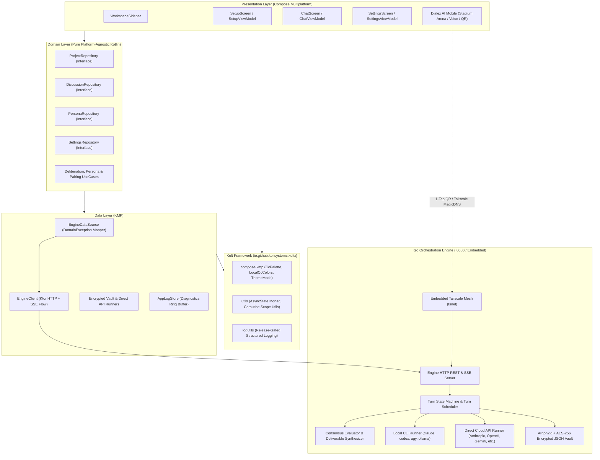
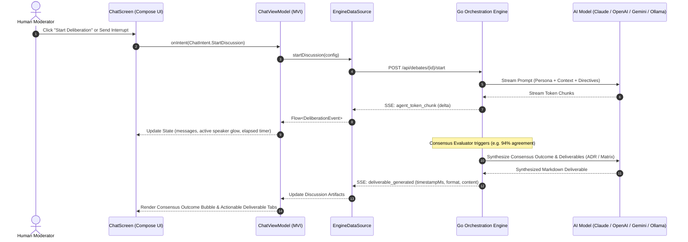

# System Topology & System Design — Dialex AI

Dialex AI is built upon **Clean Architecture**, **unidirectional Model-View-Intent (MVI)** presentation patterns, and a robust decoupled multiplatform topology pairing a high-throughput **Go Orchestration Engine** with a **Kotlin Multiplatform (KMP) & Compose Multiplatform** client layer powered by the **Kolt Ecosystem (`KoltLibs`)**.

---

## 1. System Topology Overview

---

## 2. Layering & Architectural Invariants

### A. Presentation Layer (MVI in Compose Multiplatform)
- **State**: Single immutable data class (`ChatState`) per screen utilizing `kotlinx.collections.immutable` (`ImmutableList`, `ImmutableMap`) to avoid unnecessary Compose recompositions across streaming feeds.
- **Intent**: Sealed interface (`ChatIntent`) encapsulating all user interactions and gestures.
- **Effect**: One-shot side-effects (navigation routes, file exports, snackbars) delivered via `Channel` and collected solely by Route composables.
- **Stateless Root Composable**: Receives only `state`, `onIntent: (Intent) -> Unit`, and navigation callbacks — zero ViewModel references for 100% `@Preview` testability.

### B. The Kolt Ecosystem Foundation (`KoltLibs`)
Dialex AI relies on `KoltLibs` via a Gradle Composite Build (`includeBuild("../KoltLibs")`):
- **`compose-kmp`**: Provides the Obsidian Nebula theme system (`CcPalette`, `LocalCcColors`), elevation tokens, button styles, and fluid typography.
- **`utils`**: Supplies `AsyncState<T>` (`Uninitialized`, `Loading`, `Success`, `Error`) reactive state modeling.
- **`logutils`**: Release-gated logging and telemetry ring buffers.

### C. Domain Layer (Pure Kotlin)
- Zero platform dependencies (`java.*`, `android.*`, `androidx.compose.*`).
- Encapsulates core business entities: `Project`, `Discussion`, `DiscussionMessage`, `DiscussionArtifact`, `PersonaConfig`, and `ExecutionPolicy`.
- Strict single-direction dependency rule: `UseCase` depends only on `Repository` interfaces; no peer `UseCase` cross-invocations.

### D. Data Layer (Transport & Mapping)
- `EngineDataSource`: Maps low-level transport errors (HTTP 4xx/5xx, connection timeouts, parsing bugs) into typed `DomainException` models (`NetworkUnavailable`, `AuthenticationRequired`, `ExecutionError`).
- `EngineClient`: Ktor-powered HTTP client streaming Server-Sent Events (SSE) flows directly into domain repositories.

### E. Go Orchestration Engine
- **Turn State Machine**: Thread-safe state engine coordinating model turns, loop detection, and prompt context compaction.
- **In-Stream Milestone Deliverables**: Synthesizes checkpoint ADRs and patches, timestamping each artifact and associating it with its generation round.
- **Live Interrupt Channel**: Mutex-locked FIFO queue ensuring human steering messages take immediate precedence before the next turn starts.
- **Embedded Tailscale (`tsnet`)**: Advertises the engine onto private Tailscale tailnets without requiring local root privileges or manual port forwarding.

---

## 3. Sequence: Deliberation Turn, Streaming & Consensus Deliverable

---

## 📄 License

Dialex AI is licensed under the [PolyForm Noncommercial License 1.0.0](file:///LICENSE).  
Copyright (c) 2026 Kolta Labs. Free for personal, academic, and noncommercial research. Commercial deployments require an enterprise license from Kolta Labs.
