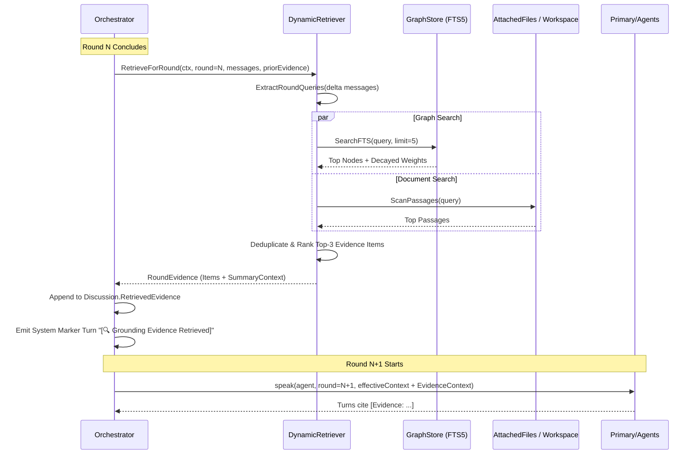

# Pending Features Specification — Dialex AI
> **Status**: Approved for Roadmap & Architecture Backlog  
> **Priority Classification**: **IMPORTANT / HIGH PRIORITY**  
> **Source Inspirations**: Dialex Epistemic Research, Multi-Mind Dialectic Synthesis (`murilloimparavel/dialex`), Buehler MIT Self-Organizing Graphs, Paraconsistent Logic.

This document serves as the formal specification for pending features slated for implementation into **Dialex AI**. Every feature in this document is marked as **IMPORTANT** to elevate Dialex AI from a turn-based deliberation chat workspace into a compounding, self-organizing cognitive engine.

---

## 📑 Specification Index

1. [Self-Organizing Knowledge Graph with Temporal Decay (COMPLETED)](features/01_KNOWLEDGE_GRAPH_AND_DRAG_DROP.md)
2. [Pre-Debate Multi-Perspective Problem Decomposition (COMPLETED)](features/02_PROBLEM_DECOMPOSITION.md)
3. [Explicit Contradiction & Tension Pair Detection Engine (COMPLETED)](features/03_CONTRADICTION_AND_TENSION_DETECTION.md)
4. [Round-Aware Dynamic Graph Retrieval (In-Debate RAG) (COMPLETED)](features/04_ROUND_AWARE_DYNAMIC_RETRIEVAL.md)
5. [Dedicated 1-on-1 Socratic Interview Mode (COMPLETED)](features/05_SOCRATIC_INTERVIEW_MODE_SPEC.md)
6. [Null Hypothesis Benchmarking & Quantitative Evaluation Suite (APPROVED SPEC)](features/06_NULL_HYPOTHESIS_BENCHMARKING_SPEC.md)
7. [8-Layer DNA Mental & Structured Persona Ingestion](#7-8-layer-dna-mental--structured-persona-ingestion)

---

## 1. Self-Organizing Knowledge Graph with Temporal Decay

> [!NOTE]
> **Status**: **COMPLETED** (v1.1) — Detailed architectural spec: [**docs/features/01_KNOWLEDGE_GRAPH_AND_DRAG_DROP.md**](features/01_KNOWLEDGE_GRAPH_AND_DRAG_DROP.md)  
> **Component**: Go Engine (`pkg/graph`, `pkg/api`), KMP Shared (`domain`, `data`, `presentation/graph`), Embedded SQLite + FTS5, Pure-Go WAL.

### 1.1 Problem Statement
Currently, Dialex AI stores discussion records in flat atomic JSON files. Each deliberation starts in a fresh silo. Past insights, consensus decisions, trade-offs, and citations do not compound across discussions into institutional memory.

### 1.2 Proposed Architecture & Specifications
Implement an embedded, local-first **SQLite + FTS5** graph storage engine with temporal decay:
* **Node Schema**:
  * `id`: UUID
  * `type`: `CONCEPT | ARGUMENT | CONSENSUS | TENSION | DELIVERABLE | SOURCE`
  * `title`: String
  * `content`: Text (indexed in FTS5)
  * `weight`: Float (activation energy $W \in [0.0, 1.0]$)
  * `created_at`, `last_accessed_at`: Timestamp
  * `decay_half_life_days`: Float (default: 30 days)
* **Edge Schema**:
  * `source_id`, `target_id`: Node IDs
  * `relation`: `CONTRADICTS | SUPPORTS | BLENDS_INTO | DERIVED_FROM | PREREQUISITE_FOR`
  * `strength`: Float (reinforced upon co-reference)
* **Temporal Decay Mathematical Formulation**:
  $$W(t) = W_0 \cdot 2^{-\frac{\Delta t}{t_{\text{half}}}}$$
  Nodes not referenced in active deliberations naturally decay in activation weight. Nodes with $W < 0.1$ go dormant (excluded from automatic context injection unless explicitly queried via FTS5). When a dormant node is recalled and validated in a debate, its weight resets to $1.0$ and connected edges strengthen.

---

## 2. Pre-Debate Multi-Perspective Problem Decomposition

> [!NOTE]
> **Status**: **COMPLETED** (v1.2) — Detailed architectural spec: [**docs/features/02_PROBLEM_DECOMPOSITION.md**](features/02_PROBLEM_DECOMPOSITION.md)  
> **Component**: Go Engine (`pkg/decomposition`, `pkg/api`), KMP Shared (`domain`, `data`, `presentation/setup`), Compose UI.

### 2.1 Problem Statement
Deliberations currently begin immediately with Round 1 framing by the Moderator. Complex, multifaceted dilemmas (e.g., *"Should we rewrite our core engine in Rust or Go?"*) often suffer from initial framing bias if the dilemma is not first split into its core orthogonal tensions.

### 2.2 Proposed Architecture & Specifications
Introduce a preliminary **Decomposition Phase** prior to Round 1:
1. **Divergent Splitting**: Before peer models debate, two distinct model personas (e.g., *Systems Architect* vs. *VP of Product / FinTech Strategist*) generate competing decompositions of the question into 3–4 sub-axes (e.g., Axis 1: Memory safety & concurrency vs Axis 2: Team hiring velocity & ecosystem maturity).
2. **Interactive Selection UI**: The human orchestrator is presented with the two proposed framing breakdown trees in the UI and can:
   - Accept Decomposition A or B.
   - Blend both into a hybrid debate agenda.
   - Kick off parallel sub-rounds across the decomposed branches.

---

## 3. Explicit Contradiction & Tension Pair Detection Engine

> [!NOTE]
> **Status**: **COMPLETED** (v1.3) — Detailed architectural spec: [**docs/features/03_CONTRADICTION_AND_TENSION_DETECTION.md**](features/03_CONTRADICTION_AND_TENSION_DETECTION.md)  
> **Component**: Go Engine (`pkg/consensus`, `pkg/model`), KMP Presentation (`chat`, `deliverables`).

### 3.1 Problem Statement
In current deliberations, contradictions between opposing models are expressed as unstructured prose. Consensus evaluation searches for lexical agreement or numerical votes, which risks papering over critical technical tensions.

### 3.2 Proposed Architecture & Specifications
Grounded in **Paraconsistent Logic** (da Costa, 1974), where contradictions are treated as informative signals rather than system failures:
* **Tension Pair Data Model**:
  ```kotlin
  data class TensionPair(
      val id: String,
      val thesis: AgentAssertion,        // e.g., "Full ACID replication required"
      val antithesis: AgentAssertion,    // e.g., "Eventual consistency required for <10ms SLA"
      val underlyingConflict: String,    // "Consistency vs. Availability"
      val status: TensionStatus          // OPEN | EXPLORED | RESOLVED | ACCEPTED_TRADE_OFF
  )
  ```
* **Real-Time Extraction**: An async evaluation pass runs at the end of each round to extract new tension pairs.
* **Tension Matrix UI Card**: A live sidebar or HUD element displaying unresolved tensions.
* **Consensus Enforcement**: The Moderator cannot mark a discussion as `CONSENSUS_REACHED` unless every identified tension pair is either resolved via a synthesis compromise or formally documented as an accepted trade-off in the final deliverable.

---

## 4. Round-Aware Dynamic Graph Retrieval (In-Debate RAG)

> [!NOTE]
> **Status**: **COMPLETED** (v1.4) — Detailed architectural spec: [**docs/features/04_ROUND_AWARE_DYNAMIC_RETRIEVAL.md**](features/04_ROUND_AWARE_DYNAMIC_RETRIEVAL.md)  
> **Component**: Go Engine (`pkg/retrieval`, `pkg/orchestrator`, `pkg/api`), KMP Shared (`domain`, `data`, `presentation/chat`), Compose UI.

### 4.1 Problem Statement & Theoretical Motivation
Standard RAG frameworks perform context retrieval **statically once at deliberation initialization ($R_0$)**. In real-world dialectic debates lasting 3 to 10 rounds:
1. **Semantic Drift & Emergent Subtopics**: Models frequently diverge into specialized, unpredicted architectural domains (e.g., SQLite WAL lock contention, Raft consensus heartbeat timeouts, SIMD vectorization pipelines, zero-trust token revocation). Initial $R_0$ retrieval becomes stale or irrelevant.
2. **Ungrounded Hallucinations in Disputed Claims**: When opposing models disagree on empirical quantities (e.g., latency numbers, throughput ceilings, API signatures, compliance requirements), they argue hypotheticals without authoritative grounding.
3. **The Dialectic Evidence Invariant**: Models must not be allowed to argue empirical claims in a vacuum when authoritative grounding exists within the project's **Knowledge Graph**, **Attached Documents**, or **Codebase Workspaces**.

### 4.2 Algorithmic Formulation & Retrieval Mathematics

Let $R_N = \{m_1, m_2, \dots, m_k\}$ denote the transcript of turns generated in Round $N$.
1. **Delta Assertion & Disputed Claim Extraction**:
   At the round boundary $N \to N+1$, compute the delta of technical assertions and empirical claims:
   $$\Delta A_N = \text{ExtractAssertions}(R_N) \setminus \text{PriorClaims}(R_{1..N-1})$$
   Extract $1 \le |Q_N| \le 3$ focused, high-information retrieval queries:
   $$Q_N = \mathcal{F}_{\text{query}}(\Delta A_N, \text{Topic})$$

2. **Dual-Source Hybrid Retrieval**:
   For each query $q \in Q_N$:
   - **Source 1: Local-First Epistemic Knowledge Graph (FTS5 + Temporal Decay)**:
     Compute rank score combining BM25 full-text relevance with exponential memory decay:
     $$S_{\text{graph}}(n, q, t) = \text{BM25}(n.\text{content}, q) \times \left(W_0 \cdot 2^{-\frac{t - t_0}{t_{\text{half}}}}\right)$$
     Where $n \in \text{Nodes}$, $n.\text{type} \in \{\text{CONCEPT}, \text{ARGUMENT}, \text{CONSENSUS}, \text{SOURCE}\}$.
   - **Source 2: Workspace Project & Attached Documents**:
     Perform paragraph-level sliding-window lexical scoring across all attached documents and project scope files:
     $$S_{\text{doc}}(d, q) = \text{TF-IDF}_{\text{passage}}(d, q)$$

3. **Deduplication, Ranking & Token Budget Cap**:
   Filter out nodes/passages already retrieved in earlier rounds:
   $$\mathcal{E}_{\text{candidate}} = \left(\text{TopHits}_{\text{graph}} \cup \text{TopHits}_{\text{doc}}\right) \setminus \bigcup_{i=1}^{N} \mathcal{E}_i$$
   Rank candidates by combined score and select top $K$ ($1 \le K \le 3$):
   $$\mathcal{E}_{N+1} = \text{TopK}(\mathcal{E}_{\text{candidate}}, K=3)$$

4. **System Context Injection for Round $N+1$**:
   For each turn in Round $N+1$, format $\mathcal{E}_{N+1}$ into a high-priority grounding block:
   ```markdown
   [DYNAMIC GROUNDING EVIDENCE FOR ROUND N+1]
   The following verified facts were retrieved based on claims raised in Round N:
   - [Evidence: Graph Node "SQLite WAL Concurrency" (Score: 0.94)]:
     "In WAL mode, readers do not block writers, and writers do not block readers..."
   - [Evidence: Workspace File "docs/benchmarks.md" (Score: 0.88)]:
     "PostgreSQL v16 sustained 14,200 write ops/sec under concurrent pgbouncer pooling..."
   MANDATE: Anchor your Round N+1 arguments directly to this retrieved evidence.
   When referencing these facts, cite using attribution tags like [Evidence: SQLite WAL Concurrency].
   ```

### 4.3 Data Contracts & Schema Specification

#### Go Engine Models (`engine/pkg/model/evidence.go`)
```go
type EvidenceSourceType string

const (
    EvidenceSourceKnowledgeGraph EvidenceSourceType = "KNOWLEDGE_GRAPH"
    EvidenceSourceAttachedFile   EvidenceSourceType = "ATTACHED_FILE"
    EvidenceSourceWorkspaceDoc   EvidenceSourceType = "WORKSPACE_DOC"
)

type EvidenceItem struct {
    ID               string             `json:"id"`
    Round            int                `json:"round"`
    Query            string             `json:"query"`
    SourceType       EvidenceSourceType `json:"sourceType"`
    SourceID         string             `json:"sourceId"`
    SourceTitle      string             `json:"sourceTitle"`
    Snippet          string             `json:"snippet"`
    Score            float64            `json:"score"`
    AttributionBadge string             `json:"attributionBadge"`
    TimestampMs      int64              `json:"timestampMs"`
}

type RoundEvidence struct {
    Round          int            `json:"round"`
    TriggerQueries []string       `json:"triggerQueries"`
    Items          []EvidenceItem `json:"items"`
    SummaryContext string         `json:"summaryContext"`
}
```

#### Discussion & Result Extensions (`engine/pkg/model/project.go`, `debate.go`)
- `Discussion.RetrievedEvidence []RoundEvidence`
- `DebateResult.RetrievedEvidence []RoundEvidence`

#### KMP Shared Models (`shared/.../domain/model/EvidenceModels.kt`)
```kotlin
@Serializable
enum class EvidenceSourceType {
    KNOWLEDGE_GRAPH, ATTACHED_FILE, WORKSPACE_DOC
}

@Serializable
data class EvidenceItem(
    val id: String,
    val round: Int,
    val query: String,
    val sourceType: EvidenceSourceType,
    val sourceId: String,
    val sourceTitle: String,
    val snippet: String,
    val score: Double = 0.0,
    val attributionBadge: String = "",
    val timestampMs: Long = 0L
)

@Serializable
data class RoundEvidence(
    val round: Int,
    val triggerQueries: List<String> = emptyList(),
    val items: List<EvidenceItem> = emptyList(),
    val summaryContext: String = ""
)
```

### 4.4 Engine Execution & Orchestrator Lifecycle



### 4.5 KMP Presentation & UI Implementation
1. **Round Divider Evidence Badge**:
   - In `RoundDivider` (or at the top of Round $N+1$), render a sleek pill:
     `[🔍 3 Evidence Nodes Injected for Round N+1 · View Details]`
   - Tapping the pill dispatches `ChatIntent.SetEvidenceDrawerOpen(true, round = N+1)`.
2. **Round Evidence Drawer (`RoundEvidenceDrawer.kt`)**:
   - Slide-out drawer or modal sheet detailing:
     - Target Round & Trigger Queries.
     - Evidence Cards with Source Type icon (`Hub` for Graph, `Description` for Docs).
     - Relevance score bar gauge.
     - Expandable snippet preview with 1-tap copy.
3. **In-Turn Citation Highlighting**:
   - Matches pattern `\[Evidence:\s*([^\]]+)\]` in message text.
   - Renders as an interactive token badge that jumps to or opens the corresponding evidence card.

### 4.6 Verification & Testing Plan
1. **Engine Retrieval Unit Tests (`pkg/retrieval/retriever_test.go`)**:
   - Query extraction with heuristic fallback when LLM is unavailable.
   - GraphStore FTS hit scoring + rank cutoff.
   - Attached files passage chunking and score calculation.
   - Dedup invariant: items retrieved in Round 1 never duplicate into Round 2.
2. **Orchestrator Integration Test (`pkg/orchestrator/orchestrator_test.go`)**:
   - Verify dynamic context injection into Round 2 prompt when Round 1 introduces ungrounded technical claims.
   - Verify `RetrievedEvidence` propagation in `DebateResult`.
3. **KMP Shared & UI Tests (`shared/.../EvidenceRetrievalTest.kt`)**:
   - Serialization and deserialization of `RoundEvidence`.
   - `ChatViewModel` state transitions when evidence drawer is toggled.
   - Verification of `RoundEvidenceDrawer` composable rendering.

---

## 5. Dedicated 1-on-1 Socratic Interview Mode

> [!NOTE]
> **Status**: **COMPLETED** (v1.5) — Detailed architectural spec: [**docs/features/05_SOCRATIC_INTERVIEW_MODE_SPEC.md**](features/05_SOCRATIC_INTERVIEW_MODE_SPEC.md)  
> **Component**: Go Engine (`pkg/socratic`, `pkg/api`), KMP Shared (`domain`, `data`, `presentation/chat`, `presentation/setup`), Compose UI.

### 5.1 Problem Statement
Convening a 4-to-6-model council is resource-intensive when a user merely wants to deep-dive an individual expert persona (e.g., interviewing *The Risk Analyst* on a specific zero-trust auth vulnerability) or stress-test an idea via classical *Elenchus* and *Maieutics*.

### 5.2 Implemented Architecture & Highlights
* **Command & UI Entrypoint**: Dedicated 1-click `[ 🎯 Socratic Interview ]` capsule in the left sidebar, top mode switcher in `SetupScreen`, and Persona Studio actions.
* **5 Deep Socratic Stances**: *Classic Elenchus*, *Maieutic Architecture*, *Radical First Principles*, *Adversarial Red-Team*, and *Aporia Boundary-Pusher*.
* **Strict *Brevis Interrogatio* Guardrail**: Enforces $\le 2$ sentences per question turn to eliminate conversational bloat and sustain high dialectic pressure.
* **Live Epistemic Ledger**: Interactive HUD tracking green **Hardened Invariants** vs red strike-through **Surrendered Concessions** with 3 reactive Dialogue Assist Chips.
* **Socratic Digest & Council Bridge**: Concludes with a 5-part structured **Socratic Digest** deliverable and 1-tap elevation to a full multi-agent Council Debate.

---

## 6. Null Hypothesis Benchmarking & Quantitative Evaluation Suite

> [!NOTE]
> **Status**: **COMPLETED** (v1.6) — Detailed spec: [**docs/features/06_NULL_HYPOTHESIS_BENCHMARKING_SPEC.md**](features/06_NULL_HYPOTHESIS_BENCHMARKING_SPEC.md)  
> **Component**: Go Engine (`pkg/benchmark`, `pkg/api`), CLI (`cmd/dialexbench`), KMP Shared (`domain`, `data`, `presentation/arena`), Desktop Compose UI, Web Admin Dashboard (`:8080/admin/benchmarks`).

### 6.1 Problem Statement
To establish scientific legitimacy and enterprise ROI, Dialex AI must empirically prove that multi-agent deliberation yields superior, less hallucinated outcomes than a single well-prompted frontier model.

### 6.2 Proposed Architecture & Specifications
* **The Null Hypothesis**: *"A single frontier model (Claude 3.7 Sonnet or GPT-4o) with extended chain-of-thought produces equivalent or superior decision quality compared to a multi-agent dialectic council."*
* **Automated Evaluation Harness**:
  * Ingests standardized architectural dilemmas and edge-case engineering prompts.
  * Runs Run A (Single-Model Baseline with high reasoning effort).
  * Runs Run B (Dialex AI Multi-Agent Council with 3–4 competing models + Moderator).
  * Evaluates both outputs using a blinded LLM-as-a-Judge and programmatic metrics:
    1. **Hallucination Rate**: Count of ungrounded or fabricated claims.
    2. **Blind Spot Coverage**: Number of recognized edge cases and risk modes.
    3. **Trade-off Completeness**: Balance and depth of pro/con analysis.
    4. **Actionability Score**: Concrete clarity of the produced deliverable.

---

## 7. 8-Layer DNA Mental & Structured Persona Ingestion

> [!NOTE]
> **Status**: **IN SPECIFICATION & DELIBERATION** (v1.7) — Detailed spec: [**docs/features/07_8_LAYER_PERSONA_DNA_SPEC.md**](features/07_8_LAYER_PERSONA_DNA_SPEC.md)  
> **Component**: Go Engine (`pkg/model`, `pkg/persona`), KMP Shared (`model`, `domain`, `presentation/settings/personas`), Persona Studio UI.

### 7.1 Problem Statement
Currently, personas are defined through basic markdown text prompts and binary style flags (e.g. Ponytail). While functional, this lacks psychological depth, structural rigor, and domain standardization:
1. **Shallow Epistemic Constraints**: Models frequently regress into generic corporate pleasantries or abandon their adversarial mandate mid-debate.
2. **Missing Negative Constraints (Taboo Spaces)**: Personas have no programmatic guardrails against invoking ungrounded marketing hype, logical fallacies, or outdated technical anti-patterns.
3. **Lack of Interoperability**: Enterprise architects and researchers cannot import/export structured cognitive archetypes into industry formats like MMOS (Mind Matrix Open Standard).

### 7.2 The 8-Layer Cognitive Schema
1. **Core Identity**: Name, background, credentials, jurisdiction, and domain authority boundaries.
2. **Epistemic Bias**: Primary reasoning frameworks (*First Principles*, *Empirical/Statistical*, *Historical Analogy*, *Pragmatic/Engineering*).
3. **Communication Vector**: Tone, formality, directness, brevity, and rhetorical posture.
4. **Heuristic Library**: Specific mental models and rules-of-thumb invoked under stress (e.g., *Gall's Law*, *Conway's Law*, *Chesterton's Fence*).
5. **Taboo Space**: Arguments, fallacies, and anti-patterns this persona explicitly rejects and challenges.
6. **Domain Ontology**: Specialized vocabulary, authoritative RFCs, ISO standards, and citation requirements.
7. **Adversarial Posture**: Behavior when challenged (*Accommodating*, *Unyielding*, *Counter-Attacking*, *Socratic Inversion*).
8. **Synthesis Preference**: Propensity toward compromise vs holding an unyielding **Minority Report** in final deliverables.

---

## 8. Mobile Epistemic Parity & Gap Closure Suite

> [!IMPORTANT]
> **Status**: **PENDING ROADMAP FEATURE** (v1.8)  
> **Component**: KMP Presentation Mobile (`presentation/mobile`, `presentation/chat`, `presentation/setup`), Android App.

### 8.1 Problem Statement & Mobile Feature Gaps
While Dialex AI Desktop provides a complete 3-pane IDE workspace with full epistemic capabilities, the Android / compact mobile experience (`maxWidth < 600.dp`) currently suffers from functional gaps where desktop-first features lack touch-friendly mobile entrypoints and viewport adaptations.

### 8.2 Inventory of Mobile Missing Features & Required Solutions

| Missing Mobile Capability | Desktop Status | Mobile Problem | Proposed Touch/Mobile Solution |
|---|---|---|---|
| **1. Dedicated Socratic Interview Launcher** | Standalone `[ 🎯 Socratic Interview ]` amber capsule in sidebar. | Mobile bottom bar and `CouncilHubTab` only launch default Council Setup. | Add a prominent **`🎯 Socratic Interview`** FAB or Quick Action Card in `CouncilHubTab` and `QuickStartTab`. |
| **2. Null Hypothesis Benchmark Arena Entry** | Full sidebar button `[ ⚔️ Arena & Benchmarks ]` + Canvas Radar. | Route exists in routing table, but has zero entrypoints in mobile navigation shell. | Add a dedicated **Arena** card in `CouncilHubTab` or top bar action icon linking to `BenchmarkArena`. |
| **3. Mobile Radar Chart & Arena Viewport** | 2-column wide layout with canvas spider web. | 2-column layout overflows on portrait mobile screens (<420dp). | Responsive 1-column mobile layout: top compact radar chart (320dp height) + swipeable horizontal deliverable cards. |
| **4. Knowledge Graph Visualization on Mobile** | Project action `GraphRoute` with force-directed 2D canvas. | No button or tab to access project knowledge graphs on mobile. | Add a **"View Knowledge Graph"** action in project menus and discussion detail header. |
| **5. Mobile Persona Studio & Editor** | Full Persona Studio tab in desktop Settings. | Mobile Vault only manages keys/profiles; cannot create or edit personas. | Add a **"Personas"** management view in `MobileVaultTab` with bottom-sheet persona editor. |
| **6. Hierarchical Project Workspace Grouping** | Tree sidebar with collapsible project folders and drag-and-drop. | `CouncilHubTab` displays a flat discussion list; cannot view projects or move discussions. | Introduce expandable project group headers, project creation dialog, and move discussion sheet. |
| **7. Dynamic RAG Round Evidence Drawer** | Slide-out side drawer (`Cmd+Shift+E`) showing retrieved graph nodes. | Side drawer breaks mobile screen width; hidden on mobile chat. | Implement a **Touch-Friendly Bottom Sheet (`ModalBottomSheet`)** for `RoundEvidenceDrawer`. |
| **8. Paraconsistent Tension Matrix Drawer** | Slide-out side drawer (`Cmd+Shift+T`) tracking open tensions. | Side drawer inaccessible without keyboard shortcut. | Implement a **Touch-Friendly Bottom Sheet** for `TensionMatrixDrawer` with direct pill in mobile chat header. |
| **9. Problem Decomposition Modal on Mobile** | Dual-mind divergent decomposition popup modal. | Decomposition modal requires width tuning for small screens. | Full-screen compact dialog for `DecompositionModal` with vertical tab selection. |
