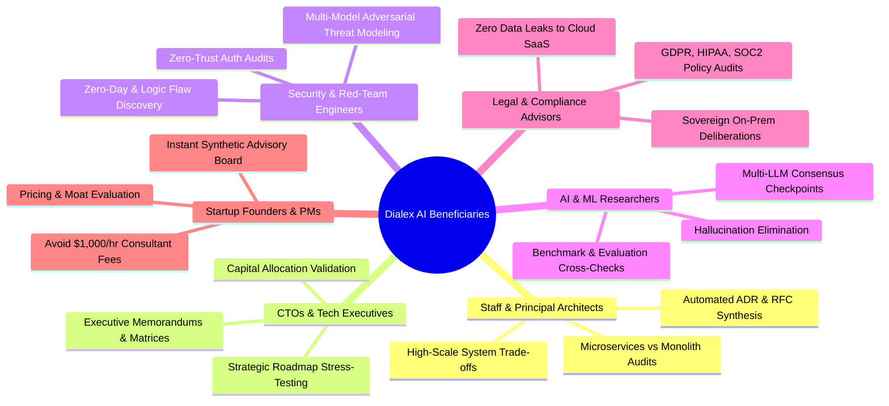

# Dialex AI Documentation Hub

Welcome to the official technical and user documentation suite for **Dialex AI** — the sovereign cross-platform multi-agent adversarial deliberation and synthetic advisory platform developed by **Kolta Labs**.

---

## 🌟 Core Value Proposition & Key USPs

| Key Unique Selling Point | Technical Reality & Business Impact |
|---|---|
| 🏛️ **Hegelian Multi-Agent Deliberation** | Pits competing frontier models (**Claude 3.7 Sonnet, GPT-4o, Gemini 2.5 Pro, DeepSeek R1, Grok 3, Ollama**) against each other to eliminate single-model hallucinations, sycophancy, and cognitive blind spots. |
| 💰 **$0 Marginal Token Cost via Local CLIs** | Connect directly to existing, already-authenticated developer CLI subscriptions (`claude`, `codex`, `antigravity`/`agy`, `ollama`). Eliminates runaway enterprise API credit card bills and expensive per-token fees. |
| 📦 **1-Click Native Desktop Downloadables** | Standalone native installers for **macOS (.dmg / .app)**, **Windows (.msi / .exe)**, **Linux (.AppImage / .deb / .rpm)**, and **Android (.apk)**. Zero terminal commands required for end-users. |
| 🔒 **100% Sovereign Zero-Cloud Vault** | Credentials encrypted at rest via Argon2id + AES-256-GCM and Android Hardware Keystore (TEE/StrongBox). Run 100% offline with local models or in isolated private on-prem networks. |
| ⚡ **Deterministic Go Turn State Machine** | Orchestrates debate rounds through a strict concurrency engine with Server-Sent Events (SSE) streaming, progressive cost meters, and **Instant Human Interrupts** with zero state corruption. |
| 🎯 **Actionable Generative Deliverables** | Synthesizes consensus into production-ready **ADRs (Architecture Decision Records)**, **Weighted Decision Matrices**, **Pro/Con Breakdowns**, **Executive Memos (HTML)**, and **Code Diffs**. |
---

## 📸 Platform Interface & Deliberation UI

<div align="center">
  
  <p><em>Dialex AI Multi-Agent Deliberation Workspace: 4 competing models debating system architecture with seat color coordination, round trackers, and live steering queue.</em></p>
</div>

<br/>

<table align="center" width="100%">
  <tr>
    <td width="50%" align="center">
      
      <br/><em>Moderator Consensus Synthesis & 1-Tap Generative Deliverables (ADR, Matrix, Pro/Con, Memo).</em>
    </td>
    <td width="50%" align="center">
      
      <br/><em>Saved Deliverables Sliding Drawer (<code>Cmd+Shift+A</code>) with Markdown and HTML export.</em>
    </td>
  </tr>
  <tr>
    <td width="50%" align="center">
      
      <br/><em>Two-Tab Persona Registry: 10 Universal Roles, 40+ Domain Archetypes, and Custom Badges.</em>
    </td>
    <td width="50%" align="center">
      
      <br/><em>1-Tap Mobile Companion Pairing with LAN IP and Tailscale (<code>tsnet</code>) private mesh.</em>
    </td>
  </tr>
</table>

---

## 👥 Who Benefits Most from Dialex AI?



---

## 🛠️ Essential Setup for Developers: The Kolt Ecosystem (`KoltLibs`)

> [!IMPORTANT]
> **Dialex AI depends directly on the Kolt Ecosystem (`KoltLibs`) via a Gradle Composite Build (`includeBuild`).**  
> If you are cloning, forking, or building the source code, you **must clone `KoltLibs` into the same parent directory alongside `DialexAI`**:

```bash
# 1. Create a parent workspace directory
mkdir -p ~/Workspace && cd ~/Workspace

# 2. Clone KoltLibs
git clone https://github.com/Kolta-Labs/KoltLibs.git

# 3. Clone DialexAI alongside KoltLibs
git clone https://github.com/Kolta-Labs/DialexAI.git

# 4. Confirm directory structure:
# ~/Workspace/
#   ├── KoltLibs/
#   └── DialexAI/
```

See [Developer Guide: Kolt Ecosystem Setup](DEVELOPER_GUIDE.md#2-kolt-ecosystem-koltlibs-dependency--setup) for composite build configuration and dependency substitution details.

---

## 📚 Complete Documentation Suite

| Guide | Summary | Target Audience | Link |
|---|---|---|---|
| 👔 **Executive Overview & Strategic Rationale** | Business case, failure modes of single-prompt AI, Hegelian dialectic deliberation, enterprise ROI, and application matrices. | Executives, Product Leaders, Architects | [**EXECUTIVE_OVERVIEW.md**](EXECUTIVE_OVERVIEW.md) |
| 🎯 **Comprehensive Project Scope & Specifications** | Exhaustive project requirements, dual-engine topology, cross-platform boundaries, and security model. | System Architects, Lead Engineers | [**01_PROJECT_SCOPE.md**](01_PROJECT_SCOPE.md) |
| 🌟 **Feature Catalog & Beneficiaries Guide** | Full inventory of user-facing capabilities, status badges, style modifiers, guardrails, and target audience workflows. | All Users, Contributors | [**02_FEATURE_LIST.md**](02_FEATURE_LIST.md) |
| 📐 **System Topology & Clean System Design** | High-level data flows, engine-to-client contracts, and module responsibility breakdown. | Backend & Mobile Engineers | [**03_ARCHITECTURE_AND_SYSTEM_DESIGN.md**](03_ARCHITECTURE_AND_SYSTEM_DESIGN.md) |
| 🏛️ **Deep Architecture & Clean Call Chains** | Strict Clean Architecture layers, unidirectional MVI (`Contract.kt`), Go Turn State Machine, and AES-256 Vault. | Core Contributors, Architects | [**ARCHITECTURE.md**](ARCHITECTURE.md) |
| 🖥️ **Server & Go Engine Setup Guide** | Standalone compilation, CLI commands, systemd/launchd daemons, Docker Compose stacks, Tailscale mesh, and reverse proxies. | DevOps, System Admins | [**SERVER_SETUP.md**](SERVER_SETUP.md) |
| 📱 **Client Applications Setup (Desktop & Mobile)** | Native 1-click installer packaging (DMG/MSI/AppImage/APK), UI polish, Dialex AI Mobile (Android), and in-memory diagnostics (`AppLogStore`). | Application Engineers, Users | [**CLIENT_SETUP.md**](CLIENT_SETUP.md) |
| 📖 **User Guide & Deliberation Manual** | Council topologies, 10 Universal Roles, 40+ Domain Personas, 3-Tier Anti-Fluff guardrails, human steering, and deliverables. | End Users, Researchers, Strategists | [**USER_GUIDE.md**](USER_GUIDE.md) |
| 🛠️ **Developer Guide & Kolt Framework** | Developer workspace setup, **Kolt / KoltLibs** composite build (`compose-kmp`, `AsyncState`), adding AI model runners, and deliverable synthesizers. | Contributors, Extension Authors | [**DEVELOPER_GUIDE.md**](DEVELOPER_GUIDE.md) |
| 🔮 **Advanced Features & Epistemic Specs** | Formal architectural specifications for Knowledge Graph, Problem Decomposition, Tension Detection, Dynamic Retrieval, Socratic Interview mode, Null Hypothesis Benchmarking, 8-Layer Persona DNA, Mobile Parity, Bayesian Credence Tracking, and Autonomous Artifact Sandbox. | Core Contributors, Researchers, Architects | [**04_PENDING_FEATURES_SPEC.md**](04_PENDING_FEATURES_SPEC.md) · [**Socratic Spec**](features/05_SOCRATIC_INTERVIEW_MODE_SPEC.md) · [**Benchmarking Spec**](features/06_NULL_HYPOTHESIS_BENCHMARKING_SPEC.md) · [**Persona DNA Spec**](features/07_8_LAYER_PERSONA_DNA_SPEC.md) · [**Bayesian Credence Spec**](features/09_BAYESIAN_CREDENCE_TRACKING_SPEC.md) · [**Sandbox Spec**](features/10_AUTONOMOUS_ARTIFACT_SANDBOX_SPEC.md) |
| 🔌 **REST & SSE API Reference** | Complete HTTP endpoints, JWT authentication, real-time Server-Sent Events (SSE) schemas, error codes, and curl payloads. | API Developers, Integrators | [**API_REFERENCE.md**](API_REFERENCE.md) |

---

## 🎯 Quick Navigation to Critical Topics

### 🚀 Getting Started & Installation
- **No-Terminal Desktop Installers**: See [Client Setup Guide: 1-Click Installers](CLIENT_SETUP.md#2-no-terminal-1-click-installation-end-users).
- **Self-Hosting Standalone Go Engine**: See [Server Setup Guide: Compilation](SERVER_SETUP.md#3-compiling-from-source).
- **Docker Compose Stacks**: See [Server Setup Guide: Docker](SERVER_SETUP.md#5-containerized-deployment-docker--compose).
- **In-Device Engine vs Remote Host Engine**: See [Server Setup Guide: Deployment Topology](SERVER_SETUP.md#1-deployment-topology-in-device-engine-vs-remote-host-engine).
- **Zero-Port Private Mesh via Tailscale**: See [Server Setup Guide: Tailscale Mesh (`tsnet`)](SERVER_SETUP.md#6-private-tailscale-mesh-stack-tsnet).

### 💡 Capabilities, USPs & Workflows
- **Local Developer CLI Integration & Cost Savings**: See [User Guide: Local CLI Execution & Cost Savings](USER_GUIDE.md#6-local-developer-cli-execution--cost-savings-usp).
- **10 Universal Debate Archetypes & 40+ Personas**: See [User Guide: Persona Registry](USER_GUIDE.md#3-the-persona-registry--live-customization).
- **8-Layer Cognitive DNA Studio & MMOS Ingestion**: See [Persona DNA Architectural Spec](features/07_8_LAYER_PERSONA_DNA_SPEC.md) and [API Reference](API_REFERENCE.md#6-8-layer-cognitive-dna--mmos-endpoints).
- **Mobile Epistemic Parity Suite & Zero-Wait Auto Mode**: See [Mobile Epistemic Parity Spec](features/08_MOBILE_EPISTEMIC_PARITY_SPEC.md).
- **3-Tier Anti-Fluff & Topic Drift Guardrails**: See [User Guide: Anti-Fluff Guardrails](USER_GUIDE.md#4-anti-fluff--topic-drift-guardrails).
- **Live Human Interjections & Instant Interrupts**: See [User Guide: Live Interventions](USER_GUIDE.md#5-live-human-interjections--instant-interrupts).
- **Consensus Outcome & Generative Deliverables**: See [User Guide: Deliverable Synthesis](USER_GUIDE.md#7-moderator-consensus--generative-deliverables).
- **Dedicated 1-on-1 Socratic Interview Mode & Epistemic Ledger**: See [User Guide: Socratic Interview Mode](USER_GUIDE.md#23-dedicated-1-on-1-socratic-interview-mode) and [Socratic Architectural Spec](features/05_SOCRATIC_INTERVIEW_MODE_SPEC.md).
- **Null Hypothesis Benchmarking Suite & Arena Radar**: See [User Guide: Benchmarking Suite](USER_GUIDE.md#9-null-hypothesis-benchmarking--quantitative-evaluation-suite-dialexbench) and [Benchmarking Spec](features/06_NULL_HYPOTHESIS_BENCHMARKING_SPEC.md).
- **Bayesian Credence Tracking & Epistemic Uncertainty Network**: See [Bayesian Credence Spec](features/09_BAYESIAN_CREDENCE_TRACKING_SPEC.md).
- **Autonomous Artifact Sandbox & Code Verification Engine**: See [Sandbox Spec](features/10_AUTONOMOUS_ARTIFACT_SANDBOX_SPEC.md).

### 📐 Architecture, Clean Code & Developers
- **Clean Architecture Strict Call Chain**: See [Architecture Guide: Domain Layer](ARCHITECTURE.md#4-domain-layer--clean-architecture).
- **MVI Pattern in Compose Multiplatform**: See [Architecture Guide: MVI Pattern](ARCHITECTURE.md#3-presentation-layer--mvi-pattern).
- **Kolt Ecosystem Composite Build Setup**: See [Developer Guide: KoltLibs](DEVELOPER_GUIDE.md#2-kolt-ecosystem-koltlibs-dependency--setup).
- **Adding AI Model Runners (Cloud API & Local CLI)**: See [Developer Guide: Adding Model Runners](DEVELOPER_GUIDE.md#5-adding-new-ai-providers-or-deliverable-formats).
- **Diagnostics Ring Buffer (`AppLogStore`)**: See [Client Setup Guide: Logging & Diagnostics](CLIENT_SETUP.md#5-client-logging--diagnostics-applogstore).

---

## 📄 License & Legal Notice

Dialex AI is licensed under the [PolyForm Noncommercial License 1.0.0](file:///LICENSE).

- **Free for Individuals & Noncommercial Use**: You are free to use, modify, test, and distribute the software for personal study, research, education, hobby, or noncommercial pursuits.
- **Commercial Use**: Any use to run a commercial business or provide services for a fee requires a commercial agreement from **Kolta Labs**. For commercial inquiries, contact `licensing@koltalabs.com`.

---

*Copyright (c) 2026 Kolta Labs. All rights reserved.*
