# Dialex AI Documentation Hub

Welcome to the official technical and user documentation suite for **Dialex AI** — the sovereign cross-platform multi-agent adversarial deliberation and synthetic advisory platform developed by **Kolta Labs**.

---

## 🌟 Core Value Proposition & Key USPs

| Key Unique Selling Point | Technical Reality & Business Impact |
|---|---|
| 🏛️ **Hegelian Multi-Agent Deliberation** | Pits competing frontier models (**Claude 3.7 Sonnet, GPT-4o, Gemini 2.5 Pro, DeepSeek R1, Grok 3, Ollama**) against each other to eliminate single-model hallucinations, sycophancy, and cognitive blind spots. |
| 💰 **$0 Marginal Token Cost via Local CLIs** | Connect directly to existing, already-authenticated developer CLI subscriptions (`claude`, `codex`, `antigravity`/`agy`, `ollama`). Eliminates runaway enterprise API credit card bills and expensive per-token fees. |
| 📦 **1-Click Native Desktop Downloadables** | Standalone native installers for **macOS (.dmg / .app)**, **Windows (.msi / .exe)**, **Linux (.AppImage / .deb / .rpm)**, and **Android (.apk)**. Zero terminal commands required for end-users. |
| 🔒 **100% Sovereign Zero-Cloud Vault** | Credentials encrypted at rest via Argon2id + AES-256-GCM and Android Hardware Keystore (TEE/StrongBox). Run 100% offline with local models or in isolated private on-prem networks. |
| ⚡ **Deterministic Go Turn State Machine** | Orchestrates debate rounds through a strict concurrency engine with Server-Sent Events (SSE) streaming, progressive cost meters, and **Instant Human Interrupts** with zero state corruption. |
| 🎯 **Actionable Generative Deliverables** | Synthesizes consensus into production-ready **ADRs (Architecture Decision Records)**, **Weighted Decision Matrices**, **Pro/Con Breakdowns**, **Executive Memos (HTML)**, and **Code Diffs**. |

---

## 📚 Complete Documentation Suite Index

Explore our comprehensive guides organized by domain and objective:

### 1. Conceptual & Strategic Foundation
- [**Product Philosophy & Epistemology**](PRODUCT_PHILOSOPHY.md)  
  *The epistemological case for dialectic multi-agent councils, why single-prompt LLMs fail, Bayesian credence updating, 3-tier anti-fluff guardrails, and data sovereignty.*
- [**Executive Overview & Strategic Value**](EXECUTIVE_OVERVIEW.md)  
  *Business justification, executive summary, ROI models, enterprise risk mitigation, and synthetic advisory board economics.*
- [**Comprehensive Project Scope**](01_PROJECT_SCOPE.md)  
  *Exhaustive functional and non-functional requirements, target environments, multiplatform guarantees, and security constraints.*
- [**Complete Feature Catalog**](02_FEATURE_LIST.md)  
  *Full inventory of capabilities, debate archetypes, domain personas, status badges, style modifiers, and target personas.*

### 2. Operational & User Manuals
- [**User Guide & Deliberation Manual**](USER_GUIDE.md)  
  *Step-by-step handbook covering project setup, council configurations, 1-on-1 Socratic interviews, live steering, artifact extraction, and mobile companion pairing.*
- [**Enterprise Use Cases & Deliberation Playbooks**](USE_CASES.md)  
  *Battle-tested, ready-to-run playbooks for Systems Architecture (Kafka vs Pulsar, Monolith vs Microservices), Cybersecurity Threat Modeling, Capital Allocation, and AI Infrastructure.*

### 3. Architecture & Technical Design
- [**System Topology & Clean System Design**](03_ARCHITECTURE_AND_SYSTEM_DESIGN.md)  
  *High-level data flow diagrams, decoupled dual-engine topology, and client-to-engine contract specifications.*
- [**Deep Architecture & Clean Call Chains**](ARCHITECTURE.md)  
  *Strict Clean Architecture layering in KMP (`domain` $\rightarrow$ `data` $\rightarrow$ `presentation`), unidirectional MVI (`Contract.kt`), Go Turn State Machine, and AES-256 Vault.*
- [**REST & SSE API Reference**](API_REFERENCE.md)  
  *Complete HTTP REST endpoints, JWT authentication schemes, real-time Server-Sent Events (SSE) streaming protocols, and curl examples.*

### 4. Setup, Deployment & Administration
- [**Server & Go Engine Setup Guide**](SERVER_SETUP.md)  
  *Standalone compilation, CLI flags, systemd/launchd background daemons, Docker Compose stacks, reverse proxies, and Tailscale mesh (`tsnet`).*
- [**Client Applications Setup (Desktop & Mobile)**](CLIENT_SETUP.md)  
  *Packaging native 1-click installers (DMG, MSI, AppImage, APK), Android biometric gate, in-memory diagnostics (`AppLogStore`), and JNI.*
- [**Developer Guide & Kolt Framework**](DEVELOPER_GUIDE.md)  
  *Developer workspace setup, **Kolt / KoltLibs** composite build (`compose-kmp`, `AsyncState`), writing unit tests, adding new AI providers, and synthesizer extensions.*

### 5. Advanced Feature Specifications (`docs/features/`)
Formal technical specifications for the ten breakthrough epistemic modules:
1. [**Knowledge Graph & Drag-and-Drop**](features/01_KNOWLEDGE_GRAPH_AND_DRAG_DROP.md) — Visual canvas connecting claims, tensions, and evidence with physics-based nodes.
2. [**Problem Decomposition & Sub-Topic Tree**](features/02_PROBLEM_DECOMPOSITION.md) — Recursive multi-tier dilemma breakdown into parallelizable sub-debates.
3. [**Contradiction & Tension Detection Matrix**](features/03_CONTRADICTION_AND_TENSION_DETECTION.md) — Automated heuristic and embedding-based extraction of conflicting claims.
4. [**Round-Aware Dynamic Retrieval**](features/04_ROUND_AWARE_DYNAMIC_RETRIEVAL.md) — Per-turn live web and vector search injected dynamically between debate rounds.
5. [**Dedicated 1-on-1 Socratic Interview Mode**](features/05_SOCRATIC_INTERVIEW_MODE_SPEC.md) — *Brevis Interrogatio*, Epistemic Ledger (Invariants vs Concessions), and Council Elevation.
6. [**Null-Hypothesis Benchmarking Suite (DialexBench)**](features/06_NULL_HYPOTHESIS_BENCHMARKING_SPEC.md) — Quantitative radar evaluation measuring hallucination reduction vs single models.
7. [**8-Layer Cognitive Persona DNA & MMOS Studio**](features/07_8_LAYER_PERSONA_DNA_SPEC.md) — Deep persona customization with ontological anchors, cognitive biases, and MMOS ingestion.
8. [**Mobile Epistemic Parity Suite**](features/08_MOBILE_EPISTEMIC_PARITY_SPEC.md) — Full feature parity on Android with Navigation 3, biometrics, offline engine, and LAN pairing.
9. [**Bayesian Credence Tracking Network**](features/09_BAYESIAN_CREDENCE_TRACKING_SPEC.md) — Real-time probability updating and epistemic uncertainty network.
10. [**Autonomous Artifact Sandbox & Code Verification**](features/10_AUTONOMOUS_ARTIFACT_SANDBOX_SPEC.md) — Sandboxed execution environment verifying generated scripts and code diffs.

---

## 👥 Who Benefits Most from Dialex AI?

```mermaid
mindmap
  root((Dialex AI Beneficiaries))
    Staff & Principal Architects
      High-Scale System Trade-offs
      Automated ADR & RFC Synthesis
      Microservices vs Monolith Audits
    CTOs & Tech Executives
      Strategic Roadmap Stress-Testing
      Executive Memorandums & Matrices
      Capital Allocation Validation
    Security & Red-Team Engineers
      Multi-Model Adversarial Threat Modeling
      Zero-Day & Logic Flaw Discovery
      Zero-Trust Auth Audits
    AI & ML Researchers
      Multi-LLM Consensus Checkpoints
      Benchmark & Evaluation Cross-Checks
      Hallucination Elimination
    Legal & Compliance Advisors
      GDPR, HIPAA, SOC2 Policy Audits
      Zero Data Leaks to Cloud SaaS
      Sovereign On-Prem Deliberations
    Startup Founders & PMs
      Instant Synthetic Advisory Board
      Avoid $1,000/hr Consultant Fees
      Pricing & Moat Evaluation
```



---

## 🛠️ Essential Setup for Developers: The Kolt Ecosystem (`KoltLibs`)

> [!IMPORTANT]
> **Dialex AI depends directly on the Kolt Ecosystem (`KoltLibs`) via a Gradle Composite Build (`includeBuild`).**  
> If you are building from source, clone `KoltLibs` into the same parent directory alongside `DialexAI`:

```bash
# 1. Create a parent workspace directory
mkdir -p ~/Workspace && cd ~/Workspace

# 2. Clone KoltLibs
git clone https://github.com/Kolta-Labs/KoltLibs.git

# 3. Clone DialexAI alongside KoltLibs
git clone https://github.com/Kolta-Labs/DialexAI.git

# 4. Confirm directory structure:
# ~/Workspace/
#   ├── KoltLibs/
#   └── DialexAI/
```

See [Developer Guide: Kolt Ecosystem Setup](DEVELOPER_GUIDE.md#2-kolt-ecosystem-koltlibs-dependency--setup) for composite build configuration and dependency substitution details.

---

## 📄 License & Legal Notice

Dialex AI is licensed under the [PolyForm Noncommercial License 1.0.0](file:///LICENSE).

- **Free for Individuals & Noncommercial Use**: You are free to use, modify, test, and distribute the software for personal study, research, education, hobby, or noncommercial pursuits.
- **Commercial Use**: Any use to run a commercial business or provide services for a fee requires a commercial agreement from **Kolta Labs**. For commercial inquiries, contact `licensing@koltalabs.com`.

---

*Copyright (c) 2026 Kolta Labs. All rights reserved.*
