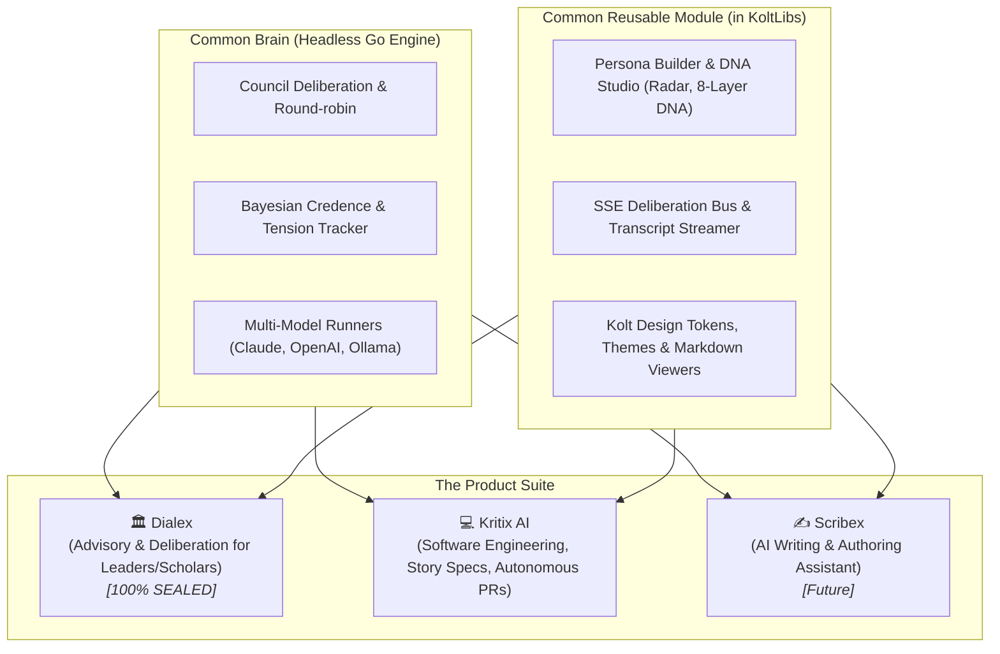

# Kritix AI: Master Architecture & Technical Specification
### The Sovereign Dialectic Software Engineering & Autonomous Coding Platform
**Part of the Dialex & Kolta Ecosystem**

---

## 1. Executive Summary & Vision

**Kritix AI** is an adversarial multi-agent software engineering platform that applies structured dialectic deliberation to software planning, architecture, code generation, and verification.

Most AI coding assistants rely on a single, agreeable model that nods along with developer prompts—frequently introducing subtle bugs, breaking architectural boundaries, hallucinating APIs, and skipping edge cases. Kritix AI solves this by convening **specialized stakeholder councils** during planning and **domain-specific adversarial loops** during coding.

### Core Value Propositions:
1. **Dialectic Verification**: Code and specs are debated, challenged, and stress-tested before mutating the workspace.
2. **Dual Deployment Modes**: Local developer workstation CLI (`kritix`) + Autonomous server worker (cloning GitHub/GitLab, branching, testing, and opening PRs).
3. **Dynamic Steering & Steering Studio**: Ingest local and external standards (Git/URL feeds), binding custom rulebooks to specific personas.
4. **Deterministic Grounding**: The deliberation loop is bound to real compiler, linter, and test runner feedback.
5. **Tone Vectors**: Ponytail Mode (executive bullet-driven specs) $\leftrightarrow$ Caveman Mode (brute, zero-fluff code & diffs).
6. **Kolt Foundation**: Full reuse of Kolta's **KoltLibs** (`compose-kmp`, `utils`, `logutils`, `MviViewModel`, `AsyncState`) and standards.
7. **Dialex Sealed Core**: Leverages the shared Go engine for deliberation, consensus, and Persona DNA with zero modifications to Dialex.

---

## 2. The Three-Product Ecosystem

The Kolta AI suite is divided into three distinct, specialized product lines:



---

## 3. Modular User Journey Specifications

To ensure modularity and deep operational clarity, the specification is broken into **7 Individual Journey Specifications** located in `docs/journeys/`:

| Journey Spec | Title & Link | Focus | Target Users |
| :--- | :--- | :--- | :--- |
| **Journey 1** | **[Local Developer Workstation Loop](docs/journeys/01_LOCAL_DEVELOPER_LOOP.md)** | Local CLI (`kritix code`, `kritix review`), atomic file patches, local test runner sandbox, diff confirmation. | Software Engineers |
| **Journey 2** | **[Autonomous Server & Remote Worker](docs/journeys/02_AUTONOMOUS_SERVER_REMOTE_WORKER.md)** | Headless daemon, remote GitHub/GitLab cloning, ephemeral Docker sandbox, auto-PR generation. | Product Owners, CI/CD, Tech Leads |
| **Journey 3** | **[Stakeholder Story Spec & Planning](docs/journeys/03_STAKEHOLDER_STORY_SPEC_PLANNING.md)** | Virtual Stakeholder Council (PO, Architect, QA Lead, EM), Gherkin acceptance criteria, ADRs, Ponytail vs. Caveman tone profiles. | Product Owners, Architects |
| **Journey 4** | **[Dynamic Steering & Steering Studio](docs/journeys/04_DYNAMIC_STEERING_AND_STUDIO.md)** | Ingesting external Git/URL feeds, dynamic persona-to-rule binding matrix, live prompt simulator, conflict detector. | Tech Leads, Security Engineers |
| **Journey 5** | **[Persona Studio & Extensible Registry](docs/journeys/05_PERSONA_STUDIO_AND_REGISTRY.md)** | 11 built-in SWE Personas, 8-Layer Persona DNA, radar chart visualizer, custom persona CRUD. | Engineering Leaders, Specialists |
| **Journey 6** | **[The Plugin & Tool Ecosystem](docs/journeys/06_PLUGIN_AND_TOOL_ECOSYSTEM.md)** | Build/Test Drivers (Gradle, Go, Cargo), VCS Forge adapters (GitHub, GitLab), Custom Skills, MCP client. | Platform Engineers, Integrators |
| **Journey 7** | **[Standalone Cockpit App UI/UX](docs/journeys/07_STANDALONE_COCKPIT_APP_UI_UX.md)** | Compose Multiplatform desktop/web app, Kolt MVI architecture, dual split workbench, interactive diff inspector. | Developers, Product Owners |
| **Journey 8** | **[Universal Editor & IDE Integration Protocol](docs/journeys/08_IDE_AND_UNIVERSAL_EDITOR_INTEGRATION.md)** | Headless daemon (JSON-RPC/LSP/MCP), thin extensions for VS Code/Cursor/Windsurf, JetBrains fleet, Zed, Neovim. | All Developers |

---

## 4. Monorepo Architecture & Directory Layout

```text
Dialex/ (Monorepo root)
│
├── .standards/ -> ../KoltLibs/Standards/steering/kmp   # Symlinked KMP & Engineering Standards
├── AGENTS.md, CLAUDE.md, GEMINI.md                    # Root Agent Steering Files
├── go.work                                           # Unified Go Workspace (./dialex-engine + ./kritix-ai)
│
├── engine/                                           # SHARED CORE [100% SEALED]
│   ├── cmd/dialexd/                                  # Daemon binary (REST + SSE API)
│   └── pkg/
│       ├── runner/                                   # Multi-model runners (Claude, OpenAI, Ollama, Gemini)
│       ├── orchestrator/                             # Deliberation orchestration & round-robin loops
│       ├── persona/                                  # 8-Layer Persona DNA compiler & registry
│       ├── credence/                                 # Bayesian credence & tension tracking
│       ├── retrieval/                                # Dynamic passage & evidence retrieval
│       ├── decomposition/                            # Problem decomposition engine
│       └── store/                                    # SQLite encrypted vault & session persistence
│
├── dialex-app/                                       # ADVISORY PLATFORM [100% SEALED]
│   ├── desktopApp/                                   # Compose Multiplatform Desktop App
│   ├── androidApp/                                   # Compose Multiplatform Android App
│   └── shared/                                       # KMP domain models & UI components
│
└── kritix/                                           # KRITIX AI PLATFORM
    ├── SPEC.md                                       # Master Technical Specification (This File)
    ├── TASKS.md                                      # Granular Implementation Task Checklist
    ├── DECISIONS.md                                  # Architectural Decision Record
    ├── go.mod                                        # Module 'kritix' (Go 1.27)
    ├── cli/                                          # Mandatory Go CLI binary ('kritix')
    │   ├── main.go
    │   └── cmd/                                      # Subcommands: spec, plan, code, review, steering, persona
    ├── app/                                          # Standalone Cockpit App (Compose Desktop + Kolt)
    │   ├── build.gradle.kts                          # Includes KoltLibs (bom, utils, logutils, compose-kmp)
    │   └── src/jvmMain/                              # Kolt MVI architecture & UI components
    ├── docs/
    │   └── journeys/                                 # The 7 Modular Journey Specifications
    └── pkg/                                          # SWE Domain Logic (Go packages)
        ├── repo/                                     # Repo scanner, AST & file tree parser
        ├── steering/                                 # Dynamic steering aggregator & remote sync
        ├── persona/                                  # 11 SWE Personas & Custom Registry
        ├── spec/                                     # Story spec generation engine
        ├── sandbox/                                  # Command & test execution sandbox
        ├── git/                                      # Local Git driver, patch applier, diff generator
        ├── forge/                                    # Remote VCS adapters (GitHub App, GitLab Token)
        ├── plugins/                                  # Pluggable build/test drivers (Gradle, Go, Cargo)
        └── mcp/                                      # Model Context Protocol client
```

---

## 5. Master Implementation Roadmap & Checklist

The complete task breakdown is tracked in **[kritix/TASKS.md](file:///Users/arunelectra/Project/Tech/KMP/Kolta/DialexAI/kritix/TASKS.md)** across 9 granular phases:

* [x] **Phase 1: Foundation, Workspace & Standards**
  - Workspace directories, `SPEC.md`, `go.mod`, `go.work` sync, standards symlinks.
* [x] **Phase 2: SWE Persona Engine & Extensible Registry**
  - 11 built-in SWE Personas with 8-Layer DNA (`builtins.go`), dynamic custom registry (`registry.go`), unit tests passing.
* [ ] **Phase 3: Repository Context & Dynamic Steering Engine**
  - Auto-detect git root & build manifests (`pkg/repo`).
  - Ingest local and external Git/URL steering feeds (`pkg/steering`).
  - Dynamic persona-to-rule binding matrix.
* [ ] **Phase 4: SWE Execution Sandbox & Git Driver**
  - Isolated command execution sandbox (`pkg/sandbox`).
  - Atomic patch applier with rollback (`pkg/git`).
* [ ] **Phase 5: Story Spec Generator (`kritix spec` / `kritix plan`)**
  - Stakeholder Council deliberation loop.
  - Markdown deliverable generator (`docs/specs/STORY-<id>.md`).
  - Ponytail vs. Caveman tone vector toggles.
* [ ] **Phase 6: Domain Coder, Reviewer & Sandbox Loop (`kritix code`)**
  - Domain Coder + Adversarial Reviewer convergence loop.
  - Automated test execution and failure repair.
  - Autonomy gates (`supervised`, `interactive`, `autonomous`).
* [ ] **Phase 7: Autonomous Remote Worker & Forge Integration**
  - GitHub App and GitLab API adapters (`pkg/forge`).
  - Remote clone, branch, commit, push, and automated Pull Request creation.
* [ ] **Phase 8: Plugin Ecosystem & MCP Extensibility**
  - Build/Test drivers (Gradle, Go, Cargo, npm).
  - MCP client connecting to Jira, Postgres, and Figma.
* [ ] **Phase 9: Standalone Cockpit App & Steering Studio**
  - Compose Multiplatform desktop app built on KoltLibs.
  - Interactive Council Chamber, Engineering Lab, Steering Studio, and Persona Studio.
