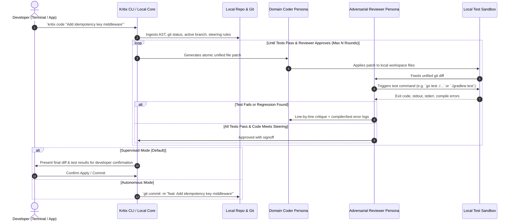

# Journey 1: The Local Developer Workstation Loop
**Target Users:** Software Engineers, Tech Leads  
**Interface:** Mandatory Go CLI (`kritix`) & Local Standalone App

---

## 1. Overview & Objective

The Local Developer Loop is the daily driver workflow for engineers writing, debugging, refactoring, and verifying code directly on their workstations. It operates with zero latency inside the developer's local repository, reading git status, applying atomic patches, and running local compilers and test suites.



---

## 2. CLI Command Ergonomics

### Commands
```bash
# 1. Implement a feature or bugfix directly from prompt
kritix code "Fix race condition in background queue worker"

# 2. Implement against an existing Story Spec
kritix code --spec docs/specs/STORY-AUTH-01.md --domain backend

# 3. Quick pair-programming mode (interactive after each round)
kritix code --autonomy=interactive "Refactor user repository to use sqlc"

# 4. Standalone Adversarial Review on current uncommitted changes
kritix review

# 5. Review a specific branch against main
kritix review --branch feature/oauth-pkce
```

### Autonomy Gates
* `--autonomy=supervised` *(Default)*: Prompts the developer before modifying files and before committing.
* `--autonomy=interactive`: Pauses at every debate/code round to allow the developer to redirect or add guidance.
* `--autonomy=autonomous`: Full automated local execution (runs tests, fixes errors, commits if clean and green).

---

## 3. The Deterministic Test Sandbox

The Reviewer does not rely on "visual LLM guessing" to determine if code works. It executes real commands in the developer's local environment:
1. **Auto-Detected Runners**:
   - Go: `go test -v ./...`, `golangci-lint run`
   - Gradle / Android: `./gradlew testDebugUnitTest`, `./gradlew ktlintCheck`
   - Rust: `cargo test`, `cargo clippy`
   - Node / TS: `npm test`, `eslint .`
2. **Timeout & Safety**: Commands run with strict timeout ceilings (e.g. 5 minutes) and kill dangling child processes.
3. **Rollback Guarantee**: If tests fail and cannot converge within $N$ rounds, Kritix rolls back the workspace to the initial git commit state cleanly.
