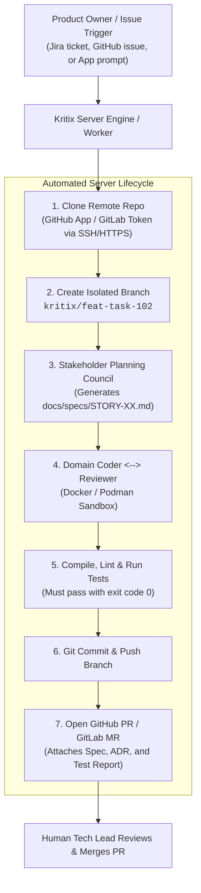

# Journey 2: The Autonomous Server & Remote Worker
**Target Users:** Product Owners, Engineering Managers, CI/CD Pipelines  
**Interface:** Kritix Server Daemon (`kritixd`), Webhooks, Standalone Cockpit App

---

## 1. Overview & Objective

In this journey, Kritix AI runs as a headless server daemon or containerized worker. Instead of requiring a developer's local laptop, a user (e.g. a Product Owner or Tech Lead) points Kritix to a remote **GitHub or GitLab repository**. Kritix clones the repository, checks out a new branch, convenes the planning council, executes the coder/reviewer loop in an isolated container, and automatically submits a complete Pull Request / Merge Request.

---

## 2. Remote Repository Configuration

### Authentication
Kritix Server connects to remote code hosts via:
* **GitHub**: GitHub App installation token or Personal Access Token (PAT).
* **GitLab**: GitLab Project / Group Access Token.
* **Generic Git**: SSH Deploy Key with write permissions.

### Execution Isolation
All code execution occurs inside an ephemeral container (Docker or Podman) to ensure:
* Zero contamination of the host machine.
* Configurable CPU, memory, and network limits.
* Clean environment resets between tasks.

---

## 3. Pull Request Deliverables

When the autonomous loop finishes, the resulting Pull Request on GitHub/GitLab includes:
1. **The Tested Code & Commits**: Clean, atomic git history.
2. **The Story Spec (`docs/specs/STORY-<id>.md`)**:
   - Executive Summary
   - User Acceptance Criteria (Gherkin format)
   - Architectural Decisions (ADR)
3. **The Test Execution Report**:
   - Full stdout/stderr logs of passing tests.
   - Linter pass confirmation.
   - Reviewer persona signoff summary.
