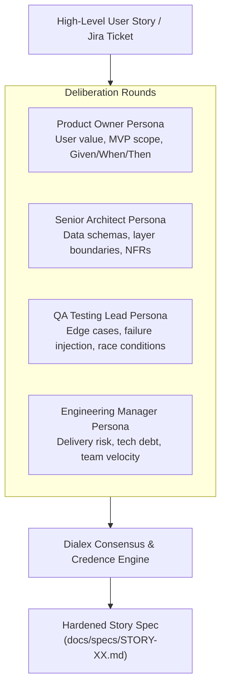

# Journey 3: Stakeholder Story Spec Generation & Planning
**Target Users:** Product Owners, Technical Product Managers, System Architects  
**Interface:** `kritix spec`, `kritix plan`, Standalone App Council Chamber

---

## 1. Overview & Objective

Writing a thorough technical specification usually requires days of meetings between Product, Architecture, QA, and Engineering Management. 

Journey 3 convenes a **Virtual Stakeholder Council** powered by the Dialex multi-agent deliberation engine. Instead of a single LLM spitting out generic boilerplate, specialized personas debate trade-offs, attack unrealistic assumptions, and produce a battle-tested **Story Spec** (`docs/specs/STORY-<id>.md`).



---

## 2. Communication Style Vectors: Ponytail vs. Caveman

Depending on who runs the planning session, Kritix supports Dialex-inherited style vectors:

### A. Ponytail Mode (Default for Product Owners & Executives)
* **Characteristics**: Highly structured, formal vocabulary, bullet-driven executive summaries, and risk-to-timeline quantification.
* **Persona Output Example**:
  > *"Adopting SSE over WebSocket reduces cloud infrastructure egress costs by ~34% for our traffic profile while maintaining sub-second updates. However, it introduces connection-pooling constraints on legacy HTTP/1.1 mobile gateways."*

### B. Caveman Mode (For High-Speed Technical Hackers)
* **Characteristics**: Zero conversational fluff, brute simplicity, high density of code snippets and constraints, pure signal.
* **Persona Output Example**:
  > *"SSE good. Less socket memory. Mobile need reconnect backoff. Add 3 tests: drop connection, bad token, server restart."*

---

## 3. The Story Spec Deliverable (`docs/specs/STORY-<id>.md`)

Every completed planning session generates a structured markdown document containing:
1. **Executive Summary & Scope Boundaries**: Explicitly lists what is *in-scope* for this story and what is *strictly deferred*.
2. **Acceptance Criteria (Gherkin Format)**:
   ```gherkin
   Scenario: User session expires during checkout
     Given the user is on the payment screen
     When their JWT token expires and they tap "Pay Now"
     Then the app prompts for biometric refresh without losing cart state
   ```
3. **Architectural Decisions (ADR)**: Tech stack choices, data structures, and trade-off rationales.
4. **File Mutation Manifest**: Exact list of files to create, edit, or remove.
5. **Verification Test Suite**: Specific CLI test commands required to pass before code can be accepted.
