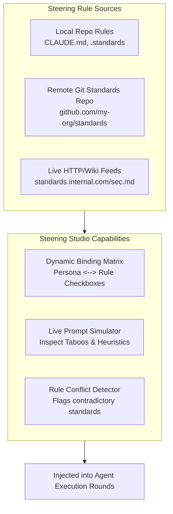

# Journey 4: Dynamic Steering & The Steering Studio
**Target Users:** Tech Leads, Staff Architects, Security Engineers  
**Interface:** Standalone Steering Studio (Compose Multiplatform) & `kritix steering` CLI

---

## 1. Overview & Objective

No two engineering teams share the exact same architectural standards, coding conventions, or compliance constraints. 

Journey 4 provides a **centralized, visual Steering Studio** and ingestion engine capable of:
1. Loading local repo rules (`CLAUDE.md`, `.standards/`, `.kritix/steering/*.md`).
2. Syncing external standards from remote git repositories or company HTTP URLs.
3. Dynamically binding different steering rules to specific personas (e.g. Coder vs. Reviewer vs. Architect).
4. Simulating and auditing how rules translate into Persona DNA **Taboo Spaces** and **Heuristics**.



---

## 2. Dynamic Role-to-Steering Binding

Rather than locking steering into fixed roles, teams configure bindings via `.kritix/steering.json` or through the visual Steering Studio grid:

```json
{
  "bindings": {
    "coder": [
      "steering/kotlin-conventions.md",
      "steering/error-handling-result.md"
    ],
    "reviewer": [
      "external/corp-security.md",
      "steering/qa-regression-checklist.md"
    ],
    "architect": [
      "standards/clean-architecture.md"
    ],
    "business_domain_expert": [
      "external/fintech-compliance.md"
    ]
  }
}
```

---

## 3. Steering Studio UI Components (Compose Multiplatform)

1. **Available Rules Repository Panel**:
   - Filter by category: Architecture, Security, Coding Standards, Testing.
   - Shows source badge: `[Local]`, `[Remote Git]`, `[Live URL]`.
2. **Dynamic Persona Binding Grid**:
   - Matrix with Personas along rows and Steering Rules along columns.
   - Click to bind/unbind rules with instant visual updates.
3. **Live Rule Simulator & Inspector**:
   - Select any persona (e.g. *Adversarial Reviewer*).
   - Inspect the compiled system prompt showing exact injected **Taboo Space** constraints (forbidden patterns) and **Heuristics** (evaluation directives).
   - View token footprint calculator for active rules.
4. **External Standards Sync Hub**:
   - Real-time sync indicators for remote standards (`Synced 5m ago`).
   - One-click manual "Sync Now" button.
