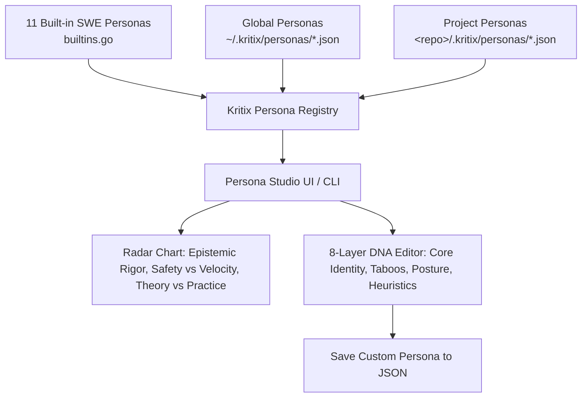

# Journey 5: Persona Studio & Extensible Persona Registry
**Target Users:** Engineering Leaders, Domain Specialists, AI Coordinators  
**Interface:** Persona Studio (Compose Multiplatform) & `kritix persona` CLI

---

## 1. Overview & Objective

Traditional AI coding tools treat the agent as an anonymous, one-size-fits-all model. Kritix AI models software engineering teams as collections of specialized cognitive agents governed by Dialex's **8-Layer Persona DNA**.

Journey 5 enables users to:
1. Use 11 built-in SWE Personas (PO, Architect, QA Lead, Backend, Android, iOS, Reviewer, Security).
2. Create, customize, and edit new personas with a visual **Radar Chart** visualizer.
3. Save personas globally (`~/.kritix/personas/*.json`) or check them into a specific repository (`<repo>/.kritix/personas/*.json`).
4. Re-use Dialex's Persona Studio UI components via the shared library module in `KoltLibs`.



---

## 2. The 8-Layer Persona DNA Architecture

Every persona in Kritix is compiled from eight distinct cognitive layers:

| Layer | Dimension | Purpose in Software Engineering |
| :--- | :--- | :--- |
| **Layer 1** | **Core Identity** | Professional title, background, credentials, and domain authority. |
| **Layer 2** | **Epistemic Bias** | Reasoning mode (First Principles, Statistical, Formal Logic) & trade-off dials (Safety vs Velocity, Rigor). |
| **Layer 3** | **Communication Vector** | Formality level, tone (Forensic, Socratic, Pragmatic), and Ponytail vs Caveman brevity. |
| **Layer 4** | **Heuristic Library** | Mental models (Conway's Law, Chesterton's Fence, Amdahl's Law, Gall's Law). |
| **Layer 5** | **Taboo Space** | Strictly forbidden arguments, anti-patterns, and rejected architectural shortcuts. |
| **Layer 6** | **Domain Ontology** | Specialized lexicons (e.g. Jetpack Compose recomposition, gRPC protobuf stubs). |
| **Layer 7** | **Adversarial Posture** | Combat stance when challenged (Analytical Deconstructor, Counter-Attacker, Socratic Inverter). |
| **Layer 8** | **Synthesis Preference** | How consensus is resolved (Seek Synthesis, Conditional Compromise, Hold Minority Report). |

---

## 3. Persona Management via CLI

```bash
# List all active personas (built-in and custom)
kritix persona list

# View the full 8-layer DNA specification for a persona
kritix persona show senior_software_architect

# Create a new persona interactively
kritix persona create --name "FinOps Architect" --category "Architecture"

# Export a persona to JSON
kritix persona export backend_engineer > backend.json

# Import a custom persona into the current repository
kritix persona import ./fintech_auditor.json --project
```
