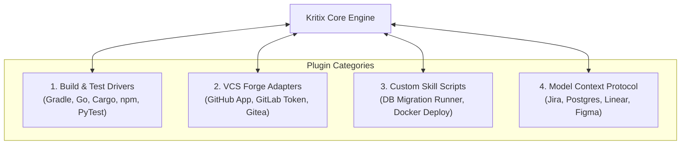

# Journey 6: The Plugin & Tool Ecosystem
**Target Users:** Platform Engineers, Tooling Specialists, Integrators  
**Interface:** Plugin Manifests (`.kritix/plugins/`), MCP Client, Custom Skills

---

## 1. Overview & Objective

To prevent the Kritix core engine from bloating into a monolithic codebase that tries to support every programming language, build tool, and git host directly, Journey 6 establishes a **modular Plugin & Tool Protocol**.

Plugins allow third-party developers, open-source communities, and enterprise platform teams to extend Kritix along four distinct axes:

---

## 2. Plugin Types in Detail

### A. Build, Test & Lint Drivers (`plugins/drivers/*`)
Encapsulates language-specific knowledge so the Adversarial Reviewer can deterministically compile code, run tests, and parse failure traces:
* **Android/KMP Driver**:
  - Test command: `./gradlew testDebugUnitTest`
  - Stack trace parser: Maps Kotlin exception traces to exact file and line numbers.
  - Linter: Runs `ktlintCheck`.
* **Go Driver**:
  - Test command: `go test -v ./...`
  - Stack trace parser: Maps panic and test failure traces.
  - Linter: Runs `golangci-lint run`.
* **Rust Driver**:
  - Test command: `cargo test`
  - Linter: Runs `cargo clippy`.

---

### B. VCS Forge Adapters (`plugins/forges/*`)
Enables the autonomous server worker to interface with Git hosts:
* **GitHub Forge**:
  - Clones using GitHub App installation tokens.
  - Creates remote branches (`kritix/feat-...`).
  - Calls GitHub REST/GraphQL APIs to open Pull Requests, post inline review comments, and label PRs.
* **GitLab Forge**:
  - Clones via Project Access Tokens.
  - Opens GitLab Merge Requests (MRs) with Story Spec markdown in the description.

---

### C. Custom Skills & Powers (`.kritix/skills/*`)
Repository-specific executable scripts and tool wrappers:
* `skills/db-migrate`: Automatically generates and verifies SQL schema migration rollback scripts.
* `skills/schema-validate`: Validates OpenAPI/Swagger schemas before code generation.

---

### D. Model Context Protocol (MCP) Connectors
Kritix acts as an MCP Client connecting to standard external MCP servers:
* **Jira / Linear MCP**: Pulls ticket requirements, acceptance criteria, and user feedback directly into the Planning Council.
* **PostgreSQL / MySQL MCP**: Inspects live database schemas, table relationships, and index definitions during architecture debate.
* **Figma MCP**: Extracts color tokens, typography scales, and component layouts for mobile/web UI engineering.
