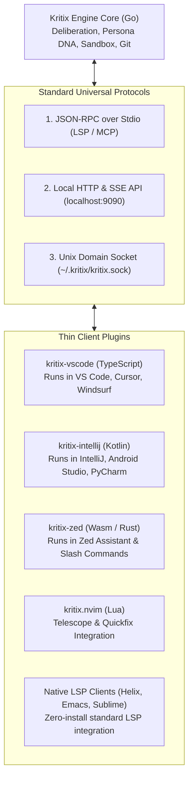

# Journey 8: Universal Editor & IDE Integration Protocol
**Target Users:** Developers using VS Code, Cursor, JetBrains (IntelliJ, Android Studio), Zed, Neovim  
**Interface:** Headless Daemon (`kritix serve`), Language Server Protocol (`kritix lsp`), Thin Extensions

---

## 1. Overview & Objective

Software engineers work across diverse IDEs and editors:
- **VS Code Ecosystem**: VS Code, Cursor, Windsurf, VSCodium, GitHub Codespaces.
- **JetBrains Ecosystem**: IntelliJ IDEA, Android Studio, PyCharm, WebStorm, GoLand, RustRover, Rider.
- **Modern Performance Editors**: Zed, Neovim, Helix, Emacs, Sublime Text.

Instead of writing 15 separate standalone engines, Journey 8 establishes a **Universal Headless Daemon & Protocol**. The Go core engine runs locally as the single source of truth, exposing standard APIs that thin IDE plugins or native LSP clients connect to.

---

## 2. Editor Integration Capabilities

### A. The Sidebar Cockpit Panel
* Displays active **Story Specs**, connected **MCP servers**, and active **Steering rules**.
* Live-streams the deliberation transcript between the Architect $\leftrightarrow$ Critic or Coder $\leftrightarrow$ Reviewer.
* Credence meters showing agreement level across personas.

### B. Code Actions & Context Menu (Right-Click)
* Right-click any selection / file $\rightarrow$ `Kritix: Adversarial Review`.
* Right-click Jira ticket / markdown file $\rightarrow$ `Kritix: Generate Story Spec`.
* Alt+Enter / Quick Fix: Detects violations of `.standards/` or `.kritix/steering/` and offers one-click AI repair.

### C. Native Editor Diff Viewer
* Leverages each IDE's native diffing engine (e.g. `vscode.diff` in VS Code, `DiffManager` in IntelliJ) with chunk-by-chunk "Accept / Reject" buttons.

---

## 3. The Three Protocol Modes

1. **`kritix serve --port=9090` (Local HTTP/SSE Server)**:
   - REST endpoints for session creation, spec generation, and git diff review.
   - Server-Sent Events (SSE) channel streaming token-by-token deliberation and test output.
2. **`kritix lsp` (Language Server Protocol over Stdio)**:
   - Any editor with LSP support (Neovim, Zed, Helix, Sublime) spawns `kritix lsp` directly as a language server.
   - Provides code diagnostics (squiggly underlines on rule violations) and code actions.
3. **`kritix mcp` (Model Context Protocol Server)**:
   - Registers Kritix as an MCP server for AI clients like Claude Desktop, Cursor, and Zed.
